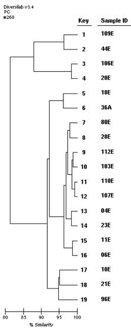

ORIGINAL ARTICLE

# Clonal relationship between human and avian ciprofloxacin-resistant Escherichia coli isolates in North-Eastern Algeria

A. Agabou $ ^{1,2} $  · N. Lezzar $ ^{2} $  · Z. Ouchenane $ ^{3} $  · S. Khemissi $ ^{3} $  · D. Satta $ ^{4} $  · A. Sotto $ ^{1,5} $  · J.-P. Lavigne $ ^{1,6} $  · A. Pantel $ ^{1,6} $ 

Received: 1 October 2015 / Accepted: 17 November 2015 / Published online: 3 December 2015

© Springer-Verlag Berlin Heidelberg 2015

## Abstract
 The objectives of this study were to determine rates, patterns, and mechanisms of antibiotic resistance, and to assess connections between chicken commensal, human commensal, and pathogenic ciprofloxacin-resistant Escherichia coli isolates. All E. coli isolates collected from chickens, their farmers, and patients in the Constantine region (North-east Algeria) were analyzed for bla and plasmid-mediated quinolone resistance (PMQR) gene contents, phylogroups, Rep-PCR profiles, and multilocus sequence types. A high prevalence of resistance to fluoroquinolones (51.4 % to ciprofloxacin) was recorded in avian isolates. Of these, 22.2 % carried the  $ aac(6')-Ib-cr $  gene, whereas lower resistance levels to these antibiotics were recorded in chicken farmers' isolates. None of the commensal isolates harbored the qnr, qepA, or oqxAB genes. One human pathogenic isolate was ertapenem-resistant and harbored the  $ bla_{OXA-48} $  gene, 84 showed an extended-spectrum  $ \beta $ -lactamase phenotype, with

bla $ _{CTX-M-15} $  gene prevalent in 87.2% of them. Seventy isolates were resistant to fluoroquinolones, with  $ aac(6')-Ib-cr $  present in 72.8%, qnrB in 5.7%, and qnrS in 10%. Three Rep-PCR profiles were common to chicken commensal and human pathogenic isolates (phylogroups D and B1; ST21, ST48, and ST471 respectively); one was found in both chicken and chicken-farmer commensal strains (D; ST108), while another profile was identified in a chicken-farmer commensal strain and a human pathogenic one (B1; ST19). These findings suggest clonal and epidemiologic links between chicken and human ciprofloxacin-resistant E. coli isolates and the important role that poultry may play in the epidemiology of human E. coli infections in the Constantine region.

## I ntroduction

Escherichia coli are commensal bacteria found in the gastrointestinal tract of humans and many animal species. However, some strains are pathogenic and frequently encountered in clinical practice. In poultry production, colibacillosis (caused by avian pathogenic  $ E.\ coli $ : APEC) continues to be a devastating disease all over the world.

Antimicrobial therapy is an important tool to reduce both the incidence of this pathology and its economic impact  $ [1] $ . Nevertheless, used therapeutically or given subtherapeutically as feed additives, antibiotics seem to have a profound impact on the development of antibiotic resistance in commensal bacteria, which are potential genetic partners in the transfer of resistance genes to pathogenic ones  $ [2, 3] $ . Over many years, the multiplication of bacterial resistance to antibiotics in animals has become a major concern in both animal and public health, as resistant bacteria can pass through the food chain to people  $ [4] $ . In several surveys, the use of antibiotics in animal production has been held responsible for the

increase of rebellious human infections due to resistant bacteria. The association between deficiency in new marketed antibiotics and accelerated evolution of bacterial resistance in both animals and humans represents a real “emergency”, and is more considered as an ecosystem problem, especially for commensal microfloras [5].

Many studies have demonstrated that some APEC strains could belong to the same clones as human extraintestinal pathogenic ones (ExPEC), and may act as potential pathogens for humans as they often possess similar virulence genes  $ [6–9] $ . However, few studies have been investigating the relationship between avian non-clinical bacteria and human pathogenic ones.

The present study was designed to assess in detail rates, patterns, and mechanisms of antibiotic resistance in chicken commensal, human commensal, and pathogenic  $ E.\ coli $  strains in the Constantine region (North-East of Algeria), and to evaluate the connection between them.

## Material and methods

## Chicken and chicken farmers' commensal isolates

Fourteen independent farms keeping chicken flocks (A to N, aged 35 days or more) from various regions of Constantine were randomly enrolled from March 2011 through December 2012. On each farm, a mixture of 20 fresh poultry droppings was collected as well as a stool sample from a consenting chicken farmer. At the laboratory, samples were diluted and cultured on MacConkey agar (BioMerieux, France). Suspected colonies were identified using the API 20E system (BioMérieux) and from each sample five E. coli colonies were arbitrarily selected for antibiotic susceptibility testing.

The following information was also recorded: flock size, age, health status and antibiotics used for birds, other animals kept at the farm, recent hospital stay and antibiotics taken by poultry farmers, their family members, or their companion animals during the last 3 months.

## Human pathogenic isolates

We selected 94 (consecutive non-repetitive) human pathogenic  $ E.\ coli $  isolates obtained from various clinical samples and collected from different wards of the Military Hospital of Constantine from March 2011 to December 2012. Epidemiological and clinical data were collected for each patient.

## Antimicrobial susceptibility testing and ESBL detection

All isolates were subjected to susceptibility testing against 31 selected antibiotics important in clinical practice by the disc diffusion method. Results were interpreted according to the SFM/EUCAST recommendations [http://www.sfmmicrobiologie.org]. ESBL-production was screened by the double-disk synergy test and fluoroquinolones-resistant isolates were selected for further molecular analyses at the INSERM U1047 (France).

## Characterization of β-lactamase-encoding and PMQR genes

Plasmid or chromosomal DNA was extracted from the isolates using the EZ1 DNA Tissue kit on the BioRobot EZ1 extraction platform (QIAGEN, France). Genes encoding for the most clinically prevalent carbapenemases ( $ bla_{KPC} $ ,  $ bla_{OXA-48-like} $ ,  $ bla_{VIM} $ ,  $ bla_{IMP} $ , and  $ bla_{NDM} $ ) and ESBLs ( $ bla_{TEM} $ ,  $ bla_{SHV} $ , and  $ bla_{CTX-M} $ ) were detected by PCR and confirmed by sequencing the PCR products [10–12]. Similarly, plasmid-mediated quinolone resistance (PMQR) genes (qnrA, qnrB, qnrS, qepA,  $ aac(6')-Ib-cr $ , and oqxAB) were screened and confirmed (by PCR and sequencing) in all the quinolone-resistant isolates [13–16].

## Phylotyping and O25b subgrouping

Phylogenetic groups of the E. coli isolates and the O25b subgroup of the ESBL-producers were determined by PCR as previously described  $ [17, 18] $ .

## Clonality analysis

The genetic relationship of all the human and avian ciprofloxacin-resistant isolates was studied using Rep-PCR (DiversiLab system, BioMérieux). Isolates with identical patterns were considered indistinguishable if their similarity percentage was  $ \geq95\% $ .

## MLST

Multilocus sequence typing (MLST) was carried out by PCR amplification and sequencing of eight housekeeping genes: dinB, icdA, pabB, polB, putP, trpA, trpB, and uidA. Allelic profile and sequence type determinations were assigned according to the Institut Pasteur's MLST web site scheme (www.pasteur.fr/mlst).

## Statistical analysis

Comparisons of antimicrobial resistance rates distribution and the resistance genes characteristics of the different E. coli isolated from poultry (P), their farmers (F) and clinical samples (C) were performed by calculating Fisher's exact test (at 95% CI and p<0.05 %) using SAS/ETS $ ^{\circledR} $  version 9.1 (SAS Institute Inc., Cary, NC, USA, 2004).

## Results

### Drug resistance profiles and phylogenetic grouping in chicken commensal E. coli

The resistance phenotypes confirmed that among the 70 avian commensal  $ E.\ coli $ , 44.3 % (belonging to all flocks except B and F) were resistant to three or more antimicrobial classes.

Resistance levels to nalidixic acid (88.6 %), ofloxacin (80 %) and ciprofloxacin (51.4 %) were very frequent, and all the strains were susceptible to  $ 3^{rd} $  generation cephalosporins and many other antibiotics (Table 1).

Among the ciprofloxacin-resistant isolates  $ (n=36) $  none harbored qnr, qepA, or oqxAB genes, but 22.2% of them carried the  $ aac(6')-Ib-cr $  gene. These isolates were distributed among the four main phylogenetic groups: B1 (41.7%), D (30.6%), A (25%), and B2 (2.7%) (Table 2). They were detected from all the poultry farms except the F one, and 59.6% of them belonged to flocks where quinolones had not been used.

### Drug resistance profiles and phylogenetic grouping in chicken farmers commensal E. coli

These isolates showed lower resistance levels to nalidixic acid (15.7%), ofloxacin (11.4%), and ciprofloxacin (5.7%), and all were susceptible to  $ 3^{rd} $  generation cephalosporins and other drugs (Table 1). None of the chicken farmers was treated with antibiotics, and 64.3% of them had pets.

Half of the ciprofloxacin-resistant isolates were collected from farmers who did not use these drugs for their poultry. These isolates harboured no PMQR genes. They belonged to phylogroups A (25%), B1 (25%), and D (50%) (Table 2), and were isolated in poultry farms B, D, F, and N.

### Drug resistance profiles and phylogenetic grouping in human pathogenic E. coli

Among the 94 clinical isolates, one exhibited resistance to ertapenem (1.1%), 84 (89.4%) showed an ESBL phenotype, and 70 (74.5%) were insensitive to ciprofloxacin.

Resistance to antibiotics was significantly more prevalent in clinical isolates than in farmers or poultry isolates (22/31 antibiotics tested), in particular to ciprofloxacin (p<0.001) (Table 1).

The ertapenem-resistant strain harboured the  $ bla_{OXA-48} $  gene in association with  $ bla_{TEM-1} $  and  $ aac(6')-Ib-cr $ . Among the 84 ESBL-producers, 82 harboured the  $ bla_{CTX-M-15} $  gene and the two remaining strains carried  $ bla_{TEM-24} $  and  $ bla_{TEM-3} $ . These ESBLs were significantly associated with strains isolated from patients  $ (p<0.001) $ . Co-resistance to ciprofloxacin was shown by 78.1% of the  $ bla_{CTX-M-15}^{+} $ isolates (Table 2).

The  $ aac(6')-Ib-cr $  gene was identified in 51 ciprofloxacin-resistant strains (72.9 %), qnrS in seven (10 %) and qnrB in five (7.1 %). The presence of the  $ aac(6')-Ib-cr $  gene was significantly associated with clinical strains as compared to poultry or farmer ones (p<0.001). The qnr+ strains also harboured  $ aac(6')-Ib-cr $  gene in six of the qnrS+ and two of the qnrB+ strains. Ciprofloxacin-resistant isolates were scattered among the four major phylogenetic groups: D (40 %), A (24.3 %), B1 (18.6 %), and B2 (17.1 %). (Table 2).

### Clonality analysis and MLST of ciprofloxacin-resistant E. coli strains

The obtained dendrogram showed that the 110 fluoroquinolones-resistant isolates were grouped in 38 Rep-PCR patterns (data not shown). Only seven profiles included five or more isolates: patterns XXIII (n=14; phylogroup D; ST3), XXXIII (n=13; B2; ST43), VI (n=10, B1; ST471), XXXVI (n=10; D; ST477), XIII (n=8; A; ST2), XVI (n=5; A; ST2), and XIX (n=5; A; ST347). The residual patterns contained two to four isolates (ten Rep-PCR patterns) or single isolates (21 Rep-PCR patterns). Cluster of the sixth profile was very diverse, intermixing isolates of different origins (hospital and several farms: A, C, D, and J), and all the clonally related isolates (determined by Rep-PCR) were of the same sequence-type defined by MLST. Three clonal groups (VI, X, and XXXI) connected chicken commensal isolates to human pathogenic ones. They belonged to phylotypes B1 and D and ST21, ST48, and ST471 (Fig. 1). One pattern (XXX) was common to chicken and chicken-farmer commensal strains (D; ST108), and another (I) was identified in a chicken-farmer commensal strain and a human pathogenic one (B1; ST19) (Fig. 1). The clustered isolates exhibited slight variations independently of their origin, year of isolation, resistance pattern, or sample nature. This suggests a link between the poultry E. coli isolates and the humans' ones.

None of the 12 human B2 O25b-ST131 strains clustered with any avian strain, suggesting the absence of any chicken reservoir for this worldwide clone. The same observation could be made for the  $ bla_{OXA-48}^{+} $  strain that belonged to ST5.

## Discussion

The findings of the present study provide evidence of a genetic homogeneity and a clonal link between  $ E.\ coli $  from poultry, farmers, and clinical cases in the Constantine region, suggesting that avian commensal, human commensal, and pathogenic strains are from the same origin. However, the exact routes of transmission remain uncertain.

Chicken-to-human transmission of bacteria during farming has been largely demonstrated. Johnson et al.  $ [19, 20] $  showed that ciprofloxacin-resistant  $ E.\ coli $  strains from human blood

Table 1 Resistance profiles of  $ E.\ coli $  isolated from poultry (P), their farmers (F) and patients (C)

<table border=1 style='margin: auto; width: max-content;'><tr><td style='text-align: center;'>Antibiotics</td><td colspan="3">Origin of isolates</td><td colspan="3">P</td></tr><tr><td style='text-align: center;'></td><td style='text-align: center;'>Poultry (n=70) n (%)</td><td style='text-align: center;'>Farmers (n=70) n (%)</td><td style='text-align: center;'>Clinical samples (n=94) n (%)</td><td style='text-align: center;'>P vs F</td><td style='text-align: center;'>P vs C</td><td style='text-align: center;'>F vs C</td></tr><tr><td style='text-align: center;'>Amoxicillin</td><td style='text-align: center;'>55 (78.5)</td><td style='text-align: center;'>10 (14.3)</td><td style='text-align: center;'>93 (98.9)</td><td style='text-align: center;'>&lt;0.001</td><td style='text-align: center;'>&lt;0.001</td><td style='text-align: center;'>&lt;0.001</td></tr><tr><td style='text-align: center;'>Ticarcillin</td><td style='text-align: center;'>55 (78.5)</td><td style='text-align: center;'>10 (14.3)</td><td style='text-align: center;'>93 (98.9)</td><td style='text-align: center;'>&lt;0.001</td><td style='text-align: center;'>&lt;0.001</td><td style='text-align: center;'>&lt;0.001</td></tr><tr><td style='text-align: center;'>Piperacillin</td><td style='text-align: center;'>3 (4.3)</td><td style='text-align: center;'>0 (0)</td><td style='text-align: center;'>92 (97.8)</td><td style='text-align: center;'>NS</td><td style='text-align: center;'>&lt;0.001</td><td style='text-align: center;'>&lt;0.001</td></tr><tr><td style='text-align: center;'>Amoxicillin/clavulanic acid</td><td style='text-align: center;'>0 (0)</td><td style='text-align: center;'>0 (0)</td><td style='text-align: center;'>76 (80.8)</td><td style='text-align: center;'>NS</td><td style='text-align: center;'>&lt;0.001</td><td style='text-align: center;'>&lt;0.001</td></tr><tr><td style='text-align: center;'>Ticarcillin/clavulanic acid</td><td style='text-align: center;'>2 (2.9)</td><td style='text-align: center;'>1 (1.4)</td><td style='text-align: center;'>83 (88.3)</td><td style='text-align: center;'>NS</td><td style='text-align: center;'>&lt;0.001</td><td style='text-align: center;'>&lt;0.001</td></tr><tr><td style='text-align: center;'>Piperacillin/tazobactam</td><td style='text-align: center;'>0 (0)</td><td style='text-align: center;'>1 (1.4)</td><td style='text-align: center;'>8 (8.5)</td><td style='text-align: center;'>NS</td><td style='text-align: center;'>NS</td><td style='text-align: center;'>NS</td></tr><tr><td style='text-align: center;'>Cefalotin</td><td style='text-align: center;'>0 (0)</td><td style='text-align: center;'>0 (0)</td><td style='text-align: center;'>88 (93.6)</td><td style='text-align: center;'>NS</td><td style='text-align: center;'>&lt;0.001</td><td style='text-align: center;'>&lt;0.001</td></tr><tr><td style='text-align: center;'>Cefamandole</td><td style='text-align: center;'>3 (4.3)</td><td style='text-align: center;'>0 (0)</td><td style='text-align: center;'>90 (95.7)</td><td style='text-align: center;'>NS</td><td style='text-align: center;'>&lt;0.001</td><td style='text-align: center;'>&lt;0.001</td></tr><tr><td style='text-align: center;'>Ceftazidime</td><td style='text-align: center;'>0 (0)</td><td style='text-align: center;'>0 (0)</td><td style='text-align: center;'>78 (82.9)</td><td style='text-align: center;'>NS</td><td style='text-align: center;'>&lt;0.001</td><td style='text-align: center;'>&lt;0.001</td></tr><tr><td style='text-align: center;'>Cefotaxime</td><td style='text-align: center;'>0 (0)</td><td style='text-align: center;'>0 (0)</td><td style='text-align: center;'>87 (92.5)</td><td style='text-align: center;'>NS</td><td style='text-align: center;'>&lt;0.001</td><td style='text-align: center;'>&lt;0.001</td></tr><tr><td style='text-align: center;'>Cefepime</td><td style='text-align: center;'>0 (0)</td><td style='text-align: center;'>0 (0)</td><td style='text-align: center;'>76 (80.8)</td><td style='text-align: center;'>NS</td><td style='text-align: center;'>&lt;0.001</td><td style='text-align: center;'>&lt;0.001</td></tr><tr><td style='text-align: center;'>Cefoxitin</td><td style='text-align: center;'>0 (0)</td><td style='text-align: center;'>0 (0)</td><td style='text-align: center;'>17 (18.1)</td><td style='text-align: center;'>NS</td><td style='text-align: center;'>&lt;0.001</td><td style='text-align: center;'>&lt;0.001</td></tr><tr><td style='text-align: center;'>Cefixime</td><td style='text-align: center;'>0 (0)</td><td style='text-align: center;'>0 (0)</td><td style='text-align: center;'>82 (87.2)</td><td style='text-align: center;'>NS</td><td style='text-align: center;'>&lt;0.001</td><td style='text-align: center;'>&lt;0.001</td></tr><tr><td style='text-align: center;'>Aztreonam</td><td style='text-align: center;'>0 (0)</td><td style='text-align: center;'>0 (0)</td><td style='text-align: center;'>84 (89.3)</td><td style='text-align: center;'>NS</td><td style='text-align: center;'>&lt;0.001</td><td style='text-align: center;'>&lt;0.001</td></tr><tr><td style='text-align: center;'>Mecillinam</td><td style='text-align: center;'>16 (22.8)</td><td style='text-align: center;'>3 (4.3)</td><td style='text-align: center;'>68 (72.3)</td><td style='text-align: center;'>0.002</td><td style='text-align: center;'>&lt;0.001</td><td style='text-align: center;'>&lt;0.001</td></tr><tr><td style='text-align: center;'>Moxalactam</td><td style='text-align: center;'>0 (0)</td><td style='text-align: center;'>0 (0)</td><td style='text-align: center;'>0 (0)</td><td style='text-align: center;'>NS</td><td style='text-align: center;'>NS</td><td style='text-align: center;'>NS</td></tr><tr><td style='text-align: center;'>Ertapenem</td><td style='text-align: center;'>0 (0)</td><td style='text-align: center;'>0 (0)</td><td style='text-align: center;'>1 (1.1)</td><td style='text-align: center;'>NS</td><td style='text-align: center;'>NS</td><td style='text-align: center;'>NS</td></tr><tr><td style='text-align: center;'>Imipenem</td><td style='text-align: center;'>0 (0)</td><td style='text-align: center;'>0 (0)</td><td style='text-align: center;'>0 (0)</td><td style='text-align: center;'>NS</td><td style='text-align: center;'>NS</td><td style='text-align: center;'>NS</td></tr><tr><td style='text-align: center;'>Meropenem</td><td style='text-align: center;'>0 (0)</td><td style='text-align: center;'>0 (0)</td><td style='text-align: center;'>0 (0)</td><td style='text-align: center;'>NS</td><td style='text-align: center;'>NS</td><td style='text-align: center;'>NS</td></tr><tr><td style='text-align: center;'>Amikacin</td><td style='text-align: center;'>0 (0)</td><td style='text-align: center;'>0 (0)</td><td style='text-align: center;'>4 (4.2)</td><td style='text-align: center;'>NS</td><td style='text-align: center;'>NS</td><td style='text-align: center;'>NS</td></tr><tr><td style='text-align: center;'>Netilmicin</td><td style='text-align: center;'>0 (0)</td><td style='text-align: center;'>0 (0)</td><td style='text-align: center;'>29 (30.8)</td><td style='text-align: center;'>NS</td><td style='text-align: center;'>&lt;0.001</td><td style='text-align: center;'>&lt;0.001</td></tr><tr><td style='text-align: center;'>Tobramycin</td><td style='text-align: center;'>0 (0)</td><td style='text-align: center;'>0 (0)</td><td style='text-align: center;'>62 (65.9)</td><td style='text-align: center;'>NS</td><td style='text-align: center;'>&lt;0.001</td><td style='text-align: center;'>&lt;0.001</td></tr><tr><td style='text-align: center;'>Gentamicin</td><td style='text-align: center;'>0 (0)</td><td style='text-align: center;'>0 (0)</td><td style='text-align: center;'>54 (57.4)</td><td style='text-align: center;'>NS</td><td style='text-align: center;'>&lt;0.001</td><td style='text-align: center;'>&lt;0.001</td></tr><tr><td style='text-align: center;'>Nalidixic acid</td><td style='text-align: center;'>62 (88.7)</td><td style='text-align: center;'>11 (15.7)</td><td style='text-align: center;'>75 (79.7)</td><td style='text-align: center;'>&lt;0.001</td><td style='text-align: center;'>NS</td><td style='text-align: center;'>&lt;0.001</td></tr><tr><td style='text-align: center;'>Ofloxacin</td><td style='text-align: center;'>56 (80)</td><td style='text-align: center;'>8 (11.4)</td><td style='text-align: center;'>74 (78.7)</td><td style='text-align: center;'>&lt;0.001</td><td style='text-align: center;'>NS</td><td style='text-align: center;'>&lt;0.001</td></tr><tr><td style='text-align: center;'>Ciprofloxacin</td><td style='text-align: center;'>36 (51.4)</td><td style='text-align: center;'>4 (5.7)</td><td style='text-align: center;'>70 (74.4)</td><td style='text-align: center;'>&lt;0.001</td><td style='text-align: center;'>0.003</td><td style='text-align: center;'>&lt;0.001</td></tr><tr><td style='text-align: center;'>Minocycline</td><td style='text-align: center;'>8 (11.4)</td><td style='text-align: center;'>0 (0)</td><td style='text-align: center;'>32 (34.1)</td><td style='text-align: center;'>&lt;0.001</td><td style='text-align: center;'>0.001</td><td style='text-align: center;'>&lt;0.001</td></tr><tr><td style='text-align: center;'>Cotrimoxazole</td><td style='text-align: center;'>58 (82.8)</td><td style='text-align: center;'>9 (12.9)</td><td style='text-align: center;'>80 (85.1)</td><td style='text-align: center;'>&lt;0.001</td><td style='text-align: center;'>NS</td><td style='text-align: center;'>&lt;0.001</td></tr><tr><td style='text-align: center;'>Nitrofurantoin</td><td style='text-align: center;'>2 (2.9)</td><td style='text-align: center;'>2 (2.9)</td><td style='text-align: center;'>2 (2.1)</td><td style='text-align: center;'>NS</td><td style='text-align: center;'>NS</td><td style='text-align: center;'>NS</td></tr><tr><td style='text-align: center;'>Fosfomycin</td><td style='text-align: center;'>0 (0)</td><td style='text-align: center;'>0 (0)</td><td style='text-align: center;'>0 (0)</td><td style='text-align: center;'>NS</td><td style='text-align: center;'>NS</td><td style='text-align: center;'>NS</td></tr><tr><td style='text-align: center;'>Colistin</td><td style='text-align: center;'>0 (0)</td><td style='text-align: center;'>0 (0)</td><td style='text-align: center;'>0 (0)</td><td style='text-align: center;'>NS</td><td style='text-align: center;'>NS</td><td style='text-align: center;'>NS</td></tr></table>

and fecal samples were almost identical to resistant isolates from geographically linked chickens, whereas drug-susceptible human  $ E.\ coli $  strains were genetically distinct from avian ones, suggesting a possible dissemination via the poultry.  $ E.\ coli $  strains could also be transmitted from poultry to humans through meat consumption and environmental contamination with manure or faeces of wild or domestic birds [21, 22]. Another route of antimicrobial-resistant  $ E.\ coli $  entry into the community is through occupational exposure to  $ E.\ coli $  from live-animal contact in the broiler chicken industry [23]. This had been confirmed by our findings, as we observed clonality between chicken and chicken farmers’ strains, and between the latter and human pathogenic ones.

The sporadic nature and the appearance of new pathogenic  $ E.\ coli $  strains by virtue of novel STs suggests that these strains may be commensal that have acquired the antibiotic resistance encoding plasmids (especially ESBL) [24]. This is in agreement with our findings, as we observed clonality between a  $ bla_{CTX-M-15}^{+} $  ExPEC strain and one chicken-farmer commensal strain and another  $ bla_{CTX-M-15}^{+} $  ExPEC strain with two chicken commensal ones (Fig. 1). Acquisition of resistance genes may also account for the differences in drug resistance between our clonal avian–human strains and clonal commensal–pathogenic strains, as the drug selection pressure in clinical environments is the major cause of the accumulation of resistance determinants against antibiotics. According to

Table 2 Resistance gene characteristics of ciprofloxacin-resistant  $ E.\ coli $  strains from poultry, their farmers, and patients

<table border=1 style='margin: auto; width: max-content;'><tr><td style='text-align: center;'></td><td colspan="3">Origin of isolates</td><td colspan="3">P</td></tr><tr><td style='text-align: center;'></td><td style='text-align: center;'>Poultry (P) (n=36)</td><td style='text-align: center;'>Farmers (F) (n=4)</td><td style='text-align: center;'>Clinical samples (C) (n=70)</td><td style='text-align: center;'>P vs F</td><td style='text-align: center;'>P vs C</td><td style='text-align: center;'>F vs C</td></tr><tr><td style='text-align: center;'></td><td style='text-align: center;'>n (%)</td><td style='text-align: center;'>n (%)</td><td style='text-align: center;'>n (%)</td><td style='text-align: center;'></td><td style='text-align: center;'></td><td style='text-align: center;'></td></tr><tr><td style='text-align: center;'>ESBL genes</td><td style='text-align: center;'></td><td style='text-align: center;'></td><td style='text-align: center;'></td><td style='text-align: center;'></td><td style='text-align: center;'></td><td style='text-align: center;'></td></tr><tr><td style='text-align: center;'>bla $ _{\text{CTX-M-15}} $</td><td style='text-align: center;'>0 (0)</td><td style='text-align: center;'>0 (0)</td><td style='text-align: center;'>65 (92.8)</td><td style='text-align: center;'>NS</td><td style='text-align: center;'>&lt;0.001</td><td style='text-align: center;'>&lt;0.001</td></tr><tr><td style='text-align: center;'>bla $ _{\text{TEM-24}} $</td><td style='text-align: center;'>0 (0)</td><td style='text-align: center;'>0 (0)</td><td style='text-align: center;'>0 (0)</td><td style='text-align: center;'>NS</td><td style='text-align: center;'>NS</td><td style='text-align: center;'>NS</td></tr><tr><td style='text-align: center;'>bla $ _{\text{TEM-3}} $</td><td style='text-align: center;'>0 (0)</td><td style='text-align: center;'>0 (0)</td><td style='text-align: center;'>0 (0)</td><td style='text-align: center;'>NS</td><td style='text-align: center;'>NS</td><td style='text-align: center;'>NS</td></tr><tr><td style='text-align: center;'>Carbapenemase genes</td><td style='text-align: center;'></td><td style='text-align: center;'></td><td style='text-align: center;'></td><td style='text-align: center;'></td><td style='text-align: center;'></td><td style='text-align: center;'></td></tr><tr><td style='text-align: center;'>bla $ _{\text{OXA-48}} $</td><td style='text-align: center;'>0 (0)</td><td style='text-align: center;'>0 (0)</td><td style='text-align: center;'>1 (1.4)</td><td style='text-align: center;'>NS</td><td style='text-align: center;'>NS</td><td style='text-align: center;'>NS</td></tr><tr><td style='text-align: center;'>PMQR genes</td><td style='text-align: center;'></td><td style='text-align: center;'></td><td style='text-align: center;'></td><td style='text-align: center;'></td><td style='text-align: center;'></td><td style='text-align: center;'></td></tr><tr><td style='text-align: center;'>qnrA</td><td style='text-align: center;'>0 (0)</td><td style='text-align: center;'>0 (0)</td><td style='text-align: center;'>0 (0)</td><td style='text-align: center;'>NS</td><td style='text-align: center;'>NS</td><td style='text-align: center;'>NS</td></tr><tr><td style='text-align: center;'>qnrB</td><td style='text-align: center;'>0 (0)</td><td style='text-align: center;'>0 (0)</td><td style='text-align: center;'>5 (7.1)</td><td style='text-align: center;'>NS</td><td style='text-align: center;'>NS</td><td style='text-align: center;'>NS</td></tr><tr><td style='text-align: center;'>qnrS</td><td style='text-align: center;'>0 (0)</td><td style='text-align: center;'>0 (0)</td><td style='text-align: center;'>7 (10)</td><td style='text-align: center;'>NS</td><td style='text-align: center;'>NS</td><td style='text-align: center;'>NS</td></tr><tr><td style='text-align: center;'>qepA</td><td style='text-align: center;'>0 (0)</td><td style='text-align: center;'>0 (0)</td><td style='text-align: center;'>0 (0)</td><td style='text-align: center;'>NS</td><td style='text-align: center;'>NS</td><td style='text-align: center;'>NS</td></tr><tr><td style='text-align: center;'>oqxAB</td><td style='text-align: center;'>0 (0)</td><td style='text-align: center;'>0 (0)</td><td style='text-align: center;'>0 (0)</td><td style='text-align: center;'>NS</td><td style='text-align: center;'>NS</td><td style='text-align: center;'>NS</td></tr><tr><td style='text-align: center;'>aac(6&#x27;)-Ib-cr</td><td style='text-align: center;'>8 (22.2)</td><td style='text-align: center;'>0 (0)</td><td style='text-align: center;'>51 (72.8)</td><td style='text-align: center;'>NS</td><td style='text-align: center;'>&lt;0.001</td><td style='text-align: center;'>&lt;0.001</td></tr><tr><td style='text-align: center;'>Phylogenetic group</td><td style='text-align: center;'></td><td style='text-align: center;'></td><td style='text-align: center;'></td><td style='text-align: center;'></td><td style='text-align: center;'></td><td style='text-align: center;'></td></tr><tr><td style='text-align: center;'>A</td><td style='text-align: center;'>9 (25)</td><td style='text-align: center;'>1 (25)</td><td style='text-align: center;'>17 (24.3)</td><td style='text-align: center;'>NS</td><td style='text-align: center;'>NS</td><td style='text-align: center;'>NS</td></tr><tr><td style='text-align: center;'>B1</td><td style='text-align: center;'>15 (41.6)</td><td style='text-align: center;'>1 (25)</td><td style='text-align: center;'>13 (18.5)</td><td style='text-align: center;'>NS</td><td style='text-align: center;'>NS</td><td style='text-align: center;'>NS</td></tr><tr><td style='text-align: center;'>B2</td><td style='text-align: center;'>1 (2.7)</td><td style='text-align: center;'>0 (0)</td><td style='text-align: center;'>12 (17.1)</td><td style='text-align: center;'>NS</td><td style='text-align: center;'>NS</td><td style='text-align: center;'>NS</td></tr><tr><td style='text-align: center;'>D</td><td style='text-align: center;'>11 (15.7)</td><td style='text-align: center;'>2 (50)</td><td style='text-align: center;'>28 (40)</td><td style='text-align: center;'>NS</td><td style='text-align: center;'>NS</td><td style='text-align: center;'>NS</td></tr><tr><td style='text-align: center;'>O25b-ST131 clone</td><td style='text-align: center;'>0 (0)</td><td style='text-align: center;'>0 (0)</td><td style='text-align: center;'>12 (17.1)</td><td style='text-align: center;'>NS</td><td style='text-align: center;'>0.007</td><td style='text-align: center;'>0.007</td></tr></table>

<table border=1 style='margin: auto; width: max-content;'><tr><td style='text-align: center;'></td><td style='text-align: center;'>Origin</td><td style='text-align: center;'>Year of isolation</td><td style='text-align: center;'>Poultry farm/Hospital ward</td><td style='text-align: center;'>Sample nature</td><td style='text-align: center;'>Phylotype</td><td style='text-align: center;'>Sequence type</td><td style='text-align: center;'>Specific resistance</td></tr><tr><td style='text-align: center;'></td><td style='text-align: center;'>Chicken</td><td style='text-align: center;'>2012</td><td style='text-align: center;'>Poultry farm K</td><td style='text-align: center;'>Droppings D</td><td style='text-align: center;'>ST48</td><td style='text-align: center;'></td><td style='text-align: center;'></td></tr><tr><td style='text-align: center;'></td><td style='text-align: center;'>Human pathogenic</td><td style='text-align: center;'>2012</td><td style='text-align: center;'>General surgery</td><td style='text-align: center;'>Pus D</td><td style='text-align: center;'>ST48</td><td style='text-align: center;'>QnrB</td><td style='text-align: center;'></td></tr><tr><td style='text-align: center;'></td><td style='text-align: center;'>Chicken</td><td style='text-align: center;'>2012</td><td style='text-align: center;'>Poultry farm K</td><td style='text-align: center;'>Droppings D</td><td style='text-align: center;'>ST108</td><td style='text-align: center;'>Aac (6&#x27;)-Ib-cr</td><td style='text-align: center;'></td></tr><tr><td style='text-align: center;'></td><td style='text-align: center;'>Chicken farmer</td><td style='text-align: center;'>2012</td><td style='text-align: center;'>Poultry farm F</td><td style='text-align: center;'>Stools D</td><td style='text-align: center;'>ST108</td><td style='text-align: center;'></td><td style='text-align: center;'></td></tr><tr><td style='text-align: center;'></td><td style='text-align: center;'>Chicken farmer</td><td style='text-align: center;'>2012</td><td style='text-align: center;'>Poultry farm D</td><td style='text-align: center;'>Stools B1</td><td style='text-align: center;'>ST19</td><td style='text-align: center;'></td><td style='text-align: center;'></td></tr><tr><td style='text-align: center;'></td><td style='text-align: center;'>Human pathogenic</td><td style='text-align: center;'>2012</td><td style='text-align: center;'>Pediatrics</td><td style='text-align: center;'>Diarrhea B1</td><td style='text-align: center;'>ST19</td><td style='text-align: center;'>bla_{CTX-M-15}</td><td style='text-align: center;'></td></tr><tr><td style='text-align: center;'></td><td style='text-align: center;'>Human pathogenic</td><td style='text-align: center;'>2012</td><td style='text-align: center;'>Internal medicine</td><td style='text-align: center;'>Urine B1</td><td style='text-align: center;'>ST471</td><td style='text-align: center;'></td><td style='text-align: center;'></td></tr><tr><td style='text-align: center;'></td><td style='text-align: center;'>Human pathogenic</td><td style='text-align: center;'>2011</td><td style='text-align: center;'>Internal medicine</td><td style='text-align: center;'>Pus B1</td><td style='text-align: center;'>ST471</td><td style='text-align: center;'>MDR. Aac (6&#x27;)-Ib-cr</td><td style='text-align: center;'></td></tr><tr><td style='text-align: center;'></td><td style='text-align: center;'>Chicken</td><td style='text-align: center;'>2012</td><td style='text-align: center;'>Poultry farm J</td><td style='text-align: center;'>Droppings B1</td><td style='text-align: center;'>ST471</td><td style='text-align: center;'></td><td style='text-align: center;'></td></tr><tr><td style='text-align: center;'></td><td style='text-align: center;'>Chicken</td><td style='text-align: center;'>2012</td><td style='text-align: center;'>Poultry farm J</td><td style='text-align: center;'>Droppings B1</td><td style='text-align: center;'>ST471</td><td style='text-align: center;'></td><td style='text-align: center;'></td></tr><tr><td style='text-align: center;'></td><td style='text-align: center;'>Chicken</td><td style='text-align: center;'>2012</td><td style='text-align: center;'>Poultry farm J</td><td style='text-align: center;'>Droppings B1</td><td style='text-align: center;'>ST471</td><td style='text-align: center;'></td><td style='text-align: center;'></td></tr><tr><td style='text-align: center;'></td><td style='text-align: center;'>Chicken</td><td style='text-align: center;'>2012</td><td style='text-align: center;'>Poultry farm J</td><td style='text-align: center;'>Droppings B1</td><td style='text-align: center;'>ST471</td><td style='text-align: center;'>Aac (6&#x27;)-Ib-cr</td><td style='text-align: center;'></td></tr><tr><td style='text-align: center;'></td><td style='text-align: center;'>Chicken</td><td style='text-align: center;'>2012</td><td style='text-align: center;'>Poultry farm A</td><td style='text-align: center;'>Droppings B1</td><td style='text-align: center;'>ST471</td><td style='text-align: center;'></td><td style='text-align: center;'></td></tr><tr><td style='text-align: center;'></td><td style='text-align: center;'>Chicken</td><td style='text-align: center;'>2012</td><td style='text-align: center;'>Poultry farm A</td><td style='text-align: center;'>Droppings B1</td><td style='text-align: center;'>ST471</td><td style='text-align: center;'></td><td style='text-align: center;'></td></tr><tr><td style='text-align: center;'></td><td style='text-align: center;'>Chicken</td><td style='text-align: center;'>2012</td><td style='text-align: center;'>Poultry farm C</td><td style='text-align: center;'>Droppings B1</td><td style='text-align: center;'>ST471</td><td style='text-align: center;'></td><td style='text-align: center;'></td></tr><tr><td style='text-align: center;'></td><td style='text-align: center;'>Chicken</td><td style='text-align: center;'>2012</td><td style='text-align: center;'>Poultry farm D</td><td style='text-align: center;'>Droppings B1</td><td style='text-align: center;'>ST471</td><td style='text-align: center;'></td><td style='text-align: center;'></td></tr><tr><td style='text-align: center;'></td><td style='text-align: center;'>Chicken</td><td style='text-align: center;'>2012</td><td style='text-align: center;'>Poultry farm D</td><td style='text-align: center;'>Droppings B1</td><td style='text-align: center;'>ST21</td><td style='text-align: center;'></td><td style='text-align: center;'></td></tr><tr><td style='text-align: center;'></td><td style='text-align: center;'>Chicken</td><td style='text-align: center;'>2012</td><td style='text-align: center;'>Poultry farm D</td><td style='text-align: center;'>Droppings B1</td><td style='text-align: center;'>ST21</td><td style='text-align: center;'></td><td style='text-align: center;'></td></tr><tr><td style='text-align: center;'></td><td style='text-align: center;'>Human pathogenic</td><td style='text-align: center;'>2012</td><td style='text-align: center;'>Internal medicine</td><td style='text-align: center;'>Urine B1</td><td style='text-align: center;'>ST21</td><td style='text-align: center;'>bla_{CTX-M-15}</td><td style='text-align: center;'></td></tr></table>

Fig. 1 DiversiLab dendrogram representing the clonal strains with their corresponding characteristics

Kolar et al. [25],  $ \beta $ -lactamases of the  $ bla_{CTX-M-9} $  group are the most frequently found in poultry.  $ bla_{OXA-48} $  had been reported in K. pneumoniae and E. cloacae from companion animals (especially dogs, cats, and horses) but not birds [26].

Ciccozzi et al. [27] suggested that the potential transmission of multidrug-resistant E. coli clones from poultry to humans seems to involve phylogroups A and B1 rather than B2 and D. Phylogroups A and B1 are known to be broad host-spectrum and could be found in all vertebrate hosts, whereas B2 and D are narrow host-spectrum and largely restricted to endothermic vertebrates, with B2 isolates as the most host-adapted [28]. In the adaptation process, mutation is the main driving evolutionary course in the E. coli group A, whereas recombination is more prevalent in B1, B2, and D [29]. Phylogroups A, B1, and D are more likely to have derived from the ancestral E. coli lineages [30, 31], and the minor genetic differences observed between strains from the different source groups could be related to their further evolutionary changes associated with host specificity [32]. This is another explanation of our results, as we found clonal human and avian strains belonging mainly to phylogroups B1 and D.

Interestingly, we did not find any correlation between the most important worldwide drug-resistant and virulent  $ E.\ coli $  O25:H4-B2-ST131 clone (mainly responsible for urinary tract infections) and any avian strains. This is an important finding, since the ST131 clone has been previously isolated from clinical cases and the environment in Algeria [33, 34]. In contrast, a 90.9 % similarity was found between avian and human O25b:H4-ST131  $ ibeA-bla_{CTX-M-9}^{+} $ strains in Spain [35]. According to Giufère et al. [36] and Cortès et al. [37], ST131 clone is strongly predominant in human ciprofloxacin-resistant  $ E.\ coli $  strains, but less in avian ones in which it has not necessary to produce an ESBL, and the acquisition of these enzyme-encoding plasmids was probably achieved in a later stage of its evolution [35, 38, 39]. The fact that a big number of our ExPEC isolates belong to clusters exclusive to humans suggests that most of human pathogenic strains may not be derived from extra-human (avian) ones. However, the clonality among several avian and human isolates supports the idea of their evolution from a recent common ancestor.

Conforming to Lee et al. [40], most fluoroquinolone-resistant  $ E.\ coli $  in poultry are commensals that harbour mutations in gyrA or less frequently parC. These chromosomes-encoded genes were not investigated in our study, and instead we focused on PMQRs because of plasmids' extreme flexibility in the acquisition and transfer of resistance. The same ciprofloxacin-resistant strains common in both chickens and humans could also be acquired from the environment or from companion animals (dogs and cats) [26, 41].

## Conclusion

This study highlights a genetic proximity among avian commensal, human commensal, and pathogenic  $ E.\ coli $  strains, suggesting that poultry may play an important role in the epidemiology of human  $ E.\ coli $  infections in Constantine region. These findings may help us to understand the acquisition and the evolution of antimicrobial resistance, and may therefore help us to block its transmission pathways. Efforts are required (i) to understand the ecology of bacterial communities present in animals and their environments, and (ii) to elucidate the transmission dynamics to humans.

Acknowledgments This work was supported by INSERM, and A. Agabou obtained an AVEROES scholarship. We thank Mariella Lomma for her assistance with editing.

## Compliance with ethical standards

Conflict of interest The authors report no conflicting interests.

## References

1. Geomaras I, Hastings JW, Holy A (2004) Genotypic analysis of Escherichia coli strains from poultry carcasses and their susceptibilities to antimicrobial agents. Appl Environ Microbiol 67:1940–1944

2. Smith JL, Drum DJV, Dai Y, Kim JM, Sanchez S, Maurer JJ, Hofacre CL, Lee MD (2007) Impact of antimicrobial usage on antimicrobial resistance in commensal Escherichia coli strains colonizing broiler chickens. Appl Environ Microbiol 73:1404–1414

3. Schjørring S, Krogfeldt KA (2011) Assessment of bacterial antibiotic resistance transfer in the gut. Int J Microbiol 2011:312956

4. Manges AR, Johnson JR (2012) Food-borne origins of Escherichia coli causing extraintestinal infections. Clin Infect Dis 55:712–719

5. Wang HH (2009) Commensal bacteria, microbial ecosystems, and horizontal gene transmission: adjusting our focus for strategic breakthroughs against antibiotic resistance. In: Jaykus LA, Wang HH, Schlesinger LS (eds) Food-borne microbes: shaping the host ecosystem. ASM Press, Washington DC, pp 267–281

6. White DG, Dho-Moulin M, Wilson RA, Whittam TS (1993) Clonal relationships and variation in virulence among Escherichia coli strains of avian origin. Microb Pathog 14:399–409

7. Johnson TJ, Kariyawasam S, Wannemuehler Y, Mangiamele P, Johnson SJ, Doetkott C, Skyberg JA, Lynne AM, Johnson JR, Nolan LK (2007) The genome sequence of avian pathogenic Escherichia coli strain O1:K1:H7 shares strong similarities with human extraintestinal pathogenic E. coli genomes. J Bacteriol 189:3228–3236

8. Ewers C, Antao EM, Diehl I, Philipp HC, Wieler LH (2009) Intestine and environment of the chicken as reservoirs for extraintestinal pathogenic Escherichia coli strains with zoonotic potential. Appl Environ Microbiol 75:184–192

9. Mora A, López C, Dabhi G, Blanco M, Blanco JE, Alonso MP, Herrera A, Mamani R, Bonacorsi S, Moulin-Schouleur M, Blanco J (2009) Extraintestinal pathogenic Escherichia coli O1:K1:H7/NM from human and avian origin: Detection of clonal groups B2 ST95 and D ST59 with different host distribution. BMC Microbiol 9:132

10. Pitout JD, Hanson ND, Church DL, Laupland KB (2004) Population-based laboratory surveillance for Escherichia coli-producing extended-spectrum beta-lactamases: importance of community isolates with blaCTX-M genes. Clin Infect Dis 38:1736–1741

11. Kim J, Lim YM, Jeong YS, Seol SY (2005) Occurrence of CTX-M-3, CTX-M-15, CTX-M-14 and CTX-M-9 extended-spectrum betalactamases in Enterobacteriaceae clinical isolates in Korea. Antimicrob Agents Chemother 49:1572–1575

12. Poirel L, Walsh TR, Cuvillier V, Nordmann P (2011) Multiplex PCR for detection of acquired carbapenemase genes. Diagn Microbiol Infect Dis 70:119–123

13. Park CH, Robicsek A, Jacoby GA, Sahm D, Hooper DC (2006) Prevalence in the United States of  $ aac(6')-Ib-cr $  encoding a ciprofloxacin-modifying enzyme. Antimicrob Agents Chemother 50:3953–3955

14. Cattoir V, Poirel L, Rotimi V, Soussy CJ, Nordmann P (2007) Multiplex PCR for detection of plasmid-mediated quinolone resistance qnr genes in ESBL-producing enterobacterial isolates. J Antimicrob Chemother 60:394–397

15. Yamane K, Wachino JI, Suzuki S, Arakawa Y (2008) Plasmid-mediated qepA gene among Escherichia coli clinical isolates from Japan. Antimicrob Agents Chemother 52:1564–1566

16. Liu BT, Wang XM, Liao XP, Sun J, Zhu HQ, Chen XY (2011) Plasmid-mediated quinolone resistance determinants oqxAB and  $ aac(6')-Ib-cr $  and extended-spectrum beta-lactamase gene blaCTX-M-24 co-located on the same plasmid in one Escherichia coli strain from China. J Antimicrob Chemother 66:1638–1639

17. Clermont O, Christenson JK, Denamur E, Gordon DM (2013) The Clermont Escherichia coli phylo-typing method revisited: improvement of specificity and detection of new phylo-groups. Environ Microbiol Rep 5:58–65

18. Clermont O, Dhanji H, Upton M, Gibreel T, Fox A, Boyd D, Mulvey MR, Nordmann P, Ruppé E, Sarthou JL, Frank T, Vimont S, Arlet G, Branger C, Woodford N, Denamur E (2009) Rapid detection of the O25b-ST131 clone of Escherichia coli encompassing the CTX-M-15-producing strains. J Antimicrob Chemother 64:274–277

19. Johnson JR, Kuskowski MA, Menard M, Gajewski A, Xercavins M, Garau J (2006) Similarity between human and chicken Escherichia coli isolates in relation to ciprofloxacin resistance status. J Infect Dis 194:71–78

20. Johnson JR, Sannes MR, Croy C, Johnston B, Clabots C, Kuskowski MA, Bender J, Smith KE, Winokur PL, Belongia EA (2007) Antimicrobial drug-resistant Escherichia coli from humans and poultry products, Minnesota and Wisconsin, 2002–2004. Emerg Infect Dis 13:838–846

21. Duffy G (2003) Verocytoxigenic Escherichia coli in animal faeces, manures and slurries. J Appl Microbiol 94:94s–103s

22. Jakobsen L, Kurbasic A, Skjøt-Rasmussen L, Ejrnaes K, Porsbo LJ, Pedersen K, Jensen LB, Emborg HD, Agersø Y, Olsen KE, Aarestrup FM, Frimodt-Møller N, Hammerum AM (2010) Escherichia coli isolates from broiler chicken meat, broiler chickens, pork, and pigs share phylogroups and antimicrobial resistance with community-dwelling humans and patients with urinary tract infection. Foodborne Pathog Dis 7:537–547

23. Price LB, Graham JP, Lackey LG, Roess A, Vailes R, Silbergeld E (2007) Elevated risk of carrying gentamicin-resistant Escherichia coli among U.S. poultry workers. Environ Health Perspect 115:1738–1742

24. Karfunkel D, Carmeli Y, Chmelnitsky I, Kotlovsky T, Navon-Venezia S (2013) The emergence and dissemination of CTX-M-producing Escherichia coli sequence type 131 causing community-onset bacteremia in Israel. Eur J Clin Microbiol Infect Dis 32:513–521

25. Kolar M, Bardon J, Chroma M, Hricova K, Stosova T, Sauer P, Koukalova D (2010) ESBL and AmpC beta-lactamase-producing

Enterobacteriaceae in poultry in the Czech Republic. Vet Med Czech 55:119–124

26. Schmiedel J, Falgenhauer L, Domann E, Bauerfeind R, Prenger-Berninghoff E, Imirzalioglu C, Chakraborty T (2014) Multiresistant extended-spectrum  $ \beta $ -lactamase-producing Enterobacteriaceae from humans, companion animals and horses in central Hesse, Germany. BMC Microbiol 14:187

27. Ciccozzi M, Giufr M, Accogli M, Lo Presti A, Graziani C, Cella E, Cerquetti M (2013) Phylogenetic analysis of multidrug-resistant Escherichia coli clones isolated from humans and poultry. New Microbiol 36:385–394

28. Gordon DM, Cowling A (2003) The distribution and genetic structure of Escherichia coli in Australian vertebrates: host and geographic effects. Microbiology 149:3575–3586

29. Wirth T, Falush D, Lan R, Colles F, Mensa P, Wieler LH, Karch H, Reeves PR, Maiden MCJ, Ochman H, Achtman M (2006) Sex and virulence in Escherichia coli: an evolutionary perspective. Mol Microbiol 60:1136–1151

30. Escobar-Páramo P, Grenet K, Le Menac'h A, Rode L, Salgado E, Amorin C, Gouriou S, Picard B, Rahimy MC, Andremont A, Denamur E, Ruimy R (2004) Large-scale population structure of human commensal Escherichia coli isolates. Appl Environ Microbiol 70:5698–5700

31. Yang Z (2007) PAML 4: Phylogenetic analysis by maximum likelihood. Mol Biol Evol 24:1586–1591

32. Bettelheim KA, Ismail N, Shinbaum R, Shooter RA, Moorhouse E, Farrell W (1976) The distribution of serotypes of Escherichia coli in cow-pats and other animal material compared with serotypes of E. coli isolated from human sources. J Hyg (Lond) 76:403–406

33. Agabou A, Pantel A, Ouchenane Z, Lezzar N, Khemissi S, Satta D, Sotto A, Lavigne JP (2014) First description of OXA-48-producing Escherichia coli and the pandemic clone ST131 from patients hospitalised at a military hospital in Algeria. Eur J Clin Microbiol Infect Dis 33:1641–1646

34. Brahmi S, Dunyach-Rémy C, Touati A, Lavigne JP (2015) CTX-M-15-producing Escherichia coli and the pandemic clone O25b-ST131 isolated from wild fish in Mediterranean Sea. Clin Microbiol Infect 21:e18–e20

35. Mora A, Herrera A, Mamani R, Lopez C, Pilar Alonso M, Blanco JE, Blanco M, Dahbi G, García-Garrote F, Pita JM, Coira A, Bernardez MI, Blanco J (2010) Recent emergence of clonal group O25b:K1:H4-B2-ST131 ibeA strains among Escherichia coli poultry isolates, including CTX-M-9-producing strains, and comparison with clinical human isolates. Appl Environ Microbiol 76:6991–6997

36. Giufè M, Graziani C, Accogli M, Luzzi I, Busani L, Cerquetti M (2012) Escherichia coli of human and avian origin: detection of clonal groups associated with fluoroquinolone and multidrug resistance in Italy. J Antimicrob Chemother 67:860–867

37. Cortés P, Blanc V, Mora A, Dahbi G, Blanco JE, Blanco M, López C, Andreu A, Navarro F, Alonso MP, Bou G, Blanco J, Llagostera M (2010) Isolation and characterization of potentially pathogenic antimicrobial-resistant Escherichia coli strains from chicken and pig farms in Spain. Appl Environ Microbiol 76:2799–2805

38. Johnson JR, Murray AC, Gajewski A, Sullivan M, Snippes P, Kuskowski MA, Smith KE (2003) Isolation and molecular characterization of nalidixic acid-resistant extraintestinal pathogenic Escherichia coli from retail chicken products. Antimicrob Agents Chemother 47:2161–2168

39. Peirano G, Pitout JD (2010) Molecular epidemiology of Escherichia coli producing CTX-M beta-lactamases: the worldwide emergence of clone ST131 O25:H4. Int J Antimicrob Agents 35:316–321

40. Lee YJ, Cho JK, Kim KS, Tak RB, Kim AR, Kim JW, Im SK, Kim BH (2005) Fluoroquinolone resistance and gyrA and parC mutations of Escherichia coli isolated from chicken. J Microbiol 43:391–397

41. Miles TD, McLaughlin W, Brown PD (2006) Antimicrobial resistance of Escherichia coli isolates from broiler chickens and humans. BMC Vet Res 2:7