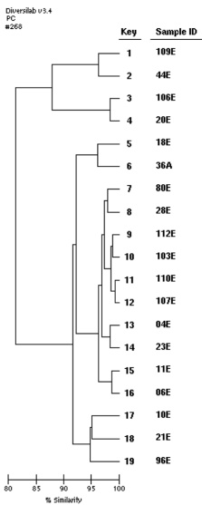

Eur J Clin Microbiol Infect Dis (2016) 35:227–234

231

Table 2 Resistance gene characteristics of ciprofloxacin-resistant  $ E.\ coli $  strains from poultry, their farmers, and patients

<table border=1 style='margin: auto; width: max-content;'><tr><td style='text-align: center;'></td><td colspan="3">Origin of isolates</td><td colspan="3">P</td></tr><tr><td style='text-align: center;'></td><td style='text-align: center;'>Poultry (P) (n=36)</td><td style='text-align: center;'>Farmers (F) (n=4)</td><td style='text-align: center;'>Clinical samples (C) (n=70)</td><td style='text-align: center;'>P vs F</td><td style='text-align: center;'>P vs C</td><td style='text-align: center;'>F vs C</td></tr><tr><td style='text-align: center;'></td><td style='text-align: center;'>n (%)</td><td style='text-align: center;'>n (%)</td><td style='text-align: center;'>n (%)</td><td style='text-align: center;'></td><td style='text-align: center;'></td><td style='text-align: center;'></td></tr><tr><td style='text-align: center;'>ESBL genes</td><td style='text-align: center;'></td><td style='text-align: center;'></td><td style='text-align: center;'></td><td style='text-align: center;'></td><td style='text-align: center;'></td><td style='text-align: center;'></td></tr><tr><td style='text-align: center;'>bla $ _{\text{CTX-M-15}} $</td><td style='text-align: center;'>0 (0)</td><td style='text-align: center;'>0 (0)</td><td style='text-align: center;'>65 (92.8)</td><td style='text-align: center;'>NS</td><td style='text-align: center;'>&lt;0.001</td><td style='text-align: center;'>&lt;0.001</td></tr><tr><td style='text-align: center;'>bla $ _{\text{TEM-24}} $</td><td style='text-align: center;'>0 (0)</td><td style='text-align: center;'>0 (0)</td><td style='text-align: center;'>0 (0)</td><td style='text-align: center;'>NS</td><td style='text-align: center;'>NS</td><td style='text-align: center;'>NS</td></tr><tr><td style='text-align: center;'>bla $ _{\text{TEM-3}} $</td><td style='text-align: center;'>0 (0)</td><td style='text-align: center;'>0 (0)</td><td style='text-align: center;'>0 (0)</td><td style='text-align: center;'>NS</td><td style='text-align: center;'>NS</td><td style='text-align: center;'>NS</td></tr><tr><td style='text-align: center;'>Carbapenemase genes</td><td style='text-align: center;'></td><td style='text-align: center;'></td><td style='text-align: center;'></td><td style='text-align: center;'></td><td style='text-align: center;'></td><td style='text-align: center;'></td></tr><tr><td style='text-align: center;'>bla $ _{\text{OXA-48}} $</td><td style='text-align: center;'>0 (0)</td><td style='text-align: center;'>0 (0)</td><td style='text-align: center;'>1 (1.4)</td><td style='text-align: center;'>NS</td><td style='text-align: center;'>NS</td><td style='text-align: center;'>NS</td></tr><tr><td style='text-align: center;'>PMQR genes</td><td style='text-align: center;'></td><td style='text-align: center;'></td><td style='text-align: center;'></td><td style='text-align: center;'></td><td style='text-align: center;'></td><td style='text-align: center;'></td></tr><tr><td style='text-align: center;'>qnrA</td><td style='text-align: center;'>0 (0)</td><td style='text-align: center;'>0 (0)</td><td style='text-align: center;'>0 (0)</td><td style='text-align: center;'>NS</td><td style='text-align: center;'>NS</td><td style='text-align: center;'>NS</td></tr><tr><td style='text-align: center;'>qnrB</td><td style='text-align: center;'>0 (0)</td><td style='text-align: center;'>0 (0)</td><td style='text-align: center;'>5 (7.1)</td><td style='text-align: center;'>NS</td><td style='text-align: center;'>NS</td><td style='text-align: center;'>NS</td></tr><tr><td style='text-align: center;'>qnrS</td><td style='text-align: center;'>0 (0)</td><td style='text-align: center;'>0 (0)</td><td style='text-align: center;'>7 (10)</td><td style='text-align: center;'>NS</td><td style='text-align: center;'>NS</td><td style='text-align: center;'>NS</td></tr><tr><td style='text-align: center;'>qepA</td><td style='text-align: center;'>0 (0)</td><td style='text-align: center;'>0 (0)</td><td style='text-align: center;'>0 (0)</td><td style='text-align: center;'>NS</td><td style='text-align: center;'>NS</td><td style='text-align: center;'>NS</td></tr><tr><td style='text-align: center;'>oqxAB</td><td style='text-align: center;'>0 (0)</td><td style='text-align: center;'>0 (0)</td><td style='text-align: center;'>0 (0)</td><td style='text-align: center;'>NS</td><td style='text-align: center;'>NS</td><td style='text-align: center;'>NS</td></tr><tr><td style='text-align: center;'>aac(6&#x27;)-Ib-cr</td><td style='text-align: center;'>8 (22.2)</td><td style='text-align: center;'>0 (0)</td><td style='text-align: center;'>51 (72.8)</td><td style='text-align: center;'>NS</td><td style='text-align: center;'>&lt;0.001</td><td style='text-align: center;'>&lt;0.001</td></tr><tr><td style='text-align: center;'>Phylogenetic group</td><td style='text-align: center;'></td><td style='text-align: center;'></td><td style='text-align: center;'></td><td style='text-align: center;'></td><td style='text-align: center;'></td><td style='text-align: center;'></td></tr><tr><td style='text-align: center;'>A</td><td style='text-align: center;'>9 (25)</td><td style='text-align: center;'>1 (25)</td><td style='text-align: center;'>17 (24.3)</td><td style='text-align: center;'>NS</td><td style='text-align: center;'>NS</td><td style='text-align: center;'>NS</td></tr><tr><td style='text-align: center;'>B1</td><td style='text-align: center;'>15 (41.6)</td><td style='text-align: center;'>1 (25)</td><td style='text-align: center;'>13 (18.5)</td><td style='text-align: center;'>NS</td><td style='text-align: center;'>NS</td><td style='text-align: center;'>NS</td></tr><tr><td style='text-align: center;'>B2</td><td style='text-align: center;'>1 (2.7)</td><td style='text-align: center;'>0 (0)</td><td style='text-align: center;'>12 (17.1)</td><td style='text-align: center;'>NS</td><td style='text-align: center;'>NS</td><td style='text-align: center;'>NS</td></tr><tr><td style='text-align: center;'>D</td><td style='text-align: center;'>11 (15.7)</td><td style='text-align: center;'>2 (50)</td><td style='text-align: center;'>28 (40)</td><td style='text-align: center;'>NS</td><td style='text-align: center;'>NS</td><td style='text-align: center;'>NS</td></tr><tr><td style='text-align: center;'>O25b-ST131 clone</td><td style='text-align: center;'>0 (0)</td><td style='text-align: center;'>0 (0)</td><td style='text-align: center;'>12 (17.1)</td><td style='text-align: center;'>NS</td><td style='text-align: center;'>0.007</td><td style='text-align: center;'>0.007</td></tr></table>

<table border=1 style='margin: auto; width: max-content;'><tr><td style='text-align: center;'></td><td style='text-align: center;'>Origin</td><td style='text-align: center;'>Year of isolation</td><td style='text-align: center;'>Poultry farm/Hospital ward</td><td style='text-align: center;'>Sample nature</td><td style='text-align: center;'>Phylotype</td><td style='text-align: center;'>Sequence type</td><td style='text-align: center;'>Specific resistance</td></tr><tr><td style='text-align: center;'></td><td style='text-align: center;'>Chicken</td><td style='text-align: center;'>2012</td><td style='text-align: center;'>Poultry farm K</td><td style='text-align: center;'>Droppings D</td><td style='text-align: center;'>ST48</td><td style='text-align: center;'></td><td style='text-align: center;'></td></tr><tr><td style='text-align: center;'></td><td style='text-align: center;'>Human pathogenic</td><td style='text-align: center;'>2012</td><td style='text-align: center;'>General surgery</td><td style='text-align: center;'>Pus D</td><td style='text-align: center;'>ST48</td><td style='text-align: center;'>QnrB</td><td style='text-align: center;'></td></tr><tr><td style='text-align: center;'></td><td style='text-align: center;'>Chicken</td><td style='text-align: center;'>2012</td><td style='text-align: center;'>Poultry farm K</td><td style='text-align: center;'>Droppings D</td><td style='text-align: center;'>ST108</td><td style='text-align: center;'>Aac (6&#x27;)-Ib-cr</td><td style='text-align: center;'></td></tr><tr><td style='text-align: center;'></td><td style='text-align: center;'>Chicken farmer</td><td style='text-align: center;'>2012</td><td style='text-align: center;'>Poultry farm F</td><td style='text-align: center;'>Stools D</td><td style='text-align: center;'>ST108</td><td style='text-align: center;'></td><td style='text-align: center;'></td></tr><tr><td style='text-align: center;'></td><td style='text-align: center;'>Chicken farmer</td><td style='text-align: center;'>2012</td><td style='text-align: center;'>Poultry farm D</td><td style='text-align: center;'>Stools B1</td><td style='text-align: center;'>ST19</td><td style='text-align: center;'></td><td style='text-align: center;'></td></tr><tr><td style='text-align: center;'></td><td style='text-align: center;'>Human pathogenic</td><td style='text-align: center;'>2012</td><td style='text-align: center;'>Pediatrics</td><td style='text-align: center;'>Diarrhea B1</td><td style='text-align: center;'>ST19</td><td style='text-align: center;'>bla_{CTX-M-15}</td><td style='text-align: center;'></td></tr><tr><td style='text-align: center;'></td><td style='text-align: center;'>Human pathogenic</td><td style='text-align: center;'>2012</td><td style='text-align: center;'>Internal medicine</td><td style='text-align: center;'>Urine B1</td><td style='text-align: center;'>ST471</td><td style='text-align: center;'></td><td style='text-align: center;'></td></tr><tr><td style='text-align: center;'></td><td style='text-align: center;'>Human pathogenic</td><td style='text-align: center;'>2011</td><td style='text-align: center;'>Internal medicine</td><td style='text-align: center;'>Pus B1</td><td style='text-align: center;'>ST471</td><td style='text-align: center;'>MDR. Aac (6&#x27;)-Ib-cr</td><td style='text-align: center;'></td></tr><tr><td style='text-align: center;'></td><td style='text-align: center;'>Chicken</td><td style='text-align: center;'>2012</td><td style='text-align: center;'>Poultry farm J</td><td style='text-align: center;'>Droppings B1</td><td style='text-align: center;'>ST471</td><td style='text-align: center;'></td><td style='text-align: center;'></td></tr><tr><td style='text-align: center;'></td><td style='text-align: center;'>Chicken</td><td style='text-align: center;'>2012</td><td style='text-align: center;'>Poultry farm J</td><td style='text-align: center;'>Droppings B1</td><td style='text-align: center;'>ST471</td><td style='text-align: center;'></td><td style='text-align: center;'></td></tr><tr><td style='text-align: center;'></td><td style='text-align: center;'>Chicken</td><td style='text-align: center;'>2012</td><td style='text-align: center;'>Poultry farm J</td><td style='text-align: center;'>Droppings B1</td><td style='text-align: center;'>ST471</td><td style='text-align: center;'></td><td style='text-align: center;'></td></tr><tr><td style='text-align: center;'></td><td style='text-align: center;'>Chicken</td><td style='text-align: center;'>2012</td><td style='text-align: center;'>Poultry farm J</td><td style='text-align: center;'>Droppings B1</td><td style='text-align: center;'>ST471</td><td style='text-align: center;'>Aac (6&#x27;)-Ib-cr</td><td style='text-align: center;'></td></tr><tr><td style='text-align: center;'></td><td style='text-align: center;'>Chicken</td><td style='text-align: center;'>2012</td><td style='text-align: center;'>Poultry farm A</td><td style='text-align: center;'>Droppings B1</td><td style='text-align: center;'>ST471</td><td style='text-align: center;'></td><td style='text-align: center;'></td></tr><tr><td style='text-align: center;'></td><td style='text-align: center;'>Chicken</td><td style='text-align: center;'>2012</td><td style='text-align: center;'>Poultry farm A</td><td style='text-align: center;'>Droppings B1</td><td style='text-align: center;'>ST471</td><td style='text-align: center;'></td><td style='text-align: center;'></td></tr><tr><td style='text-align: center;'></td><td style='text-align: center;'>Chicken</td><td style='text-align: center;'>2012</td><td style='text-align: center;'>Poultry farm C</td><td style='text-align: center;'>Droppings B1</td><td style='text-align: center;'>ST471</td><td style='text-align: center;'></td><td style='text-align: center;'></td></tr><tr><td style='text-align: center;'></td><td style='text-align: center;'>Chicken</td><td style='text-align: center;'>2012</td><td style='text-align: center;'>Poultry farm D</td><td style='text-align: center;'>Droppings B1</td><td style='text-align: center;'>ST471</td><td style='text-align: center;'></td><td style='text-align: center;'></td></tr><tr><td style='text-align: center;'></td><td style='text-align: center;'>Chicken</td><td style='text-align: center;'>2012</td><td style='text-align: center;'>Poultry farm D</td><td style='text-align: center;'>Droppings B1</td><td style='text-align: center;'>ST21</td><td style='text-align: center;'></td><td style='text-align: center;'></td></tr><tr><td style='text-align: center;'></td><td style='text-align: center;'>Chicken</td><td style='text-align: center;'>2012</td><td style='text-align: center;'>Poultry farm D</td><td style='text-align: center;'>Droppings B1</td><td style='text-align: center;'>ST21</td><td style='text-align: center;'></td><td style='text-align: center;'></td></tr><tr><td style='text-align: center;'></td><td style='text-align: center;'>Human pathogenic</td><td style='text-align: center;'>2012</td><td style='text-align: center;'>Internal medicine</td><td style='text-align: center;'>Urine B1</td><td style='text-align: center;'>ST21</td><td style='text-align: center;'>bla_{CTX-M-15}</td><td style='text-align: center;'></td></tr></table>

Fig. 1 DiversiLab dendrogram representing the clonal strains with their corresponding characteristics

