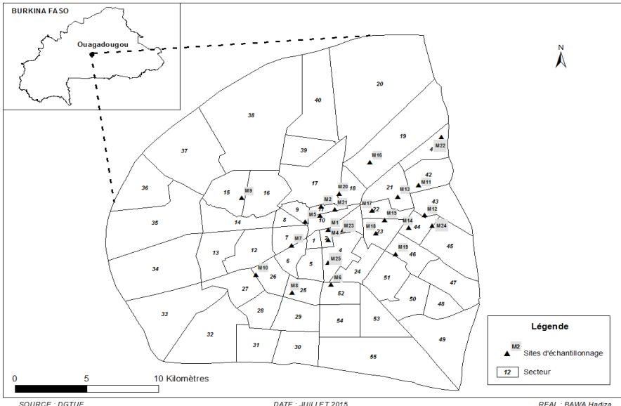

Bawa et al. J. Appl. Biosci. 2015 Antimicrobial susceptibility of Salmonella enterica strains isolated from raw beef, mutton and intestines sold in Ouagadougou, Burkina Faso.

Journal of Applied Biosciences 95:8966 – 8972

ISSN 1997-5902

# Antimicrobial susceptibility of Salmonella enterica strains isolated from raw beef, mutton and intestines sold in Ouagadougou, Burkina Faso.

Bawa I. H $ ^{1} $ , Bsadjo Tchamba G $ ^{1} $ , Bagré T. S $ ^{1} $ , Bouda S. C $ ^{1} $ , Konaté A $ ^{1} $ , Bako E $ ^{1} $ , Kagambèga A $ ^{1,2} $ , Zongo C $ ^{1} $ , Somda M $ ^{1} $ , Savadogo A $ ^{1} $ , Traoré A. S $ ^{1} $ , Barro N $ ^{1} $ .

 $ ^{1} $  Laboratoire de Biologie Moléculaire d'Epidémiologie et de Surveillance des agents Transmissibles par les Aliments (LaBESTA). Centre de Recherche en Sciences Biologiques, Alimentaires et Nutritionnelles (CRSBAN). Université de Ouagadougou, 03 B.P 7021 Ouagadougou 03, Burkina Faso.

 $ ^{2} $  Institut des Sciences, 01 BP 1757 Ouagadougou 01, Burkina Faso.

Corresponding author: Email: hadizabawa@yahoo.fr, Phone (+226) 78 45 78 16

Original submitted in on 8 $ ^{th} $  October 2015. Published online at www.m.elewa.org on 30 $ ^{th} $  November 2015 http://dx.doi.org/10.4314/jab.v95i1.6

## ABSTRACT

Objectives: The aim of this study was to determine the prevalence and antibiotic resistance profile of Salmonella enterica isolated from raw beef, mutton and intestines sold in Ouagadougou; Burkina Faso.

Methodology and Results: A total of 450 samples from raw meat of beef (n=175), mutton (n=175), beef intestine (n=50) and sheep intestine (n=50) were analyzed using standards microbiological method for the detection of Salmonella. The isolates were tested for antibacterial resistance using the agar diffusion method with fourteen commonly used antibiotics. In this study, Salmonella contaminated 19% (86/450) of the samples with 27% (47/175) of beef, 18% (9/50) of beef intestine, 11% (19/175) of mutton and 22% (11/50) of sheep intestine. Salmonella strains isolates were most resistant to tetracycline and cefalotin than other tested antibiotics.

Conclusion and main findings: The high rate of Salmonella strains in animals can pose a major public health risk in Burkina Faso. In addition, the susceptibility test confirms the circulation of antibiotic resistant pathogens in raw meat. Interestingly, these findings indicate a presence of multiresistant strains. The regulation of antibiotics use in animal husbandry is recommended to prevent antibiotic resistance in humans.

Key words: Beef, Mutton, Raw Intestine, Salmonella, Antimicrobial Susceptibility, Burkina Faso.

## I NTRODUCTION

Microbial food safety is an increasing worldwide public health problem (OMS, 2015). Problem of food Safety in the industrialized world differ considerably from those of developing countries where traditional methods of processing and packaging, improper holding temperature, poor personal hygiene of food handlers are still observed during food marketing (Oladipo et al., 2010). The risk of the transmission of zoonotic infections is also associated with the consumption of contaminated meat. Salmonella enterica infections are the second leading cause of bacterial foodborne illness and approximately 95% of cases of human salmonellosis are associated with the consumption of contaminated products such as meat, poultry, eggs, milk, seafood, and fresh produce (OMS, 2013). These infections may cause significant morbidity and mortality both in humans and production animals as well as considerable

8966

Bawa et al. J. Appl. Biosci. 2015 Antimicrobial susceptibility of Salmonella enterica strains isolated from raw beef, mutton and intestines sold in Ouagadougou, Burkina Faso.

economic losses (Fadlalla et al., 2012; Hendriksen et al., 2012). In Burkina Faso, salmonella is considered as a public health concern and is a common source of medical complications (Bonkoungou et al., 2013; Timbiné et al., 2013; Dembélé et al., 2014). The utilization of antimicrobial drugs has played an important role in animal husbandry, since they are used in prophylaxis, treatment and growth promotion (EFSA, 2012). However, their abusive use in human and animals has led to an increase in bacterial resistance among several bacterial strains including Salmonella (Li et al., 2013). The husbandry practices used in the meat industry and the widespread use of medicated feeds in edible intestines operations made meat a major reservoir of antimicrobial-resistant Salmonella (Sodagari et al., 2015). Previous studies showed that Salmonella enterica

## MATERIALS AND METHODS

Study design and sampling: The study was conducted between October 2011 to October 2012, in twenty-five (25) open markets located in Ouagadougou, Burkina Faso (Figure 1). Sampling was done by buying 125g to 500g of beef (175), beef intestine (50), mutton (175) and sheep intestine (50). Samples collected were placed in separate sterile containers and then in ice boxes, transported at 4 °C to the laboratory and processed within two hours. The sampling sites were identified according to the importance and availability of meat.

Identification of Salmonella isolates: Salmonella isolation was conducted according to ISO 6579:2002 (E) methods lightly modified. Briefly, twenty-five grams (25 g) of each sample was mixed in 225 ml of buffered peptone water (Liofilchem, Italy) with a stomacher lab blender 400 (Sewar, England). The suspension of meat was incubated at 37°C for 24 hours. An aliquot (1 ml) of pre-enriched broth was inoculated into 9 ml of Rappaport-Vassiliadis (RV) broth (Liofilchem, Italy) and incubated at 42°C for 24 hours. A loopful of enriched broth was streaked onto Xylose-lysine desoxycholate (XLD) and Hektoen enteric (HEK) (Liofilchem, Italy) agar plate media and incubated at 37°C for 24 hours. All suspected Salmonella colonies were firstly tested for urea, indole, lactose, glucose, citrate metabolism, gas production, mannitol, mobility, oxidase (Bio-Rad, France). Presumed isolated of Salmonella were suspended in physiological saline solution (NaCl, 9 g/L in water) for identification by API 20 E system (BioMerieux, France). The database accessed isolated from meat and several foods is resistant to commonly used antibiotics like amoxicillin/clavulanic acid, aztreonam, cefalotin, ceftriaxone, cefepim, gentamicin, chloramphenicol, tetracycline, nalidixic acid and ciprofloxacin. (Kagambèga et al., 2011; Bagré et al., 2014; Bsadjo Tchamba et al., 2015; Sodagari et al., 2015). Animals are the main source of the resistance of Salmonella to the different antibiotics in treatment of human infections (kagambèga et al., 2013). Antibiotic resistance has been attributed to genetic and environmental factors (Sambe-Ba et al., 2013). In view of the great consumption for beef and mutton in Burkina Faso, this study was conducted to assess the microbial quality of raw meat sold in the local market of Ouagadougou and to determine the antibiotic resistance profile of Salmonella enterica.

from the apiweb $ ^{™} $  software (BioMérieux, France) was used in order to interpret the results.

Antibiotic susceptibility tests: Antibiogram was done onto Mueller-Hinton agar (Liofilchem, Italy) plate media following the standardized disk diffusion method as described by Bauer et al. (1966). Pure colonies of each isolate were suspended in sterile physiological saline solution (NaCl, 9 g/l %) to prepare a suspension at the same turbidity to the 0.5 Mc Farland standards ( $ \sim10^{8} $  UFC/ml) and used to sow the Mueller-Hinton agar plates. A total of 14 Antimicrobials agents (Liofilchem, Italy) were tested: Aminopenicillins (amoxicillin/clavulanic acid, 30  $ \mu $ g); Carboxypenicillins (ticarcillin, 75  $ \mu $ g); Monobactams (aztreonam, 30  $ \mu $ g); Carbapenemes (imipenem, 10  $ \mu $ g); Cephalosporins (cefalotin, 30  $ \mu $ g; cefalexin, 30  $ \mu $ g; cefamandol, 30  $ \mu $ g; ceftriaxone, 30  $ \mu $ g; cefepim, 30  $ \mu $ g); Aminoglucosides (gentamicin, 30  $ \mu $ g); Phenicols (chloramphenicol, 30  $ \mu $ g); Cyclines (tetracycline, 30  $ \mu $ g); Quinolones (nalidixic acid, 30  $ \mu $ g) and Fluoroquinolones (ciprofloxacin, 5  $ \mu $ g). Inhibition diameters of the antibiotics were interpreted according to the European Committee on Antimicrobial Susceptibility Instructions (EUCAST, 2014).

Statistical analysis: Epi-Info version 3.5.1 software was used to calculate the prevalence and MedCalc 11.0.1.0 to determine p value of the various parameters. Any p value < 0.05 was considered as statistically significant.

8967

Bawa et al. J. Appl. Biosci. 2015 Antimicrobial susceptibility of Salmonella enterica strains isolated from raw beef, mutton and intestines sold in Ouagadougou, Burkina Faso.

Figure 1: Sampling sites in Ouagadougou/Burkina Faso

## RESULTS

In this study, out of 450 samples collected, 86 (19%) were contaminated by Salmonella spp (Table 1). Salmonella were found in 27% (47/175), 18% (9/50), 11% (19/175) and 22% (11/50) respectively of beef, beef intestine, mutton and sheep intestine.

Table 2: Antimicrobial resistance of Salmonella enterica spp

<table border=1 style='margin: auto; width: max-content;'><tr><td style='text-align: center;'>Source of meat sample</td><td style='text-align: center;'>Prevalence of Salmonella enterica</td></tr><tr><td style='text-align: center;'>Beef (n = 175)</td><td style='text-align: center;'>47 (27%)</td></tr><tr><td style='text-align: center;'>Beef intestine (n = 50)</td><td style='text-align: center;'>9 (18%)</td></tr><tr><td style='text-align: center;'>Mutton (n = 175)</td><td style='text-align: center;'>19 (11%)</td></tr><tr><td style='text-align: center;'>Sheep intestine (n = 50)</td><td style='text-align: center;'>11 (22%)</td></tr><tr><td style='text-align: center;'>Total (n = 450)</td><td style='text-align: center;'>86 (19%)</td></tr></table>

%= percentage, n= number

The antibiotic susceptibility test showed resistant Salmonella strains. Of the 86 Salmonella spp isolated in beef meat and mutton, 36% and 47% were respectively resistant to at least three or more families of antibiotics (Table 2). Overall resistance was most frequently observed to tetracycline and cefalotin respectively 91% and 60% in beef and 95% and 74% respectively in mutton. Low resistance between 30% and 2% in beef and between 42% and 5% in mutton were observed for other antibiotics tested. In addition, strains of Salmonella isolated in intestine products resist only to tetracycline (78%) and cefalotin (56%) for beef intestine and (73%) to tetracycline for sheep intestine (Table 2).

8968

Bawa et al. J. Appl. Biosci. 2015 Antimicrobial susceptibility of Salmonella enterica strains isolated from raw beef, mutton and intestines sold in Ouagadougou, Burkina Faso.

Table 2: Antimicrobial resistance of Salmonella enterica spp

<table border=1 style='margin: auto; width: max-content;'><tr><td rowspan="2">Antibiotics</td><td colspan="5">Number of isolates resistant in different samples of meat</td></tr><tr><td style='text-align: center;'>Beef (n=47)</td><td style='text-align: center;'>Beef intestine (n=9)</td><td style='text-align: center;'>Mutton (n=19)</td><td style='text-align: center;'>Sheep intestine</td><td style='text-align: center;'>(n=11)</td></tr><tr><td style='text-align: center;'>Amoxicillin/clavulanate</td><td style='text-align: center;'>10(21%)</td><td style='text-align: center;'>-</td><td style='text-align: center;'>8 (42%)</td><td style='text-align: center;'>-</td><td style='text-align: center;'></td></tr><tr><td style='text-align: center;'>Aztreonam</td><td style='text-align: center;'>4(9%)</td><td style='text-align: center;'>-</td><td style='text-align: center;'>-</td><td style='text-align: center;'>-</td><td style='text-align: center;'></td></tr><tr><td style='text-align: center;'>Cefalotin</td><td style='text-align: center;'>28(60%)</td><td style='text-align: center;'>5(56%)</td><td style='text-align: center;'>14(74%)</td><td style='text-align: center;'>-</td><td style='text-align: center;'></td></tr><tr><td style='text-align: center;'>Cefamandol</td><td style='text-align: center;'>7(15%)</td><td style='text-align: center;'>-</td><td style='text-align: center;'>5 (26%)</td><td style='text-align: center;'>-</td><td style='text-align: center;'></td></tr><tr><td style='text-align: center;'>Cefepim</td><td style='text-align: center;'>-</td><td style='text-align: center;'>-</td><td style='text-align: center;'>-</td><td style='text-align: center;'>-</td><td style='text-align: center;'></td></tr><tr><td style='text-align: center;'>Ceftriaxone</td><td style='text-align: center;'>3 (6%)</td><td style='text-align: center;'>-</td><td style='text-align: center;'>-</td><td style='text-align: center;'>-</td><td style='text-align: center;'></td></tr><tr><td style='text-align: center;'>Cefalexin</td><td style='text-align: center;'>7(14%)</td><td style='text-align: center;'>-</td><td style='text-align: center;'>8(42%)</td><td style='text-align: center;'>-</td><td style='text-align: center;'></td></tr><tr><td style='text-align: center;'>Chloramphenicol</td><td style='text-align: center;'>1(2%)</td><td style='text-align: center;'>-</td><td style='text-align: center;'>1(5%)</td><td style='text-align: center;'>-</td><td style='text-align: center;'></td></tr><tr><td style='text-align: center;'>Ciprofloxacin</td><td style='text-align: center;'>-</td><td style='text-align: center;'>-</td><td style='text-align: center;'>-</td><td style='text-align: center;'>-</td><td style='text-align: center;'></td></tr><tr><td style='text-align: center;'>Gentamicin</td><td style='text-align: center;'>14(30%)</td><td style='text-align: center;'>-</td><td style='text-align: center;'>7 (37%)</td><td style='text-align: center;'>-</td><td style='text-align: center;'></td></tr><tr><td style='text-align: center;'>Imipenem</td><td style='text-align: center;'>-</td><td style='text-align: center;'>-</td><td style='text-align: center;'>-</td><td style='text-align: center;'>-</td><td style='text-align: center;'></td></tr><tr><td style='text-align: center;'>Nalidixic acid</td><td style='text-align: center;'>11(23%)</td><td style='text-align: center;'>-</td><td style='text-align: center;'>6 (32%)</td><td style='text-align: center;'>-</td><td style='text-align: center;'></td></tr><tr><td style='text-align: center;'>Tetracycline</td><td style='text-align: center;'>43(91%)</td><td style='text-align: center;'>7 (78%)</td><td style='text-align: center;'>18 (95%)</td><td style='text-align: center;'>8 (73%)</td><td style='text-align: center;'></td></tr><tr><td style='text-align: center;'>Ticarcillin</td><td style='text-align: center;'>1(2%)</td><td style='text-align: center;'>-</td><td style='text-align: center;'>-</td><td style='text-align: center;'>-</td><td style='text-align: center;'></td></tr><tr><td style='text-align: center;'>Number of Multiresistant</td><td style='text-align: center;'>17(36%)</td><td style='text-align: center;'>0</td><td style='text-align: center;'>9(47%)</td><td style='text-align: center;'>0</td><td style='text-align: center;'></td></tr></table>

= no resistance,%= percentage

## DISCUSSION

The present study evaluated the microbial quality of raw meat sold in different markets of Ouagadougou. This finding detected the prevalence of (19%) for Salmonella spp. in beef, mutton and intestines raw meats slaughtered for human consumption in Burkina Faso. Previous study in Nigeria, Burkina Faso, Brazil and Iran were found that raw meat of beef and chicken sold in open market were contaminated respectively by 9%, 29%, 29% and 19% of Salmonella (Iroha et al., 2011; Kagambèga et al., 2011; Carvalho et al., 2013; Sodagari et al., 2015). Rate of Salmonella reported in beef (27%) are higher than mutton (11%) (p = 0.0150). As far as intestines are concerned, the proportions of Salmonella are lower in beef intestine (18%) than sheep intestine (22%) (p = 0.635). The incidence of Salmonella in meats products obtained by other authors varied between 0 and 100% in Russia, Burkina Faso, China and Iran (Alali et al., 2012; Kagambèga et al., 2013; Li et al., 2013; Zhu et al., 2014; Sodagari et al., 2015). The presence of these organisms in food animals and in raw meat products has relevant public health implications (Tassew et al., 2010). In Burkina Faso, in 2011, study conducted by Kagambèga et al., (2011); showed a high level of Salmonella 29%; where as in this study, Salmonella was found at 19%. As observed in this study, the reasons for the higher incidence of Salmonella contamination can be due to the widespread habit of raw meat treatment, the common factors such as overcrowding, poverty, inadequate sanitary conditions, and poor general hygiene.

(Kagambëga et al., 2011; Abd el-Aziz, 2013). Also, it was observed that Salmonella was most prevalent in beef. All previous studies showed that Salmonella was widely distributed in retail meat globally, which increased salmonellosis following consumption of contaminated meat or cross-contamination. In Burkina Faso, sheep and others animals were mostly roam freely at pasture in the bush (Kagambëga et al., 2013). The risk of contamination may be higher if beef meat or mutton is consumed undercooked (Sodagari et al., 2015). The prevalence may be based by diversity in sampling methods, sampling seasons and techniques (Li et al., 2013). However, some variations may be due to several factors, sanitation within the slaughterhouse, and the cross-contamination of carcasses by contact with intestinal tracts during slaughter or processing and differences among isolation methods applied to detect Salmonella (Rahimi, 2012; Kagambëga et al., 2013). The high level of contamination of meat and intestine with Salmonella observed in this study indicates the need for an improvement in the microbiological quality of meat. There is also a need for a comprehensive epidemiological study and control of Salmonella contamination at various levels of meat production in Burkina Faso. Resistance rates of Salmonella are varied from animals' sample. The Salmonella resistance rates to ticarcillin, tetracycline and cefalotin found in this study was higher than resistance rates to others antimicrobials because of the overuse of these antimicrobials for treatment and growth promotion.

8969

Bawa et al. J. Appl. Biosci. 2015 Antimicrobial susceptibility of Salmonella enterica strains isolated from raw beef, mutton and intestines sold in Ouagadougou, Burkina Faso.

in different fields. The resistance to tetracycline obtained is higher than those reported in Ethiopia, Sudan and China in raw meats (Tassew et al., 2010; Fadlalla et al., 2012; Li et al., 2013). In this study, results on intestines strains are similar with the study done in Ivory Coast, Nigeria and Iran (Coulibaly et al., 2010; Iroha et al., 2011; Sodagari et al., 2015). This suggests a potential health risk due to consumption of meat. Such risks can be minimized by avoiding poor handling and raising the awareness of food handlers. The results of this study have disclosed two public health problems; the presence of resistant Salmonella strains in the possibility of Salmonella human infections through the consumption of contaminated food, and the isolation of antibiotic-resistant strains might suggest the use of drugs in that animal's environment. The occurrence of antibiotic-resistant strains of a number of pathogenic bacteria especially Salmonella in foods has caused great concern in relation to public health (Carlvalho et al., 2013). While the antibiotics use has been proven an effective means for the prevention and control of Salmonella infection, their abusive use can have adverse consequences by promoting the selection and prevalence of drug-resistant microbial populations (Li

## CONCLUSION

This study shows the degree of contamination by salmonella enterica in raw meat sold in the open market of Ouagadougou, Burkina Faso. Of the samples analyzed, almost all of the meat was contaminated by this enteropathogen. In addition, several Salmonella strains

Conflict of Interests: The authors declare that there is no conflict of interests regarding the publication of this paper.

