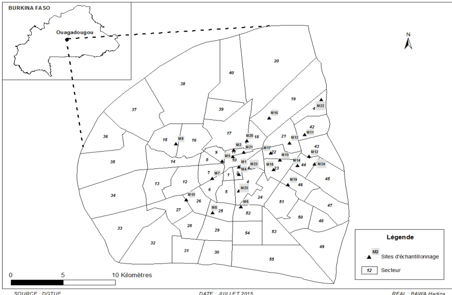

Figure 1: Sampling sites in Ouagadougou/Burkina Faso

## RESULTS

In this study, out of 450 samples collected, 86 (19%) were contaminated by Salmonella spp (Table 1). Salmonella were found in 27% (47/175), 18% (9/50), 11% (19/175) and 22% (11/50) respectively of beef, beef intestine, mutton and sheep intestine.

Table 2: Antimicrobial resistance of Salmonella enterica spp

<table><tr><td>Source of meat sample</td><td>Prevalence of Salmonella enterica</td></tr><tr><td>Beef (n = 175)</td><td>47 (27%)</td></tr><tr><td>Beef intestine (n = 50)</td><td>9 (18%)</td></tr><tr><td>Mutton (n = 175)</td><td>19 (11%)</td></tr><tr><td>Sheep intestine (n = 50)</td><td>11 (22%)</td></tr><tr><td>Total (n = 450)</td><td>86 (19%)</td></tr></table>

%= percentage, n= number

The antibiotic susceptibility test showed resistant Salmonella strains. Of the 86 Salmonella spp isolated in beef meat and mutton, 36% and 47% were respectively resistant to at least three or more families of antibiotics (Table 2). Overall resistance was most frequently observed to tetracycline and cefalotin respectively 91% and 60% in beef and 95% and 74% respectively in mutton. Low resistance between 30% and 2% in beef and between 42% and 5% in mutton were observed for other antibiotics tested. In addition, strains of Salmonella isolated in intestine products resist only to tetracycline (78%) and cefalotin (56%) for beef intestine and (73%) to tetracycline for sheep intestine (Table 2).

