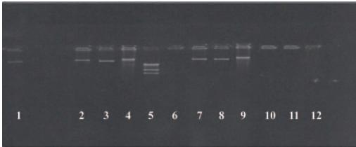

# PROCESSING, PRODUCTS, AND FOOD SAFETY

# Antimicrobial resistance of 100 Salmonella strains isolated from Gallus gallus in 4 wilayas of Algeria

S. Bounar-Kechih, $ ^{*} $  T. M. Hamdi, $ ^{\dagger1} $  L. Mezali, $ ^{\dagger} $  F. Assaous, $ ^{\ddagger} $  and K. Rahal $ ^{\ddagger} $ 

 $ ^{*} $ Regional Veterinary Laboratory of Draa Ben Khedda, 15100 Tizi-Ouzou, Algeria;  $ \dagger $ High National Veterinary School of Algiers, BP 161, El-Harrach, 16200 Algiers, Algeria; and  $ \ddagger $ Bacteriology and antibiotherapy department, Institut Pasteur of Algeria, Route du petit Staouéli, Dely-Brahim, 16320 Algiers, Algeria

## ABSTRACT
 This study aims at identifying serotypes and surveying the antimicrobial resistance and plasmid support of resistance of 100 Salmonella strains, which were isolated from 96 out of 506 (18.97%) samples taken from different production farms in the wilayah (i.e., Algerian states) of Tizi-Ouzou, Bouira, Bejaia, and Boumerdes in 2007. The highest percentage of Salmonella (48%) was recorded in Bouira. Thirteen serotypes were identified among the 100 Salmonella strains used in this study. The most prevalent ones were Salmonella Heidelberg (24%), Salmonella Enteritidis (20%), Salmonella Albany (16%), and Salmonella Typhimurium (9%). The strains showed resistance to 8 of the 34 antibiotics tested. Fifty-three percent of strains were resistant to at least one antibiotic, among which 15.09% were multiresistant. The most frequently observed resistance was to quinolones (58.49%), with a contribution

of 94.74% of Salmonella Heidelberg resistant strains. The plasmid transfer performed on 53 strains showed that only 11 exhibited one or more markers of resistance, the most frequent being ampicillin, followed by tetracycline, then cotrimoxazole, sulphonamides, and kanamycin, in that order. The tetracycline characteristics were present in 72.72% of transconjugants, those of the  $ \beta $ -lactams and sulphonamides in 27.27% each and those of the aminosides in 9.09%. The incompatibility groups of plasmids belong to the F1me and Com1 classes, and the molecular weight of the plasmid DNA was greater than 100 kb. The phenotypic and genotypic results indicate a clonal dissemination in the Gallus gallus species in this particular study; this phenomenon could generate resistant bacteria and transferable genes of resistance to humans.

Key words: Salmonella, Gallus gallus, antimicrobial resistance profile, plasmid profile, incompatibility group

## I NTRODUCTION

The production and consumption of poultry has increased considerably worldwide. Poultry production has left the farmyard and is now industrialized and conducted in a more rational manner (Delpech, 1992). In Algeria, since the 1980s, the emergence of the poultry industries increased the consumption of animal proteins at a much affordable cost (Ferrah et al., 2003). Poultry represents one of the main reservoirs of Salmonella that are responsible for a major zoonosis with serious economic and public health consequences (Brisabois, 2001). Antimicrobial agents played a dominant role for the treatment and the control of the salmonellosis. Their overconsumption contributed to the emergence of resistances. In fact, despite the decrease of salmonellosis incidence in the world, multiresistant strains

2012 Poultry Science 91:1179–1185 http://dx.doi.org/10.3382/ps.2011-01620

appeared in humans and became increasingly alarming in both industrialized and developing countries (Brisabois, 2001). The surveillance of the current bacterial resistances should not be exclusively based on the determination of the resistant phenotypes. The genetic characterization by conjugation is currently the most used tool in Algeria to better understand the spread of antibiotic resistance in zoonotic bacteria, until the introduction of molecular biology techniques.

Our objectives were the phenotypic characterization of 100 Salmonella strains by determining the circulating serotypes in the study's area, the antimicrobial resistance profiles, as well as the genotypic characterization.

## MATERIALS AND METHODS

## Sampling

As part of official control of poultry in 4 wilayas of Algeria, from January to December 2007, 100 Salmonella strains were isolated from 506 avian samples during autopsies of slain live subjects. This was conducted

©2012 Poultry Science Association Inc.

Received May 19, 2011.

Accepted January 29, 2012.

 $ ^{1} $ Corresponding author: moussahamdi@hotmail.com

1179

1180

BOUNAR-KECHIH ET AL.

at the medical bacteriology department of the Regional Veterinary Laboratory of Draa-Ben-Khedda.

## I solation and Identification of Salmonella Strains

The NF U 47–100/2007 (Afnor, 2007) standard method was adopted for the isolation and the biochemical and serological identification of Salmonella. The serotyping was carried out at the enterobacteria service of the Institut Pasteur of Algeria, using Salmonella antiserums anti-O and anti-H (BioMérieux, Marcy l'Etoile, France).

## Antimicrobial Sensitivity Testing

The phenotypic study of the antimicrobial resistance was performed at the Bacteriology and Antibiotherapy Department of the Institut Pasteur of Algeria. Thirty-four antimicrobial agents of 9 different chemical classes were used: ampicillin (10  $ \mu $ g), amoxicillin/clavulanic acid (20  $ \mu $ g/10  $ \mu $ g), mecillinam (10  $ \mu $ g), ticarillin (75  $ \mu $ g), piperacillin (100  $ \mu $ g), latamoxef (30  $ \mu $ g), imepenem (10  $ \mu $ g), aztreonam (30  $ \mu $ g), cefazolin (30  $ \mu $ g), cefalexin (30  $ \mu $ g), cefoxitin (30  $ \mu $ g), ceftazidim (30  $ \mu $ g), cefepim (30  $ \mu $ g), cefuroxim (30  $ \mu $ g), cefotaxim (30  $ \mu $ g), to ceftiofur (30  $ \mu $ g), cephalotin (30  $ \mu $ g), gentamicin (10  $ \mu $ g), amikacin (30  $ \mu $ g), netilmicin (30  $ \mu $ g), kanamycin (30  $ \mu $ g), isepamicin (30  $ \mu $ g), nitrofurantoin (300  $ \mu $ g), nalidixic acid (30  $ \mu $ g), ciprofloxacin (5  $ \mu $ g), enrofloxacin (5  $ \mu $ g), levofloxacin (5  $ \mu $ g), tetracyclines (30  $ \mu $ g), chloramphenicol (30  $ \mu $ g), sulphonamides (300  $ \mu $ g), trimethoprim (5  $ \mu $ g), trimethoprim/sulfamethoxazole (1.25  $ \mu $ g/23.75  $ \mu $ g), colistin (10  $ \mu $ g), and fosfomycin (200  $ \mu $ g; Bio-Rad, Hercules, CA). Micrograms indicate the antibiotic load in one disk; the unit of this load (expressed in micrograms) for each antibiotic used for each bacterial species is specified by the supplier (Bio-Rad). The minimum inhibitory concentration was established using the E-test (AB-Biodisk). Escherichia coli ATCC 25922 (Institut Pasteur Paris, Paris, France) was used for the control antibiograms. The method adopted for the study of the antimicrobial resistance is based on the diffusion in Mueller-Hinton agar media as described by Kirby-Bauer and interpreted according to the Clinical Laboratory Standards Institute (CLSI, 2001) guidelines, which are recommended by the World Health Organization (WHO, 1999). In our study, the multiresistant strains are the ones that confer a resistance to 2 or more antimicrobials. The study of genetic support required the use of antimicrobial powders: tetracycline (Sigma, Woodstock, VA), nalidixic acid (Serva, Heidelberg, Germany), rifampicin (Life-pharmacy, Tuen Mun, Hong Kong, China), nitrofurantoin (Saidal, Annaba, Algeria), kanamycin (Bristol-Meyers Squibb, New York, NY), trimethoprim (Roche, Basel, Switzerland), injectable sodic ampicillin (Biopharm, Bothell, WA), chloramphenicol sodic ampicillin (Serva Peinbiochemica). Also, several reference strains and plasmids

were used (Institut Pasteur Paris): Escherichia coli K12Nal (nalidixic acid resistance) and Escherichia coli C600Rif (rifampicin resistance) for the plasmid transfer by conjugation and Com1 (K) Rif, Com1 PPED 178 (ACTp) Rif, F1me PPED 181/4(T) Nal, and F1me PPED 181/3(CTp) Rif for the compatibility test, as well as the DNA of the  $ \lambda $  phage digested by the Hind III enzyme as a reference to determine the size of the plasmids. The genetic transfer by conjugation that was used for the detection of plasmids carrying the resistance characters was described by Courvalin et al. (1985). After streaking on agar bromocresol purple and 18 to 24 h of incubation at 35°C, a colony of the studied donor strain and that of the recipient reference strain were individually inoculated in buffered glucose broth. After shaking for 4 h in a water bath at 35°C, 1 mL of each culture was mixed with a rake on Mueller-Hinton agar and incubated for 18 h at 35°C. One milliliter of buffered glucose broth was added, and then the supernatant was recovered after mixing. Moreover, 1 mL of an antibiotic for the suspected plasmidic character for the donor strain and 1 mL of another antibiotic for the suspected chromosomal character for the receiving strain were added to 18 mL of Mueller-Hinton agar. The final concentrations of the antibiotics used are Furans, 300  $ \mu $ g/mL; TCY, 33  $ \mu $ g/mL; ampicillin, 200  $ \mu $ g/mL; kanamycin, 25  $ \mu $ g/mL; Nal, 100  $ \mu $ g/mL; TMP, 20  $ \mu $ g/mL; CCC, 25  $ \mu $ g/mL. A quarter of a Petri dish was seeded in lines by the 2 strains and the 3/4 remaining were streaked by the supernatant (mixture of these 2 strains). After 18 h of incubation at 35°C, the appearance of colonies on the part inoculated with the supernatant indicates the presence of the transconjugants.

The resulting transconjugants were tested to determine their resistance profiles and therefore their transferable characteristics. To determine the major incompatibility groups of plasmids the used test was the same as for the genetic transfer; it required a cross between a transconjugant and E. coli carrying a plasmid reference. The plasmids were extracted from the transferred strains and their transconjugants, using the alkaline lyse technique (Kado and Liu, 1981), and the plasmid profiles were determined by separating the plasmids extracted on agarose gel.

## RESULTS

Nineteen percent of the total samples were positive for Salmonella. The distribution of Salmonella per wilaya showed 48% of cases from Bouira, 21% from Bejaïa, 16% from Boumerdes, and 15% from Tizi-Ouzou. Thirteen different serotypes were identified, among which Salmonella Heidelberg was the most prevalent (24%). Salmonella Heidelberg, Salmonella Enteritidis, Salmonella Albany, Salmonella Infantis, Salmonella Blockley, and Salmonella Livingstone were present in all the wilayas. Besides, Salmonella Enteritidis prevailed in Bouira, Salmonella Albany in Bejaïa and Tizi-Ouzou, and Salmonella Heidelberg in Boumerdes (Table 1).

ANTIBIOGRAM AND PLASMID PROFILES OF SALMONELLA

1181

The study of the antimicrobial resistance performed on 100 Salmonella strains revealed a resistance to 8 of them from 6 different classes. Fifty-three percent of the strains showed resistance to at least one antimicrobial, among which 15.09% were multiresistant. Forty-seven percent of strains were susceptible to all antimicrobials tested. The resistance to quinolones was the most frequent (58.49%) and included 94.74% of the resistant strains of the prevalent serotype in our study (Table 2). The plasmid transfer assay was performed on 53 strains with resistance to  $ \beta $ -lactams (4%), aminoglycosides (2%), tetracyclines (15%), sulphonamides (13%), nitrofurans (19%), and to quinolones (47%). In total, 11 strains have transferred one or several resistance markers, of which the most frequent were ampicillin, tetracycline, cotrimoxazole, sulphonamides, and kanamycin. The tetracycline character was present in 72.72% of transconjugants, those of the sulphonamides and  $ \beta $ -lactams in 27.27% each, and that of the aminoglycosides in 9.09%. The compatibility test revealed incompatibility groups of plasmids in Com1 and F1me classes (Table 3). The plasmid DNA analysis resulted in a molecular weight that is greater than 100 kb (Figure 1).

## DISCUSSION

## Geographical Distribution of Salmonella Serotypes

Bouira was characterized by the most important number of isolated strains because most avian samples were from this region, which has more than one-thousand poultry farms. Salmonella Heidelberg prevailed in our study. Our results were supported by the study of Barnhart et al. (1991) in Northern Ireland, on 42 poultry samples (56.5%), and that of Mammina et al. (2003) in Italy, on laying hens and the environment of chicken farms (20.3%). Whereas in a national study, Salmonella Heidelberg represents only 1.81% (Elgroud et al., 2009). This serotype is among the 3 most common cases of human salmonellosis in Canada and one of the 5 most prevalent in the USA, according to the Canadian integrated program for monitoring of the antimicrobial resistance (PICRA, 2006). According to this program, international comparisons of human data from 2000 to 2004 indicated that Salmonella Heidelberg was more common in North America, whereas Mammina et al. (2003) have shown that this serotype was responsible for only a small proportion of human infection in Italy. According to Usera et al. (1999) and the report of the European Community (EFSA, 2007), Salmonella Enteritidis was the most frequently reported, with prevalences of 46.1 and 42%, respectively, and these are higher than those we have recorded. Our present result is higher than that recorded by Elgroud et al. (2008; 3.63%). The isolation frequency of Salmonella Infantis and Salmonella Albany was comparable to that given in Austria by Berghold and Kornschober (2002). Similarly, the rate that we recorded for Salmonella Typhimurium was comparable to that reported by Elgroud et al. (2009) and by Van Immerseel et al. (2005) in poultry farms in Europe between 1991 and 2000 but higher than that noted by these same authors in 2003. The registered prevalence for Salmonella Blockley was lower than that found in Saudi Arabia (al-Nakhli et al., 1999). Salmonella Hadar, identified in 5% of our strains, was the predominant serotype in Italy (Uyttendaele et al., 1998) and Senegal (Cardinale et al., 2005). Salmonella Pullorum, which has no impact on public health, as related to host species has been eradicated from poultry farms in several developed countries, such as the USA and Canada. The declaration of pullorosis in our farms could cause major economic losses, such as those observed from the thirties to the sixties (Villate, 2001). In our study, Salmonella Newport and Salmonella Montevideo were isolated with a very low prevalence. These results are corroborated by the study of Elgroud

Table 1. Distribution of Salmonella serotypes isolated from Gallus gallus on 4 wilayas of the center of Algeria $ ^{1} $ 

<table border=1 style='margin: auto; width: max-content;'><tr><td rowspan="2">Salmonella serotype</td><td colspan="4">Wilaya (n) $ ^{2} $</td><td rowspan="2">Total (%)</td></tr><tr><td style='text-align: center;'>Bouira</td><td style='text-align: center;'>Bejaïa</td><td style='text-align: center;'>Boumerdès</td><td style='text-align: center;'>Tizi-Ouzou</td></tr><tr><td style='text-align: center;'>Heidelberg</td><td style='text-align: center;'>9</td><td style='text-align: center;'>4</td><td style='text-align: center;'>8</td><td style='text-align: center;'>3</td><td style='text-align: center;'>24</td></tr><tr><td style='text-align: center;'>Enteritidis</td><td style='text-align: center;'>15</td><td style='text-align: center;'>2</td><td style='text-align: center;'>1</td><td style='text-align: center;'>2</td><td style='text-align: center;'>20</td></tr><tr><td style='text-align: center;'>Albany</td><td style='text-align: center;'>5</td><td style='text-align: center;'>6</td><td style='text-align: center;'>1</td><td style='text-align: center;'>4</td><td style='text-align: center;'>16</td></tr><tr><td style='text-align: center;'>Typhimurium</td><td style='text-align: center;'>7</td><td style='text-align: center;'>2</td><td style='text-align: center;'>0</td><td style='text-align: center;'>0</td><td style='text-align: center;'>9</td></tr><tr><td style='text-align: center;'>Blockley</td><td style='text-align: center;'>3</td><td style='text-align: center;'>1</td><td style='text-align: center;'>1</td><td style='text-align: center;'>1</td><td style='text-align: center;'>6</td></tr><tr><td style='text-align: center;'>Infantis</td><td style='text-align: center;'>1</td><td style='text-align: center;'>3</td><td style='text-align: center;'>1</td><td style='text-align: center;'>1</td><td style='text-align: center;'>6</td></tr><tr><td style='text-align: center;'>Hadar</td><td style='text-align: center;'>3</td><td style='text-align: center;'>1</td><td style='text-align: center;'>1</td><td style='text-align: center;'>0</td><td style='text-align: center;'>5</td></tr><tr><td style='text-align: center;'>Livingstone</td><td style='text-align: center;'>1</td><td style='text-align: center;'>1</td><td style='text-align: center;'>1</td><td style='text-align: center;'>2</td><td style='text-align: center;'>5</td></tr><tr><td style='text-align: center;'>Pullorum</td><td style='text-align: center;'>2</td><td style='text-align: center;'>0</td><td style='text-align: center;'>1</td><td style='text-align: center;'>1</td><td style='text-align: center;'>4</td></tr><tr><td style='text-align: center;'>Indiana</td><td style='text-align: center;'>1</td><td style='text-align: center;'>1</td><td style='text-align: center;'>0</td><td style='text-align: center;'>0</td><td style='text-align: center;'>2</td></tr><tr><td style='text-align: center;'>Kedougou</td><td style='text-align: center;'>0</td><td style='text-align: center;'>0</td><td style='text-align: center;'>1</td><td style='text-align: center;'>0</td><td style='text-align: center;'>1</td></tr><tr><td style='text-align: center;'>Newport</td><td style='text-align: center;'>0</td><td style='text-align: center;'>0</td><td style='text-align: center;'>0</td><td style='text-align: center;'>1</td><td style='text-align: center;'>1</td></tr><tr><td style='text-align: center;'>Montevideo</td><td style='text-align: center;'>1</td><td style='text-align: center;'>0</td><td style='text-align: center;'>0</td><td style='text-align: center;'>0</td><td style='text-align: center;'>1</td></tr><tr><td style='text-align: center;'>Total (%)</td><td style='text-align: center;'>48</td><td style='text-align: center;'>21</td><td style='text-align: center;'>16</td><td style='text-align: center;'>15</td><td style='text-align: center;'>100</td></tr></table>

 $ ^{1} $ Bold numbers indicate the strains by serotype that prevailed in each wilaya.

 $ ^{2}n= $  number of serotypes.

1182

BOUNAR-KECHIH ET AL.

Table 2. Rates and antimicrobial resistance profiles of Salmonella strains isolated from Gallus gallus

 $ ^{3} $ AMP: ampicillin; K: kanamycin; FT: nitrofurantoin; NAL: nalidixic acid; TCY: tetracycline; SSS: sulphonamides, TMP: trimethoprim, SXT: cotrimoxazole.

<table border=1 style='margin: auto; width: max-content;'><tr><td rowspan="2">Salmonella serotype</td><td rowspan="2">n1¹</td><td style='text-align: center;'>β-Lactam</td><td style='text-align: center;'>Aminoglycoside</td><td style='text-align: center;'>Furan</td><td style='text-align: center;'>Quinolone</td><td style='text-align: center;'>Cycline</td><td colspan="3">Sulphonamide</td><td rowspan="2">n2²</td><td rowspan="2">Resistance profile³</td></tr><tr><td style='text-align: center;'>AMP</td><td style='text-align: center;'>K</td><td style='text-align: center;'>FT</td><td style='text-align: center;'>NAL</td><td style='text-align: center;'>TCY</td><td style='text-align: center;'>SSS</td><td style='text-align: center;'>TMP</td><td style='text-align: center;'>SXT</td></tr><tr><td rowspan="3">Heidelberg</td><td rowspan="3">19/24</td><td style='text-align: center;'>1</td><td style='text-align: center;'>0</td><td style='text-align: center;'>0</td><td style='text-align: center;'>1</td><td style='text-align: center;'>1</td><td style='text-align: center;'>0</td><td style='text-align: center;'>0</td><td style='text-align: center;'>0</td><td style='text-align: center;'>1</td><td style='text-align: center;'>AMP, TCY</td></tr><tr><td style='text-align: center;'>0</td><td style='text-align: center;'>0</td><td style='text-align: center;'>0</td><td style='text-align: center;'>0</td><td style='text-align: center;'>1</td><td style='text-align: center;'>0</td><td style='text-align: center;'>0</td><td style='text-align: center;'>0</td><td style='text-align: center;'>1</td><td style='text-align: center;'>NAL</td></tr><tr><td style='text-align: center;'>0</td><td style='text-align: center;'>0</td><td style='text-align: center;'>0</td><td style='text-align: center;'>17</td><td style='text-align: center;'>0</td><td style='text-align: center;'>0</td><td style='text-align: center;'>0</td><td style='text-align: center;'>0</td><td style='text-align: center;'>17</td><td style='text-align: center;'>TCY, NAL</td></tr><tr><td rowspan="2">Enteritidis</td><td rowspan="2">12/20</td><td style='text-align: center;'>0</td><td style='text-align: center;'>0</td><td style='text-align: center;'>9</td><td style='text-align: center;'>0</td><td style='text-align: center;'>0</td><td style='text-align: center;'>0</td><td style='text-align: center;'>0</td><td style='text-align: center;'>0</td><td style='text-align: center;'>9</td><td style='text-align: center;'>FT</td></tr><tr><td style='text-align: center;'>0</td><td style='text-align: center;'>0</td><td style='text-align: center;'>0</td><td style='text-align: center;'>3</td><td style='text-align: center;'>0</td><td style='text-align: center;'>0</td><td style='text-align: center;'>0</td><td style='text-align: center;'>0</td><td style='text-align: center;'>3</td><td style='text-align: center;'>NAL</td></tr><tr><td style='text-align: center;'>Albany</td><td style='text-align: center;'>2/16</td><td style='text-align: center;'>0</td><td style='text-align: center;'>0</td><td style='text-align: center;'>0</td><td style='text-align: center;'>2</td><td style='text-align: center;'>0</td><td style='text-align: center;'>0</td><td style='text-align: center;'>0</td><td style='text-align: center;'>0</td><td style='text-align: center;'>2</td><td style='text-align: center;'>NAL</td></tr><tr><td rowspan="3">Typhimurium</td><td rowspan="3">5/9</td><td style='text-align: center;'>0</td><td style='text-align: center;'>0</td><td style='text-align: center;'>1</td><td style='text-align: center;'>0</td><td style='text-align: center;'>0</td><td style='text-align: center;'>1</td><td style='text-align: center;'>0</td><td style='text-align: center;'>0</td><td style='text-align: center;'>1</td><td style='text-align: center;'>FT, SSS</td></tr><tr><td style='text-align: center;'>0</td><td style='text-align: center;'>0</td><td style='text-align: center;'>0</td><td style='text-align: center;'>0</td><td style='text-align: center;'>1</td><td style='text-align: center;'>1</td><td style='text-align: center;'>1</td><td style='text-align: center;'>1</td><td style='text-align: center;'>1</td><td style='text-align: center;'>TMP, SXT</td></tr><tr><td style='text-align: center;'>0</td><td style='text-align: center;'>0</td><td style='text-align: center;'>0</td><td style='text-align: center;'>3</td><td style='text-align: center;'>0</td><td style='text-align: center;'>0</td><td style='text-align: center;'>0</td><td style='text-align: center;'>0</td><td style='text-align: center;'>3</td><td style='text-align: center;'>SSS, TCY, NAL</td></tr><tr><td rowspan="3">Pullorum</td><td rowspan="3">4/4</td><td style='text-align: center;'>0</td><td style='text-align: center;'>0</td><td style='text-align: center;'>0</td><td style='text-align: center;'>1</td><td style='text-align: center;'>0</td><td style='text-align: center;'>0</td><td style='text-align: center;'>0</td><td style='text-align: center;'>0</td><td style='text-align: center;'>1</td><td style='text-align: center;'>NAL</td></tr><tr><td style='text-align: center;'>0</td><td style='text-align: center;'>0</td><td style='text-align: center;'>0</td><td style='text-align: center;'>1</td><td style='text-align: center;'>0</td><td style='text-align: center;'>1</td><td style='text-align: center;'>0</td><td style='text-align: center;'>0</td><td style='text-align: center;'>1</td><td style='text-align: center;'>NAL, SSS</td></tr><tr><td style='text-align: center;'>0</td><td style='text-align: center;'>0</td><td style='text-align: center;'>1</td><td style='text-align: center;'>0</td><td style='text-align: center;'>0</td><td style='text-align: center;'>0</td><td style='text-align: center;'>0</td><td style='text-align: center;'>0</td><td style='text-align: center;'>2</td><td style='text-align: center;'>FT</td></tr><tr><td rowspan="2">Blockley</td><td rowspan="2">3/6</td><td style='text-align: center;'>0</td><td style='text-align: center;'>0</td><td style='text-align: center;'>0</td><td style='text-align: center;'>0</td><td style='text-align: center;'>0</td><td style='text-align: center;'>1</td><td style='text-align: center;'>0</td><td style='text-align: center;'>0</td><td style='text-align: center;'>1</td><td style='text-align: center;'>SSS</td></tr><tr><td style='text-align: center;'>0</td><td style='text-align: center;'>0</td><td style='text-align: center;'>0</td><td style='text-align: center;'>0</td><td style='text-align: center;'>1</td><td style='text-align: center;'>0</td><td style='text-align: center;'>0</td><td style='text-align: center;'>0</td><td style='text-align: center;'>2</td><td style='text-align: center;'>TCY</td></tr><tr><td rowspan="3">Hadar</td><td rowspan="3">3/5</td><td style='text-align: center;'>1</td><td style='text-align: center;'>0</td><td style='text-align: center;'>0</td><td style='text-align: center;'>1</td><td style='text-align: center;'>1</td><td style='text-align: center;'>0</td><td style='text-align: center;'>0</td><td style='text-align: center;'>0</td><td style='text-align: center;'>1</td><td style='text-align: center;'>AMP, TCY</td></tr><tr><td style='text-align: center;'>0</td><td style='text-align: center;'>1</td><td style='text-align: center;'>0</td><td style='text-align: center;'>0</td><td style='text-align: center;'>0</td><td style='text-align: center;'>0</td><td style='text-align: center;'>0</td><td style='text-align: center;'>0</td><td style='text-align: center;'>1</td><td style='text-align: center;'>NAL</td></tr><tr><td style='text-align: center;'>0</td><td style='text-align: center;'>0</td><td style='text-align: center;'>0</td><td style='text-align: center;'>0</td><td style='text-align: center;'>1</td><td style='text-align: center;'>0</td><td style='text-align: center;'>0</td><td style='text-align: center;'>0</td><td style='text-align: center;'>1</td><td style='text-align: center;'>K, TCY</td></tr><tr><td rowspan="2">Indiana</td><td rowspan="2">2/2</td><td style='text-align: center;'>0</td><td style='text-align: center;'>0</td><td style='text-align: center;'>1</td><td style='text-align: center;'>0</td><td style='text-align: center;'>0</td><td style='text-align: center;'>0</td><td style='text-align: center;'>0</td><td style='text-align: center;'>0</td><td style='text-align: center;'>1</td><td style='text-align: center;'>FT</td></tr><tr><td style='text-align: center;'>0</td><td style='text-align: center;'>0</td><td style='text-align: center;'>0</td><td style='text-align: center;'>0</td><td style='text-align: center;'>1</td><td style='text-align: center;'>1</td><td style='text-align: center;'>1</td><td style='text-align: center;'>1</td><td style='text-align: center;'>1</td><td style='text-align: center;'>TMP, SXT, SSS, TCY</td></tr><tr><td style='text-align: center;'>Infantis</td><td style='text-align: center;'>1/6</td><td style='text-align: center;'>0</td><td style='text-align: center;'>0</td><td style='text-align: center;'>0</td><td style='text-align: center;'>1</td><td style='text-align: center;'>0</td><td style='text-align: center;'>0</td><td style='text-align: center;'>0</td><td style='text-align: center;'>0</td><td style='text-align: center;'>1</td><td style='text-align: center;'>NAL</td></tr><tr><td style='text-align: center;'>Livingstone</td><td style='text-align: center;'>1/5</td><td style='text-align: center;'>0</td><td style='text-align: center;'>0</td><td style='text-align: center;'>0</td><td style='text-align: center;'>0</td><td style='text-align: center;'>1</td><td style='text-align: center;'>0</td><td style='text-align: center;'>1</td><td style='text-align: center;'>1</td><td style='text-align: center;'>1</td><td style='text-align: center;'>TCY, SXT, TMP</td></tr><tr><td style='text-align: center;'>Newport</td><td style='text-align: center;'>1/1</td><td style='text-align: center;'>1</td><td style='text-align: center;'>0</td><td style='text-align: center;'>0</td><td style='text-align: center;'>1</td><td style='text-align: center;'>1</td><td style='text-align: center;'>0</td><td style='text-align: center;'>0</td><td style='text-align: center;'>0</td><td style='text-align: center;'>1</td><td style='text-align: center;'>AMP, TCY, NAL</td></tr><tr><td style='text-align: center;'>Kedougou</td><td style='text-align: center;'>0/1</td><td style='text-align: center;'>0</td><td style='text-align: center;'>0</td><td style='text-align: center;'>0</td><td style='text-align: center;'>0</td><td style='text-align: center;'>0</td><td style='text-align: center;'>0</td><td style='text-align: center;'>0</td><td style='text-align: center;'>0</td><td style='text-align: center;'>0</td><td style='text-align: center;'>/</td></tr><tr><td style='text-align: center;'>Montevideo</td><td style='text-align: center;'>0/1</td><td style='text-align: center;'>0</td><td style='text-align: center;'>0</td><td style='text-align: center;'>0</td><td style='text-align: center;'>0</td><td style='text-align: center;'>0</td><td style='text-align: center;'>0</td><td style='text-align: center;'>0</td><td style='text-align: center;'>0</td><td style='text-align: center;'>0</td><td style='text-align: center;'>/</td></tr><tr><td style='text-align: center;'>%</td><td style='text-align: center;'>53/100</td><td style='text-align: center;'>5.66</td><td style='text-align: center;'>1.89</td><td style='text-align: center;'>22.64</td><td style='text-align: center;'>58.49</td><td style='text-align: center;'>16.98</td><td style='text-align: center;'></td><td style='text-align: center;'>11.32</td><td style='text-align: center;'></td><td style='text-align: center;'>53</td><td style='text-align: center;'></td></tr></table>

ANTIBIOGRAM AND PLASMID PROFILES OF SALMONELLA

1183

Figure 1. Plasmid profiles of transconjugants: 1: Com1; 5:  $ \lambda $  gene digested by Hind III; 10: Escherichia coli K $ _{12} $ Nal; 11: E. coli C $ _{600} $ Rif. Transconjugants: 2: 24 (TCY, SSS, TMP) NAL; 3: 36 (TCY, SSS, TMP) NAL; 4: 44 (K) NAL; 6: 41 (TCY) NAL; 7: 37 (TCY) NAL; 8: 52 (TCY) NAL; 9: 75 (TCY) NAL; 12: 21 (TCY, SSS, TMP) NAL. TCY: tetracycline; SSS: sulphonamides; TMP: trimethoprim; NAL: nalidixic acid; K: kanamycin.

et al. (2009) but refuted by those of Uyttendaele et al. (1998) in Belgium and Foley et al. (2008) in the USA, who have ranked it among the 6 most common serotypes. The study of the distribution of Salmonella serotypes within 4 wilayahs taught us about their dynamic expansion across the adjacent wilayahs, or even their possible spread in the national territory. Bouira was the wilayah that counted most of the serotypes, with a high prevalence of Salmonella Enteritidis, Salmonella Heidelberg, and Salmonella Typhimurium. Bejaia had less diversity than that recorded in Bouira; the predominant serotypes were Salmonella Albany, Salmonella Heidelberg, and Salmonella Infantis. Although Tizi-Ouzou and Boumerdes had only 15 and 16 strains, diversity was observed with a predominance of Salmonella Albany and Salmonella Heidelberg, respectively. The homogeneous distribution of all serotypes in the study's area could be the consequence of the uncontrolled movement of poultry products.

## Resistance of Antimicrobial Agents Tested

There is a positive correlation between antimicrobial use and bacterial resistance rates; indeed, each exposure eliminates the susceptible bacteria and promotes the growth of resistant strains (Jaecklin, 2002; Fluit, 2005). Even though the treatment of avian salmonellosis is banned in Algeria by ministerial order (JORA, 2003), the high rate of antimicrobial resistance that we recorded (53%) could be explained by the indiscriminate use of these drugs for therapeutic, prophylactic purposes or as growth promoters. Our result was significantly higher than that reported by Al-Bahry et al. (2007; 23.7%) and lower than that recorded by Elgroud et al. (2008; 80%) and that reported by the PICRA (2006; 63%). Multidrug resistance observed in our study was also described by Bornert (2000) and Al-Bahry et al. (2007). Moreover, resistance was found for 6 of the 9 antimicrobial classes tested. The observed resistance to first generation quinolones (nalidixic acid) was the most frequent. This is likely due to their repeated use in poultry production. Fortunately, there is no resistance to fluoroquinolones tested (ciprofloxacin, enrofloxacin, levofloxacin) as reported by McKenzie and Nadeau (2006). These results corroborate several international studies (Heurtin-Le Corre et al. 1999; San Martin et al., 2005; PICRA, 2006). Salmonella isolates were found to be resistant to ciprofloxacin in previous French (Brisabois et al., 1997) and Algerian studies (Elgroud et al., 2009; Bouzidi et al., 2011), which is more worrying as fluoroquinolones should be reserved for the treatment of invasive human salmonellosis (Davies et al., 1999). Although furans have been removed from the Algerian nomenclature, we recorded a high rate of resistance to nitrofurantoines. This result was lower than that noted in 2004 in Poland by Wasyl and Hoszowski (2004; 48.2%). The rates of resistance to cyclines reported by several authors were higher than those we recorded and ranged from 20 to 91% (Brisabois et al., 1997; Dinh Nam Lâm et al., 2000; McKenzie and Nadeau, 2006; PICRA, 2006). As for sulphonamides, our result was higher than that reported by the national monitoring network to antimicrobial resistance (7%; Aboun, 2005) and lower than that noted by Brisabois et al.

Table 3. Determination of incompatibility groups and plasmid profiles of Salmonella strains that transferred resistance markers $ ^{1} $ 

<table border=1 style='margin: auto; width: max-content;'><tr><td style='text-align: center;'>Salmonella serotype</td><td style='text-align: center;'>n12</td><td style='text-align: center;'>Resistance profile3</td><td style='text-align: center;'>n24</td><td style='text-align: center;'>Transferred resistance</td><td style='text-align: center;'>Incompatibility group</td><td style='text-align: center;'>DNA extraction</td></tr><tr><td rowspan="2">Heidelberg</td><td rowspan="2">19</td><td style='text-align: center;'>AMP, TCY, NAL</td><td style='text-align: center;'>1</td><td style='text-align: center;'>(AMP)Rif</td><td style='text-align: center;'>ND</td><td style='text-align: center;'>/</td></tr><tr><td style='text-align: center;'>TCY</td><td style='text-align: center;'>1</td><td style='text-align: center;'>TCY(NAL)</td><td style='text-align: center;'>Com1</td><td style='text-align: center;'>+</td></tr><tr><td style='text-align: center;'>Typhimurium</td><td style='text-align: center;'>5</td><td style='text-align: center;'>SXT, TMP, SSS, TCY</td><td style='text-align: center;'>1</td><td style='text-align: center;'>(TCY, SSS, TMP)NAL</td><td style='text-align: center;'>Com1</td><td style='text-align: center;'>+</td></tr><tr><td rowspan="2">Blockley</td><td rowspan="2">3</td><td rowspan="2">TCY</td><td rowspan="2">2</td><td style='text-align: center;'>(TCY)NAL</td><td style='text-align: center;'>Com1</td><td style='text-align: center;'>+</td></tr><tr><td style='text-align: center;'>(TCY)NAL</td><td style='text-align: center;'>Com1</td><td style='text-align: center;'>+</td></tr><tr><td rowspan="3">Hadar</td><td rowspan="3">3</td><td style='text-align: center;'>AMP, TCY, NAL</td><td style='text-align: center;'>3</td><td style='text-align: center;'>(AMP)Rif</td><td style='text-align: center;'>ND</td><td style='text-align: center;'>/</td></tr><tr><td rowspan="2">TCY</td><td rowspan="2">K</td><td style='text-align: center;'>TCY(NAL)</td><td style='text-align: center;'>Com1</td><td style='text-align: center;'>+</td></tr><tr><td style='text-align: center;'>K(NAL)</td><td style='text-align: center;'>ND</td><td style='text-align: center;'>/</td></tr><tr><td style='text-align: center;'>Livingstone</td><td style='text-align: center;'>1</td><td style='text-align: center;'>TCY, SSS, TMP, SXT</td><td style='text-align: center;'>1</td><td style='text-align: center;'>(TCY, SSS, TMP)NAL</td><td style='text-align: center;'>Com1</td><td style='text-align: center;'>NV</td></tr><tr><td style='text-align: center;'>Indiana</td><td style='text-align: center;'>2</td><td style='text-align: center;'>TCY, SSS, TMP, SXT</td><td style='text-align: center;'>1</td><td style='text-align: center;'>(TCY, SSS, TMP)NAL</td><td style='text-align: center;'>Com1</td><td style='text-align: center;'>+</td></tr><tr><td style='text-align: center;'>Newport</td><td style='text-align: center;'>1</td><td style='text-align: center;'>AMP, TCY, NAL</td><td style='text-align: center;'>1</td><td style='text-align: center;'>(AMP, TCY)Rif</td><td style='text-align: center;'>F1me</td><td style='text-align: center;'>NE</td></tr></table>

 $ ^{1} $ ND: not determined; NV: not visualized; NE: no extract.

 $ ^{2} $ n1: number of donor strains on which tests conjugation were performed.

 $ ^{3} $ AMP: ampicillin; TCY: tetracycline, NAL: nalidixic acid; FT: nitrofurantoin; SXT: cotrimoxazole, TMP: trimethoprim; SSS: sulphonamides, K: kanamycin.

 $ ^{4} $ n2: number of strains that transferred one or more resistance markers.

1184

BOUNAR-KECHIH ET AL.

(1997; 88%). Resistance to  $ \beta $ -lactams involved ampicillin only; our result was lower than those reported by McKenzie and Nadeau (2006), Al-Bahry et al. (2007), and Dinh Nam Lâm et al. (2000), which were between 36 and 88.89%. Acquired resistance to aminoglycosides is not common in Enterobacteriaceae (Courvalin and Philippon, 1989); the only restraint in our study was resistance to kanamycin, although this antimicrobial agent is not used in poultry. Our result, probably due to the cross resistance with neomycin, was in agreement with those obtained by Brisabois et al. (1997), Millemann (1998), Dinh Nam Lâm et al. (2000), and McKenzie and Nadeau (2006). The susceptibility to polypeptides was confirmed by Aboun (2005); on the other hand, the susceptibility to chloramphenicol was reversed by Brisabois et al. (1997), Dinh Nam Lâm et al. (2000), and Al-Bahry et al. (2007), who noted 91, 25, and 14% resistance rates, respectively. Out of 24 Salmonella Heidelberg strains tested, only 5 were susceptible to all antimicrobials used. The 19 remaining were mostly resistant to nalidixic acid. In Canada, this serotype would be particularly resistant to the third generation cephalosporins (PICRA, 2006). The resistance of Salmonella Enteritidis to furans was confirmed by the results of Espigares et al. (2006). In our study, Salmonella Typhimurium was resistant to quinolones, furans, cyclones, and sulphonamides. This multidrug resistance could facilitate the spread of this serotype and the development of other mechanisms of resistance to other antimicrobial classes. Indeed, in the literature, Salmonella Typhimurium was resistant to several antimicrobial agents with a special surge of resistance to nalidixic acid (Brisabois et al. 1997; Heurtin-Le Corre et al., 1999). Salmonella Hadar, resistant to quinolones and tetracycline, was multiresistant in the study of Espigares et al. (2006).

## Genetic Support of Resistance

The Salmonella strains resistant to nalidixic acid and nitrofurantoines were not transferable, confirming the chromosomal support of these resistances. The majority of resistance markers were transferred; the most common were ampicillin, tetracycline, cotrimoxazole, sulphonamides, and kanamycin. In our study, a plasmid grouping identified the same classes (Com1 and F1me) as described by Chaslus-Dancla (1980) in France and found in a national study on enterobacteria isolated in western Algeria (Barka, 2002). The results obtained by physical analysis of plasmid content of transconjugants implied that the spread of resistance characteristics of studied Salmonella strains is provided by high molecular weight plasmids. This study allowed us to highlight diverse serotypes, with a predominance of Salmonella Heidelberg. The free flow of the same Salmonella serotypes and the dissemination of antimicrobial resistance and plasmid groups, observed in a limited area of study, is an alarming reality. The fight against avian salmonellosis requires the application of control measures at various levels of the production chain. It would also require the development of an effective plan of epidemiological surveillance, and for this, similar and complementary studies must be conducted in Algeria and will include the identification of different phage types and their distribution, monitoring the geographical spread and resistance evolution of identified serotypes, the spread of resistant Salmonella strains from animals to humans, and the identification of resistance genes. The use of different techniques in molecular biology is essential, particularly those based on the analysis of the restriction pattern of plasmids should be generalized.

