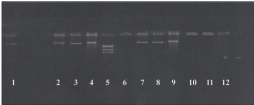

Figure 1. Plasmid profiles of transconjugants: 1: Com1; 5:  $ \lambda $  gene digested by Hind III; 10: Escherichia coli K $ _{12} $ Nal; 11: E. coli C $ _{600} $ Rif. Transconjugants: 2: 24 (TCY, SSS, TMP) NAL; 3: 36 (TCY, SSS, TMP) NAL; 4: 44 (K) NAL; 6: 41 (TCY) NAL; 7: 37 (TCY) NAL; 8: 52 (TCY) NAL; 9: 75 (TCY) NAL; 12: 21 (TCY, SSS, TMP) NAL. TCY: tetracycline; SSS: sulphonamides; TMP: trimethoprim; NAL: nalidixic acid; K: kanamycin.

et al. (2009) but refuted by those of Uyttendaele et al. (1998) in Belgium and Foley et al. (2008) in the USA, who have ranked it among the 6 most common serotypes. The study of the distribution of Salmonella serotypes within 4 wilayahs taught us about their dynamic expansion across the adjacent wilayahs, or even their possible spread in the national territory. Bouira was the wilayah that counted most of the serotypes, with a high prevalence of Salmonella Enteritidis, Salmonella Heidelberg, and Salmonella Typhimurium. Bejaia had less diversity than that recorded in Bouira; the predominant serotypes were Salmonella Albany, Salmonella Heidelberg, and Salmonella Infantis. Although Tizi-Ouzou and Boumerdes had only 15 and 16 strains, diversity was observed with a predominance of Salmonella Albany and Salmonella Heidelberg, respectively. The homogeneous distribution of all serotypes in the study's area could be the consequence of the uncontrolled movement of poultry products.

## Resistance of Antimicrobial Agents Tested

There is a positive correlation between antimicrobial use and bacterial resistance rates; indeed, each exposure eliminates the susceptible bacteria and promotes the growth of resistant strains (Jaecklin, 2002; Fluit, 2005). Even though the treatment of avian salmonellosis is banned in Algeria by ministerial order (JORA, 2003), the high rate of antimicrobial resistance that we recorded (53%) could be explained by the indiscriminate use of these drugs for therapeutic, prophylactic purposes or as growth promoters. Our result was significantly higher than that reported by Al-Bahry et al. (2007; 23.7%) and lower than that recorded by Elgroud et al. (2008; 80%) and that reported by the PICRA (2006; 63%). Multidrug resistance observed in our study was also described by Bornert (2000) and Al-Bahry et al. (2007). Moreover, resistance was found for 6 of the 9 antimicrobial classes tested. The observed resistance to first generation quinolones (nalidixic acid) was the most frequent. This is likely due to their repeated use in poultry production. Fortunately, there is no resistance to fluoroquinolones tested (ciprofloxacin, enrofloxacin, levofloxacin) as reported by McKenzie and Nadeau (2006). These results corroborate several international studies (Heurtin-Le Corre et al. 1999; San Martin et al., 2005; PICRA, 2006). Salmonella isolates were found to be resistant to ciprofloxacin in previous French (Brisabois et al., 1997) and Algerian studies (Elgroud et al., 2009; Bouzidi et al., 2011), which is more worrying as fluoroquinolones should be reserved for the treatment of invasive human salmonellosis (Davies et al., 1999). Although furans have been removed from the Algerian nomenclature, we recorded a high rate of resistance to nitrofurantoines. This result was lower than that noted in 2004 in Poland by Wasyl and Hoszowski (2004; 48.2%). The rates of resistance to cyclines reported by several authors were higher than those we recorded and ranged from 20 to 91% (Brisabois et al., 1997; Dinh Nam Lâm et al., 2000; McKenzie and Nadeau, 2006; PICRA, 2006). As for sulphonamides, our result was higher than that reported by the national monitoring network to antimicrobial resistance (7%; Aboun, 2005) and lower than that noted by Brisabois et al.

Table 3. Determination of incompatibility groups and plasmid profiles of Salmonella strains that transferred resistance markers $ ^{1} $ 

<table><tr><td>Salmonella serotype</td><td>n12</td><td>Resistance profile3</td><td>n24</td><td>Transferred resistance</td><td>Incompatibility group</td><td>DNA extraction</td></tr><tr><td rowspan="2">Heidelberg</td><td rowspan="2">19</td><td>AMP, TCY, NAL</td><td>1</td><td>(AMP)Rif</td><td>ND</td><td>/</td></tr><tr><td>TCY</td><td>1</td><td>TCY(NAL)</td><td>Com1</td><td>+</td></tr><tr><td>Typhimurium</td><td>5</td><td>SXT, TMP, SSS, TCY</td><td>1</td><td>(TCY, SSS, TMP)NAL</td><td>Com1</td><td>+</td></tr><tr><td rowspan="2">Blockley</td><td rowspan="2">3</td><td rowspan="2">TCY</td><td rowspan="2">2</td><td>(TCY)NAL</td><td>Com1</td><td>+</td></tr><tr><td>(TCY)NAL</td><td>Com1</td><td>+</td></tr><tr><td rowspan="3">Hadar</td><td rowspan="3">3</td><td>AMP, TCY, NAL</td><td>3</td><td>(AMP)Rif</td><td>ND</td><td>/</td></tr><tr><td rowspan="2">TCY</td><td rowspan="2">K</td><td>TCY(NAL)</td><td>Com1</td><td>+</td></tr><tr><td>K(NAL)</td><td>ND</td><td>/</td></tr><tr><td>Livingstone</td><td>1</td><td>TCY, SSS, TMP, SXT</td><td>1</td><td>(TCY, SSS, TMP)NAL</td><td>Com1</td><td>NV</td></tr><tr><td>Indiana</td><td>2</td><td>TCY, SSS, TMP, SXT</td><td>1</td><td>(TCY, SSS, TMP)NAL</td><td>Com1</td><td>+</td></tr><tr><td>Newport</td><td>1</td><td>AMP, TCY, NAL</td><td>1</td><td>(AMP, TCY)Rif</td><td>F1me</td><td>NE</td></tr></table>

 $ ^{1} $ ND: not determined; NV: not visualized; NE: no extract.

 $ ^{2} $ n1: number of donor strains on which tests conjugation were performed.

 $ ^{3} $ AMP: ampicillin; TCY: tetracycline, NAL: nalidixic acid; FT: nitrofurantoin; SXT: cotrimoxazole, TMP: trimethoprim; SSS: sulphonamides, K: kanamycin.

 $ ^{4} $ n2: number of strains that transferred one or more resistance markers.