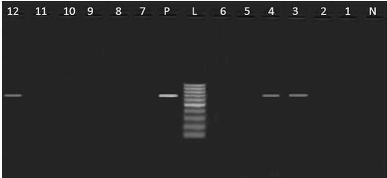
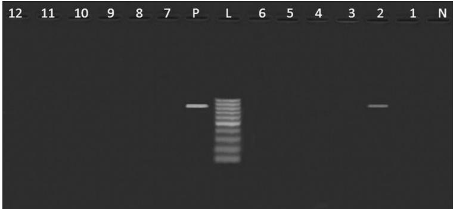
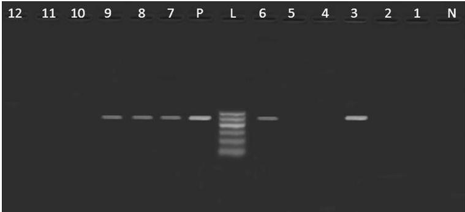
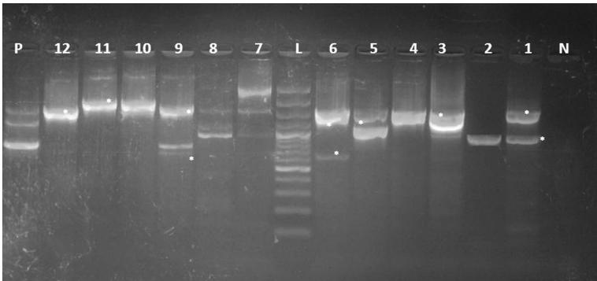

Gharieb et al. Gut Pathog (2015) 7:34 DOI 10.1186/s13099-015-0081-1

Gut Pathogens

RESEARCH

Open Access

# Non-Typhoidal Salmonella in poultry meat and diarrhoeic patients: prevalence, antibiogram, virulotyping, molecular detection and sequencing of class I integrons in multidrug resistant strains

Rasha M. Gharieb $ ^{1*} $ , Yasmine H. Tartor $ ^{2} $  and Mariam H. E. Khedr $ ^{3} $ 

## Abstract

Background: The worldwide increase of food-borne infections with antibiotic resistant pathogens constitutes a major public health problem. Therefore, this study aimed to determine the prevalence, antibiogram, virulence genes profiles and integron characteristics of non-typhoidal Salmonella spp. isolated from poultry meat and diarrhoeic patients in Egypt.

Methods: A total of 150 samples comprising (100 poultry meat and 50 diarrhoeic patients' stool) were examined for the presence of Salmonella spp. using culture methods followed by biochemical and serological identification of the isolates. All Salmonella strains were tested for their susceptibility to the antibiotics using disk diffusion method and screened for the presence of virulence genes and class I integrons using PCR.

Results: The overall prevalence of Salmonella spp. in poultry meat samples was 10% compared to 4% in diarrhoeic patients. All the isolates were serologically identified into Salmonella Typhimurium (seven isolates), S. Derby, S. Kiel, S. Rubislaw (one isolate, each) and untypable strains (two isolates). Antibiotic susceptibility testing showed a higher resistance of the total isolates to erythromycin and tetracycline (100%, each), followed by amoxicillin-clavulanic acid (91.7%), trimethoprim-sulfamethoxazole (83.3%), streptomycin, nalidixic acid, ampicillin-sulbactam (75%, each), gentamycin, ampicillin (66.7%, each), chloramphenicol (58.3%), ciprofloxacin (25%) and ceftriaxone (16.7%). Virulence genes profiles revealed the presence of sopB gene in five Salmonella strains isolated from poultry meat (n=3) and humans (n=2). Moreover, pefA was only identified in three isolates from poultry meat. On the other hand, S. Kiel and S. Typhimurium (one isolate, each) were harboring hilA and stn genes, respectively. Class 1 integrons were detected in all Salmonella spp. with variable amplicon sizes ranged from 650–3000 bp. Sequencing of these amplicons revealed the presence of gene cassettes harboring  $ aac(3) $ -ld, aadA2, aadA4, aadA7, sat, dfrA15, lnuF and estX resistance genes. Nucleotide sequence analysis showed point mutations in the  $ aac(3) $ -ld of S. Derby, aadA2, estX-sat genes of S. Typhimurium. Meanwhile, frame shift mutation was observed in aadA7 genes of S. Typhimurium.

Conclusions: Increasing rate of antimicrobial resistance and class 1 integrons among multidrug resistant Salmonella spp. has prompted calls for the reduction of antimicrobial use in livestock to prevent future emergence of resistance.
Keywords: Salmonella spp., Zoonoses, multidrug resistance, Virulence, Class I integrons

 $ ^{*} $ Correspondence: ghariebrasha@gmail.com
 $ ^{1} $  Department of Zoonoses, Faculty of Veterinary Medicine, Zagazig University, 44511 Zagazig, Egypt
Full list of author information is available at the end of the article

© 2015 Gharieb et al. This article is distributed under the terms of the Creative Commons Attribution 4.0 International License (http://creativecommons.org/licenses/by/4.0/), which permits unrestricted use, distribution, and reproduction in any medium, provided you give appropriate credit to the original author(s) and the source, provide a link to the Creative Commons license, and indicate if changes were made. The Creative Commons Public Domain Dedication waiver (http://creativecommons.org/publicdomain/zero/1.0/) applies to the data made available in this article, unless otherwise stated.

Gharieb et al. Gut Pathog (2015) 7:34

Page 2 of 11

## Background

Non-typhoidal Salmonella (NTS) is one of the major zoonotic food-borne pathogens representing an important public health problem worldwide. It can cause a variety of clinical manifestations ranging from mild gastroenteritis to bacteraemia and extra intestinal localized infections involving many organs. The global burden of NTS gastroenteritis has been estimated to be 93.8 million cases of gastroenteritis each year with 155,000 deaths annually  $ [1] $ . Food of animal origin especially poultry meat is considered to be one of the major vehicles of Salmonella infections in humans and has been implicated in outbreaks of human salmonellosis  $ [2] $ . Antimicrobial resistance and virulence of Salmonella strains play a vital role in systemic infections. Salmonella pathogenicity is dictated by an array of factors encoded by virulence genes that assist the organism to express its virulence in the host cells and ultimately manifest in the typical symptoms of salmonellosis. Some genes are known to be involved in adhesion and invasion including; plasmid encoded fimbriae (pefA) and hyper invasive locus (hilA)  $ [3, 4] $ . Salmonella outer proteins (sop A-E) encoded by sop gene and (stn) codes for enterotoxin productions are associated with the actual manifestation of pathogenic processes  $ [5] $ . In addition to virulence factors, the emergence of antimicrobial resistance among NTS has become a public health threat. Since food of animal origin is a major source of Salmonella spp., it has been suggested that abundant use of antimicrobials in food animals' production may contribute to the presence of antimicrobial resistance in these species and subsequently transferred to humans through food chain  $ [6] $ . Factors contributed to the resistance and virulence of Salmonella may be located on chromosomes, plasmids, transposon and integrons. Integrons are DNA elements that can transfer antibiotic resistance genes among bacteria. Class I integrons are the most common type of integrons recognized among the multidrug resistant (MDR) Salmonella and have conserved regions (5'-CS and 3'-CS) which often contain gene cassettes  $ [7] $ . These cassettes contain genes that confer resistance to antimicrobial agents including aminoglycosides, b-lactams, chloramphenicol and trimethoprim as well as genes that confer resistance to antiseptics and disinfectants  $ [8] $ . The present study was undertaken to (i) trace the prevalence and antimicrobial susceptibility patterns of NTS enterica serotypes isolated from poultry meat and diarrhoeic patients (ii) ascertain the presence of virulence genes and class I integrons using PCR (iii) sequencing of the amplified DNA fragments of class I integrons in order to identify the resistance genes located in integron gene cassettes.

## Results and discussion

## Prevalence of Salmonella serovars in poultry meat and diarrhoeic patients

In the present study, the overall prevalence of Salmonella spp. in the total examined poultry meat samples was 10 % (Table 1). This result was compatible with previous studies in Nepal [9]. Moreover, our results regarding the prevalence of Salmonella spp. in broiler chicken meat (14 %) substantiate the findings of others in Canada [10].

Serotyping of Salmonella spp. isolated from poultry meat in this study revealed the predominance of S. Typhimurium in chicken meat and this was in concordance with previous studies from India  $ [11] $ . Additionally, other serovars such as S. Rubislaw, S. Kiel (chicken meat) and S. Derby (duck meat) were identified.

It was obvious from Table 1 that 4 % (2 out of 50) of stool samples from diarrhoeic patients were positive for Salmonella spp. and S. Typhimurium was the only serotype identified. Nearly similar prevalence in diarrhoeic patients was reported in India [12]. The isolation of S. Derby from poultry meat and humans has been previously recorded in Netherlands [13]. Moreover, S. Rubislaw was isolated from chicken meat in Senegal and

Table 1 Frequency distribution of Salmonella serovars in poultry meat and diarrhoeic patients

<table border=1 style='margin: auto; width: max-content;'><tr><td rowspan="3">Source</td><td colspan="3">Poultry meat</td><td rowspan="2">Diarrhoeic patients (n = 50)</td><td rowspan="2">Total (150)</td></tr><tr><td style='text-align: center;'>Chicken (n = 50)</td><td style='text-align: center;'>Duck (n = 50)</td><td style='text-align: center;'>Total (n = 100)</td></tr><tr><td style='text-align: center;'>No. (%)</td><td style='text-align: center;'>No. (%)</td><td style='text-align: center;'>No. (%)</td><td style='text-align: center;'>No. (%)</td><td style='text-align: center;'>No. (%)</td></tr><tr><td style='text-align: center;'>Serotype</td><td style='text-align: center;'></td><td style='text-align: center;'></td><td style='text-align: center;'></td><td style='text-align: center;'></td><td style='text-align: center;'></td></tr><tr><td style='text-align: center;'>S. Typhimurium (O1,4,5],12 H $ _{1} $ : i H $ _{2} $ : 1,2)</td><td style='text-align: center;'>5 (10)</td><td style='text-align: center;'>0 (0)</td><td style='text-align: center;'>5 (5)</td><td style='text-align: center;'>2 (4)</td><td style='text-align: center;'>7 (4.7)</td></tr><tr><td style='text-align: center;'>S. Rubislaw (O11 H $ _{1} $ : r H2: e,n,x)</td><td style='text-align: center;'>1 (2)</td><td style='text-align: center;'>0 (0)</td><td style='text-align: center;'>1 (1)</td><td style='text-align: center;'>0 (0)</td><td style='text-align: center;'>1 (0.7)</td></tr><tr><td style='text-align: center;'>S. Kiel (O1,2,12 H $ _{1} $ : g, p H $ _{2} $ :−)</td><td style='text-align: center;'>1 (2)</td><td style='text-align: center;'>0 (0)</td><td style='text-align: center;'>1 (1)</td><td style='text-align: center;'>0 (0)</td><td style='text-align: center;'>1 (0.7)</td></tr><tr><td style='text-align: center;'>S. Derby (O1,4,5],12 H $ _{1} $ : f,g H2: [1,2])</td><td style='text-align: center;'>0 (0)</td><td style='text-align: center;'>1 (2)</td><td style='text-align: center;'>1 (1)</td><td style='text-align: center;'>0 (0)</td><td style='text-align: center;'>1 (0.7)</td></tr><tr><td style='text-align: center;'>Untypable</td><td style='text-align: center;'>0 (0)</td><td style='text-align: center;'>2 (4)</td><td style='text-align: center;'>2 (2)</td><td style='text-align: center;'>0 (0)</td><td style='text-align: center;'>2 (1.3)</td></tr><tr><td style='text-align: center;'>Total</td><td style='text-align: center;'>7 (14)</td><td style='text-align: center;'>3 (6)</td><td style='text-align: center;'>10 (10)</td><td style='text-align: center;'>2 (4)</td><td style='text-align: center;'>12 (8)</td></tr></table>

Gharieb et al. Gut Pathog (2015) 7:34

Page 3 of 11

diarrhoeic children in Gambia  $ [14] $  and this confirms the zoonotic importance of the former serotypes.

## Antibiotic susceptibility testing

All Salmonella isolates were tested for their susceptibility towards antimicrobial drugs (Table 2). The results highlighted the higher resistance of the isolates to erythromycin and tetracycline (100 %, each), followed by amoxicillin-clavulanic acid (91.7 %), trimethoprim-sulfamethoxazole (83.3 %), streptomycin, nalidixic acid, ampicillin-sulbactam (75 %, each), gentamycin, ampicillin (66.7 %, each), chloramphenicol (58.3 %), ciprofloxacin (25 %) and ceftriaxone (16.7 %). This isn't surprising because these antibiotics are cheap, easily affordable and commonly used in humans and poultry without prescription. In poultry, these drugs are used either for therapeutic purposes or as growth promoters added to the feed leading to the development of resistance in the enteric bacterial flora of poultry. Subsequently the pathogenic bacteria such as Salmonella may acquire resistance from this enteric flora and transfer this resistance to human's strains through food chain leading to the emergence of MDR Salmonella strains that constitute a public health risk and potentially affect the efficacy of drug treatment in humans. It was obvious from Table 2 that 100 % of Salmonella spp. isolated from poultry meat were resistant to each of erythromycin and tetracycline, 9 (90 %) were resistant to amoxicillin-clavulanic acid, 8 (80 %) showing resistance to trimethoprim-sulfamethoxazole, 7 (70 %) exhibiting resistance to each of streptomycin, ampicillin-sulbactam, nalidixic acid and gentamycin. Moreover, the lower resistance rates to chloramphenicol (50 %), ciprofloxacin (30 %) and ceftriaxone (10 %) were observed. Nearly similar resistance rate to ampicillin, streptomycin, nalidixic acid, tetracycline and trimethoprim-sulfamethoxazole was recorded in Salmonella spp. isolated from chicken meat in Pakistan [15]. On the contrary, the lower resistance rate to ceftriaxone and ciprofloxacin corroborates with others in India [11].

Table 2 also showed that all Salmonella isolates of human origin were resistant to ampicillin, erythromycin, streptomycin, tetracycline, ampicillin-sulbactam, trimethoprim-sulfamethoxazole, chloramphenicol, nalidixic acid and amoxicillin-clavulanic acid. Conversely, the resistance to ceftriaxone and gentamycin was found in 50 % of the isolates. On the other hand, none of the isolates was resistant to ciprofloxacin. Consistent with our results, a higher resistance rate (100 %) to ampicillin, chloramphenicol, streptomycin, trimethoprim-sulfamethoxazole and tetracyclines was recorded in S. Typhimurium strains isolated from diarrhoeic patients in Kenya [16]. Another worrisome situation in this study is that, 50 % of Salmonella isolates from diarrhoeic patients were resistant to ceftriaxone and gentamycin. This is of particular concern because the extended spectrum cephalosporins such as ceftriaxone are the antibiotics of choice for treatment of invasive salmonellosis in children and the emergence of resistance toward these drugs could be attributed to inappropriate use of them in treatment of Salmonella infections in humans. The higher susceptibility of S. Typhimurium isolated from human source to ciprofloxacin (100 %) in this study may be due to discriminate use of this drug because it is relatively expensive, not easily affordable to all people, not sold in private pharmacies without prescription. This result corroborates the findings of other investigators in Kenya.

Table 2 Antibiogram of Salmonella serovars isolated from poultry meat and diarrhoeic patients

<table border=1 style='margin: auto; width: max-content;'><tr><td style='text-align: center;'>Sources/serovars</td><td colspan="12">Antibiotic (concentration  $ \mu $ g)</td></tr><tr><td style='text-align: center;'></td><td style='text-align: center;'>A (10)</td><td style='text-align: center;'>E (15)</td><td style='text-align: center;'>S (10)</td><td style='text-align: center;'>Cx (5)</td><td style='text-align: center;'>T (30)</td><td style='text-align: center;'>Co (30)</td><td style='text-align: center;'>As (20)</td><td style='text-align: center;'>Sxt (25)</td><td style='text-align: center;'>C (30)</td><td style='text-align: center;'>Na (30)</td><td style='text-align: center;'>G (10)</td><td style='text-align: center;'>Amc (30)</td></tr><tr><td style='text-align: center;'>Chicken meat (7)</td><td style='text-align: center;'>4 (57.1)</td><td style='text-align: center;'>7 (100)</td><td style='text-align: center;'>5 (71.4)</td><td style='text-align: center;'>2 (28.6)</td><td style='text-align: center;'>7 (100)</td><td style='text-align: center;'>1 (14.3)</td><td style='text-align: center;'>5 (71.4)</td><td style='text-align: center;'>6 (85.7)</td><td style='text-align: center;'>4 (57.1)</td><td style='text-align: center;'>5 (71.4)</td><td style='text-align: center;'>6 (85.7)</td><td style='text-align: center;'>6 (85.7)</td></tr><tr><td style='text-align: center;'>S. Typhimurium (5)</td><td style='text-align: center;'>2 (20)</td><td style='text-align: center;'>5 (100)</td><td style='text-align: center;'>4 (80)</td><td style='text-align: center;'>2 (40)</td><td style='text-align: center;'>5 (100)</td><td style='text-align: center;'>1 (20)</td><td style='text-align: center;'>4 (80)</td><td style='text-align: center;'>5 (100)</td><td style='text-align: center;'>3 (60)</td><td style='text-align: center;'>4 (80)</td><td style='text-align: center;'>5 (100)</td><td style='text-align: center;'>4 (80)</td></tr><tr><td style='text-align: center;'>S. Kiel (1)</td><td style='text-align: center;'>1 (100)</td><td style='text-align: center;'>1 (100)</td><td style='text-align: center;'>0</td><td style='text-align: center;'>0</td><td style='text-align: center;'>1 (100)</td><td style='text-align: center;'>0</td><td style='text-align: center;'>0</td><td style='text-align: center;'>0</td><td style='text-align: center;'>0</td><td style='text-align: center;'>0</td><td style='text-align: center;'>0</td><td style='text-align: center;'>1 (100)</td></tr><tr><td style='text-align: center;'>S. Rubislaw (1)</td><td style='text-align: center;'>1 (100)</td><td style='text-align: center;'>1 (100)</td><td style='text-align: center;'>1 (100)</td><td style='text-align: center;'>0</td><td style='text-align: center;'>1 (100)</td><td style='text-align: center;'>0</td><td style='text-align: center;'>1 (100)</td><td style='text-align: center;'>1 (100)</td><td style='text-align: center;'>1 (100)</td><td style='text-align: center;'>1 (100)</td><td style='text-align: center;'>1 (100)</td><td style='text-align: center;'>1 (100)</td></tr><tr><td style='text-align: center;'>Duck meat (3)</td><td style='text-align: center;'>2 (66.7)</td><td style='text-align: center;'>3 (100)</td><td style='text-align: center;'>2 (66.7)</td><td style='text-align: center;'>1 (33.3)</td><td style='text-align: center;'>3 (100)</td><td style='text-align: center;'>0</td><td style='text-align: center;'>2 (66.7)</td><td style='text-align: center;'>2 (66.7)</td><td style='text-align: center;'>1 (33.3)</td><td style='text-align: center;'>2 (66.7)</td><td style='text-align: center;'>1 (33.3)</td><td style='text-align: center;'>3 (100)</td></tr><tr><td style='text-align: center;'>S. Derby (1)</td><td style='text-align: center;'>0</td><td style='text-align: center;'>1 (100)</td><td style='text-align: center;'>1 (100)</td><td style='text-align: center;'>0</td><td style='text-align: center;'>1 (100)</td><td style='text-align: center;'>0</td><td style='text-align: center;'>0</td><td style='text-align: center;'>0</td><td style='text-align: center;'>0</td><td style='text-align: center;'>0</td><td style='text-align: center;'>0</td><td style='text-align: center;'>1 (100)</td></tr><tr><td style='text-align: center;'>Untypable (2)</td><td style='text-align: center;'>2 (100)</td><td style='text-align: center;'>2 (100)</td><td style='text-align: center;'>1 (50)</td><td style='text-align: center;'>1 (50)</td><td style='text-align: center;'>2 (100)</td><td style='text-align: center;'>0</td><td style='text-align: center;'>2 (100)</td><td style='text-align: center;'>2 (100)</td><td style='text-align: center;'>1 (50)</td><td style='text-align: center;'>2 (100)</td><td style='text-align: center;'>1 (50)</td><td style='text-align: center;'>2 (100)</td></tr><tr><td style='text-align: center;'>Total (10)</td><td style='text-align: center;'>6 (60)</td><td style='text-align: center;'>10 (100)</td><td style='text-align: center;'>7 (70)</td><td style='text-align: center;'>3 (30)</td><td style='text-align: center;'>10 (100)</td><td style='text-align: center;'>1 (10)</td><td style='text-align: center;'>7 (70)</td><td style='text-align: center;'>8 (80)</td><td style='text-align: center;'>5 (50)</td><td style='text-align: center;'>7 (70)</td><td style='text-align: center;'>7 (70)</td><td style='text-align: center;'>9 (90)</td></tr><tr><td style='text-align: center;'>Human (2) S. Typhimurium</td><td style='text-align: center;'>2 (100)</td><td style='text-align: center;'>2 (100)</td><td style='text-align: center;'>2 (100)</td><td style='text-align: center;'>0</td><td style='text-align: center;'>2 (100)</td><td style='text-align: center;'>1 (50)</td><td style='text-align: center;'>2 (100)</td><td style='text-align: center;'>2 (100)</td><td style='text-align: center;'>2 (100)</td><td style='text-align: center;'>2 (100)</td><td style='text-align: center;'>1 (50)</td><td style='text-align: center;'>2 (100)</td></tr><tr><td style='text-align: center;'>Total sensitive (%)</td><td style='text-align: center;'>2 (16.7)</td><td style='text-align: center;'>0</td><td style='text-align: center;'>2 (16.7)</td><td style='text-align: center;'>4 (33.3)</td><td style='text-align: center;'>0</td><td style='text-align: center;'>4 (33.3)</td><td style='text-align: center;'>1 (8.3)</td><td style='text-align: center;'>2 (16.7)</td><td style='text-align: center;'>2 (16.7)</td><td style='text-align: center;'>0</td><td style='text-align: center;'>2 (16.7)</td><td style='text-align: center;'>0</td></tr><tr><td style='text-align: center;'>Total intermediate (%)</td><td style='text-align: center;'>2 (16.7)</td><td style='text-align: center;'>0</td><td style='text-align: center;'>1 (8.3)</td><td style='text-align: center;'>5 (41.7)</td><td style='text-align: center;'>0</td><td style='text-align: center;'>6 (50)</td><td style='text-align: center;'>2 (16.7)</td><td style='text-align: center;'>0</td><td style='text-align: center;'>3 (25)</td><td style='text-align: center;'>3 (25)</td><td style='text-align: center;'>2 (16.7)</td><td style='text-align: center;'>1 (8.3)</td></tr><tr><td style='text-align: center;'>Total resistant (%)</td><td style='text-align: center;'>8 (66.7)</td><td style='text-align: center;'>12 (100)</td><td style='text-align: center;'>9 (75)</td><td style='text-align: center;'>3 (25)</td><td style='text-align: center;'>12 (100)</td><td style='text-align: center;'>2 (16.7)</td><td style='text-align: center;'>9 (75)</td><td style='text-align: center;'>10 (83.3)</td><td style='text-align: center;'>7 (58.3)</td><td style='text-align: center;'>9 (75)</td><td style='text-align: center;'>8 (66.7)</td><td style='text-align: center;'>11 (91.7)</td></tr></table>

A Ampicillin, E Erythromycin, S Streptomycin, Cx Ciprofloxacin, T Tetracycline, Co Ceftriaxone, As Ampicillin-Sulbactam, Sxt Trimethoprim-Sulfamethoxazole, C Chloramphenicol, Na Nalidixic acid, G Gentmycin, Amc Amoxicillin-Clavulanic acid

Gharieb et al. Gut Pathog (2015) 7:34

Page 4 of 11

[16]. Therefore, ciprofloxacin still to have a high potency against NTS strains in humans and continue to be the most successful drug used for treatment of septicaemic salmonellosis in adult humans. The increased resistance of S. Typhimurium isolated from humans to quinolones (nalidixic acid) in this study (100 %) is a matter of concern and could be attributed to indiscriminate use of these antibiotics by human patients. Moreover, the presence of these drug residues in food of animal origin may result in increased resistance among human's isolates.

Table 3 verified that all Salmonella spp. isolated from poultry and humans were MDR, exhibiting resistance to at least four or more antibiotics displayed by ten resistance patterns.

## Molecular detection of Salmonella virulence genes (virulotyping)

Table 3 revealed the presence of pefA gene among three Salmonella strains isolated from poultry meat, belonged to S. Rubislaw, S. Typhimurium and untypable strain (one isolate, each) (Fig. 1). Moreover, hilA gene was only identified in one isolate of S. Kiel (Fig. 2). Furthermore, three Salmonella isolates from poultry meat comprising untypable strains (two isolates) and S. Typhimurium (one isolate) were harboring sopB gene (Fig. 3). The detection of pefA gene in S. Rubislaw in Gambia and Senegal [14] and S. Typhimurium in India [4] was previously reported. On the other hand, hilA gene was identified in Salmonella serotypes isolated from chickens in Iran [17].

It was obvious from Table 3 that all S. Typhimurium isolates from humans were harboring sopB compared to one isolate had stn gene (Figs. 3, 4). Consistent with our findings, sopB gene was previously identified in S. Typhimurium isolated from diarrhoeic patients and birds in India [18]. Meanwhile, stn gene was detected in S. Typhimurium isolated from humans in India [4].

## Molecular detection and sequencing of class 1 integrons

A notable feature in this study is that all Salmonella strains isolated from poultry meat and humans were MDR and harboring class I integrons that are chromosomally located (Fig. 5). Ten different profiles of class I integrons with variable amplicon sizes ranged from 650–3000 bp were observed (Table 3). Similarly, class I integrons were detected in 97 % of S. Typhimurium isolated from Norwegian diarrhoeic patients [19]. On the contrary, a lower detection rate (9 %) was recorded in Salmonella spp. isolated from poultry meat [20]. Sequencing

Table 3 Resistance pattern, virulence genes and class I integron profiles among multidrug resistant Salmonella serotypes in this study

<table border=1 style='margin: auto; width: max-content;'><tr><td rowspan="2">Strain no.</td><td rowspan="2">Serovar (source of isolate)</td><td rowspan="2">Resistance pattern</td><td colspan="4">Virulence genes</td><td rowspan="2">Integron amplicon size (bp)</td><td rowspan="2">Integron profile (IP)</td><td rowspan="2">Genes in the cassettes</td><td rowspan="2">Accession numbers</td></tr><tr><td style='text-align: center;'>PefA</td><td style='text-align: center;'>hilA</td><td style='text-align: center;'>SopB</td><td style='text-align: center;'>Stn</td></tr><tr><td style='text-align: center;'>1</td><td style='text-align: center;'>S. Derby (duck)</td><td style='text-align: center;'>ST E Amc</td><td style='text-align: center;'>−</td><td style='text-align: center;'>−</td><td style='text-align: center;'>−</td><td style='text-align: center;'>−</td><td style='text-align: center;'>937</td><td style='text-align: center;'>I</td><td style='text-align: center;'>aac (3)-Idaac (3)-Id, aadA7</td><td style='text-align: center;'>KT581257</td></tr><tr><td style='text-align: center;'>2</td><td style='text-align: center;'>S. Kiel (chicken)</td><td style='text-align: center;'>AT E Amc</td><td style='text-align: center;'>−</td><td style='text-align: center;'>+</td><td style='text-align: center;'>−</td><td style='text-align: center;'>−</td><td style='text-align: center;'>937</td><td style='text-align: center;'>II</td><td style='text-align: center;'></td><td style='text-align: center;'></td></tr><tr><td style='text-align: center;'>3</td><td style='text-align: center;'>Untypable (duck)</td><td style='text-align: center;'>A C S Sxt T E Cx As Na G Amc</td><td style='text-align: center;'>+</td><td style='text-align: center;'>−</td><td style='text-align: center;'>+</td><td style='text-align: center;'>−</td><td style='text-align: center;'>1500</td><td style='text-align: center;'>III</td><td style='text-align: center;'>aac (3)-Id, aadA7</td><td style='text-align: center;'>KT581256</td></tr><tr><td style='text-align: center;'>4</td><td style='text-align: center;'>S. Rubislaw (chicken)</td><td style='text-align: center;'>A C S Sxt T E As Na G Amc</td><td style='text-align: center;'>+</td><td style='text-align: center;'>−</td><td style='text-align: center;'>−</td><td style='text-align: center;'>−</td><td style='text-align: center;'>1500</td><td style='text-align: center;'>III</td><td style='text-align: center;'>−</td><td style='text-align: center;'></td></tr><tr><td style='text-align: center;'>5</td><td style='text-align: center;'>S. Typhimurium (chicken)</td><td style='text-align: center;'>A C S Sxt T E As Na G Amc</td><td style='text-align: center;'>−</td><td style='text-align: center;'>−</td><td style='text-align: center;'>−</td><td style='text-align: center;'>−</td><td style='text-align: center;'>1100</td><td style='text-align: center;'>IV</td><td style='text-align: center;'>−</td><td style='text-align: center;'>KT581255</td></tr><tr><td style='text-align: center;'>6</td><td style='text-align: center;'>S. Typhimurium (chicken)</td><td style='text-align: center;'>S Sxt T E Cx Co Na G</td><td style='text-align: center;'>−</td><td style='text-align: center;'>−</td><td style='text-align: center;'>+</td><td style='text-align: center;'>−</td><td style='text-align: center;'>650</td><td style='text-align: center;'>V</td><td style='text-align: center;'>sat</td><td style='text-align: center;'>KT449570</td></tr><tr><td style='text-align: center;'>7</td><td style='text-align: center;'>Untypable (duck)</td><td style='text-align: center;'>A Sxt T E As Na Amc</td><td style='text-align: center;'>−</td><td style='text-align: center;'>−</td><td style='text-align: center;'>+</td><td style='text-align: center;'>−</td><td style='text-align: center;'>1550</td><td style='text-align: center;'>VI</td><td style='text-align: center;'>ac (3)-Id, aadA7at</td><td style='text-align: center;'>KT598359</td></tr><tr><td style='text-align: center;'>8</td><td style='text-align: center;'>S. Typhimurium (human)</td><td style='text-align: center;'>A C S Sxt T E Cro As Na G Amc</td><td style='text-align: center;'>−</td><td style='text-align: center;'>−</td><td style='text-align: center;'>+</td><td style='text-align: center;'>−</td><td style='text-align: center;'>1000</td><td style='text-align: center;'>VII</td><td style='text-align: center;'>−</td><td style='text-align: center;'></td></tr><tr><td style='text-align: center;'>9</td><td style='text-align: center;'>S. Typhimurium (human)</td><td style='text-align: center;'>A C S Sxt T E As Na Amc</td><td style='text-align: center;'>−</td><td style='text-align: center;'>−</td><td style='text-align: center;'>+</td><td style='text-align: center;'>+</td><td style='text-align: center;'>650</td><td style='text-align: center;'>VIII</td><td style='text-align: center;'>adA4</td><td style='text-align: center;'>KT581253</td></tr><tr><td style='text-align: center;'></td><td style='text-align: center;'></td><td style='text-align: center;'></td><td style='text-align: center;'></td><td style='text-align: center;'></td><td style='text-align: center;'></td><td style='text-align: center;'></td><td style='text-align: center;'>750</td><td style='text-align: center;'></td><td style='text-align: center;'>adfrA15</td><td style='text-align: center;'>KT449571</td></tr><tr><td style='text-align: center;'></td><td style='text-align: center;'></td><td style='text-align: center;'></td><td style='text-align: center;'></td><td style='text-align: center;'></td><td style='text-align: center;'></td><td style='text-align: center;'></td><td style='text-align: center;'>1600</td><td style='text-align: center;'></td><td style='text-align: center;'></td><td style='text-align: center;'></td></tr><tr><td style='text-align: center;'>10</td><td style='text-align: center;'>S. Typhimurium (chicken)</td><td style='text-align: center;'>S Sxt T E As G Amc</td><td style='text-align: center;'>−</td><td style='text-align: center;'>−</td><td style='text-align: center;'>−</td><td style='text-align: center;'>−</td><td style='text-align: center;'>1900</td><td style='text-align: center;'>IX</td><td style='text-align: center;'></td><td style='text-align: center;'></td></tr><tr><td style='text-align: center;'>11</td><td style='text-align: center;'>S. Typhimurium (chicken)</td><td style='text-align: center;'>A C S Sxt T E As Na G Amc</td><td style='text-align: center;'>−</td><td style='text-align: center;'>−</td><td style='text-align: center;'>−</td><td style='text-align: center;'>−</td><td style='text-align: center;'>1900</td><td style='text-align: center;'>IX</td><td style='text-align: center;'>aadA2, InuF</td><td style='text-align: center;'>KT449569</td></tr><tr><td style='text-align: center;'>12</td><td style='text-align: center;'>S. Typhimurium (chicken)</td><td style='text-align: center;'>C Sxt T E Cx As Na G Amc</td><td style='text-align: center;'>+</td><td style='text-align: center;'>−</td><td style='text-align: center;'>−</td><td style='text-align: center;'>−</td><td style='text-align: center;'>1550</td><td style='text-align: center;'>X</td><td style='text-align: center;'>aac (3)-Id, aadA7</td><td style='text-align: center;'>KT581254</td></tr></table>

Gharieb et al. Gut Pathog (2015) 7:34

Page 5 of 11

Fig. 1 Agarose gel electrophoresis showing an amplification of pefA gene (700 bp) in Salmonella isolates from poultry meat and humans. Lane N: negative control (pefA $ ^{-} $  Salmonella strain), lane L: DNA ladder (100 bp), lane P: positive control (pefA $ ^{+} $  Salmonella strain), lane 1: pefA $ ^{-} $  (S. Derby, duck), lane 2: pefA $ ^{-} $  (S. Kiel, chicken), lane 3: pefA $ ^{+} $  (untypable, duck), lane 4: pefA $ ^{+} $  (S. Rubislaw, chicken), lanes 5, 6, 10, 11: pefA $ ^{-} $  (S. Typhimurium, chicken), lane 7: pefA $ ^{-} $  (untypable, duck), lanes 8, 9: pefA $ ^{-} $  (S. Typhimurium, humans), lane 12: pefA $ ^{+} $  (S. Typhimurium, chicken)

Fig. 2 Agarose gel electrophoresis showing an amplification of hilA gene (854 bp) in Salmonella isolates from poultry meat and humans. Lane N: negative control (hilA $ ^{-} $  Salmonella strain), lane L: DNA ladder (100 bp), lane P: Positive control (hilA $ ^{+} $  Salmonella strain), lane 1: hilA $ ^{-} $  (S. Derby, duck), lane 2: hilA $ ^{+} $  (S. Kiel, chicken), lane 3,7: hilA $ ^{-} $  (untypable, duck), lane 4: hilA $ ^{-} $  (S. Rubislaw, chicken), lanes 5, 6, 10, 11,12: hilA $ ^{-} $  (S. Typhimurium, chicken), lanes 8,9: hilA $ ^{-} $  (S. Typhimurium, humans)

of the variable amplicons of class I integrons denoted by asterisks (Fig. 5) revealed the presence of gene cassettes containing aminoglycoside acetyltransferase [aac(3)-Id or aacCA5] gene which confers resistance against gentamycin, aminoglycoside adenyltransferase (aadA2, aadA4, aadA7) genes that confer resistance to streptomycin and spectinomycin, streptothricin acetyltransferase (sat) encoding resistance against streptothricin, dihydrofolate reductase type 15 (dfrA15) that confers resistance to trimethoprim, lnuF gene that codes for lincosamides resistance (lincomycin and clindamycin) and putative esterase (estX). Interestingly, the aac (3)-Id plus aadA7 were the most predominant resistance genes identified in class I integron gene cassettes of 1600 bp (S. Derby, duck), 1500 bp (untypable strain, duck) and 1550 bp (S. Typhimurium, chicken). The same cassettes harboring aac (3)-Id and aadA7 genes were previously identified in class I integron of S. Haifa (GenBank accession no. AY563051) [21], S. Newport (AY458224) [22] and S. Kentucky (AY463797) [23]. Despite the presence of these genes, some strains such as S. Derby was susceptible to gentamycin and S. Typhimurium strains (chicken) were

Gharieb et al. Gut Pathog (2015) 7:34

Page 6 of 11

Fig. 3 Agarose gel electrophoresis showing an amplification of sopB gene (517 bp) in Salmonella isolates from poultry meat and humans. Lane N: negative control (sopB $ ^{-} $  Salmonella strain), lane L: DNA ladder (100 bp), lane P: Positive control (sopB $ ^{+} $  Salmonella strain), lane 1: sopB $ ^{-} $  (S. Derby, duck), lane 2: sopB $ ^{-} $  (S. Kiel, chicken), lanes 3, 7: sopB $ ^{+} $  (untypable, duck), lane 4: sopB $ ^{-} $  (S. Rubislaw, chicken), lanes 5: sopB $ ^{-} $  (S. Typhimurium, chicken), lane 6: sopB $ ^{+} $  (S. Typhimurium, chicken), lanes 8, 9: sopB $ ^{+} $  (S. Typhimurium, humans), lane 10, 11, 12: sopB $ ^{-} $  (S. Typhimurium, chicken)

Fig. 4 Agarose gel electrophoresis showing an amplification of stn gene (617 bp) in Salmonella isolates from poultry meat and humans. Lane N: negative control (stn $ ^{-} $  Salmonella strain), lane L: DNA ladder (100 bp), lane P: Positive control (stn $ ^{+} $  Salmonella strain), lane 1: stn $ ^{-} $  (S. Derby, duck), lane 2: stn $ ^{-} $  (S. Kiel, chicken), lanes 3,7: stn $ ^{-} $  (untypable, duck), lane 4: stn $ ^{-} $  (S. Rubislaw, chicken), lanes 5,6,10,11,12: stn $ ^{-} $  (S. Typhimurium, chicken), lane 8: stn $ ^{-} $  (S. Typhimurium, humans), lane 9: stn $ ^{+} $  (S. Typhimurium, humans)

sensitive to streptomycin and this could be attributed to point mutations in the  $ aac(3) $ -Id gene of S. Derby [24] and frame shift mutation in S. Typhimurium [25, 26]. Nucleotide sequence analysis revealed point mutations in the  $ aac(3) $ -Id gene of S. Derby leading to the amino acid changes at codon 36 (glutamine CAG→proline CCG), codon 166,172 (arginine AGA→threonine ACA), codon 187 (arginine CGA→CTA leucine) and codon 189 (cysteine TGC→arginine CGC). C-to-T transition at position 208 of the deduced polypeptide resulted in a leucine to phenylalanine substitution and A to C transversion at codon 214 resulted in asparagine to histidine substitution. Silent mutation was recorded only at nucleotide 138 and didn't result in amino acid substitution (CCA→CCG, both are proline). Moreover, sequence analysis of aadA7 gene showed frame shift mutation due to additional cytosine at position 969 of the deposited sequence of S. Typhimurium from chicken.

In the present study, only one isolate of S. Typhimurium from human was found to harbor class I integrons of 650, 750 and 1600 bp. Sequence analysis of 650 bp revealed the presence of gene cassette containing aadA4.

Gharieb et al. Gut Pathog (2015) 7:34

Page 7 of 11

Fig. 5 Amplification of conserved regions (5'-CS and 3'-CS) of class 1 integron and integron profiles (IPs) detected in Salmonella isolates from poultry meat and humans. Asterisks represent the bands selected for sequencing. Lane N: negative control, lane L: DNA ladder (100 bp), lane P: Positive control, lane 1: IP I (S. Derby, duck), lane 2: IP II (S. Kiel, chicken), lanes 3,4: IP III (untypable, duck & S. Rubislaw, chicken), lanes 5, 6, 10, 11, 12: IP IV, V, IX, X (S. Typhimurium, chicken), lanes 8, 9: IPs VII, VIII (S. Typhimurium, humans)

which showed 100 % identity with aadA4 previously identified in class I integron of S. Newport (CP006631) and plasmid of S. Indiana (ref|NG_041636). In addition, the 1600 bp integron carried gene cassette containing dfrA15 gene that showed 100 % amino acid and nucleotide homology with dfrA15 gene previously reported in S. enterica strain (KM823524).

The sat gene detected in the gene cassette of class I integron (650 bp) of S. Typhimurium in this study was previously identified in S. Kedougou (DQ284538) $ ^{[27]} $  and plasmid of S. Choleraesuis (AY509004) $ ^{[28]} $ . Moreover, the 1500 bp amplicon identified in S. Typhimurium contained estX-sat gene cassette that is identical to estX gene previously identified in S. Typhimurium (EF051039), sat gene of S. Choleraesuis plasmid (ref|NG_036624) and SC-B67 strain (AY509004). Point mutations were observed in estX-sat gene cassette in this study compared to the classical estX and sat genes (99 % nucleotide identity); these genes displayed both missense and silent mutations. The nucleotide number 763 of estX was exchanged from T to C resulting in exchange of amino acid (phenylalanine) into leucine. Furthermore, at codon 288 (histidine  $ \underline{TAC}\rightarrow $ tyrosine  $ \underline{CAC} $ ) and 290 (threonine  $ \underline{ACA}\rightarrow $ alanine  $ \underline{GCA} $ ). Silent mutations were recorded at nucleotides 894 (GTC $ \rightarrow $ GTA, alanine), 903 (TAT $ \rightarrow $ TAC, tyrosine) and 927 (GTC $ \rightarrow $ GTA, both are valine). While in sat gene, silent mutations were detected at codon 418 (ACT $ \rightarrow $ ACC, tyrosine), 428 (GTC $ \rightarrow $ GTA, valine), 451 and 453 (GGC $ \rightarrow $ GGT, GGA $ \rightarrow $ GGG both are glycine). Amino acids replacement was recorded in sat gene at codon 459 (lysine  $ \underline{AAA}\rightarrow $ glutamic acid  $ \underline{GAA} $ ), 462 (proline  $ \underline{CCG}\rightarrow $ leucine  $ \underline{CTG} $ ) and 465 (isoleucine  $ \underline{ATC}\rightarrow $ threonine  $ \underline{ACC} $ ). Nonsense mutation was predicted at nucleotide 1418 (serine  $ \underline{TCA}\rightarrow $ stop codon  $ \underline{TAA} $ ). Antimicrobial drug resistance can occur by point mutations in the bacterial genome $ ^{[29]} $  or through mobile genetic elements called integrons which are able to disseminate the antimicrobial resistance among the enterobacteriaceae by horizontal transfer $ ^{[30]} $ .

In fact, this study reports for the first time the presence of aadA2 plus lnuF genes within the same integron gene cassette of 1900 bp in S.typhimurium from chicken. The nucleotide sequence of aadA2 and lnuF genes, respectively showed 99 and 100 % identity with aadA2 and lnuF genes previously reported in S. enterica serovar Stanley (EU118119). Moreover, the aadA2 gene had 99 % amino acid and nucleotide homology with aadA2 previously identified in S. Typhimurium isolated from food-animals and humans in Mexico (FJ460233)  $ [31] $ . On the other hand, the 1900 bp of class I integron was found to harbor aadA2 plus dfrA12 in S. enterica serovar Typhimurium isolated from food-animals, chicken and humans in Malaysia  $ [32] $ .

The nucleotide sequence of aadA2 showed four base differences from other aadA2 in GenBank reported cassettes and this caused point mutation which are responsible for an alteration in the codon 60 (glycine GGA→arginine CGA), codon 61 (isoleucine ATC→threonine ACC), codon 62 (asparagine AAC→aspartic acid GAC) and codon 105 (proline CCT→TCT serine) (Fig. 6). Similarly, point mutation in the aadA2 gene of NTS enterica isolates was reported  $ [29] $ .

Gharieb et al. Gut Pathog (2015) 7:34

Page 8 of 11

AF071555.1 S.Typhimurium DT10

Gharieb et al. Gut Pathog (2015) 7:34

Page 9 of 11

## Conclusions

The higher resistance rates displayed by Salmonella isolates in this study to the antibiotics and the detection of class 1 integron gene cassettes harboring resistance genes among MDR strains shows the potential of integrons to carry and spread resistance genes to other S. enterica isolates or to other bacteria. Therefore, a more prudent use of antibiotics in both humans and animals is required.

## Methods

## Ethical approval

This study was approved by Zagazig University, Egypt ethical board (Protocol No. 10122). Permission to collect stool samples was obtained from the administrators of Al-Ahrar General hospital.

## Specimen collection

The present work was conducted during the period from March, 2014 to February, 2015. A total of one hundred fresh poultry carcasses comprising broiler chicken and ducks (50, each) were randomly purchased from poultry retail outlets at Zagazig City, Egypt. In addition, fifty-two stock samples were collected from the patients attending the outpatients' clinic of Al-Ahrar General Hospital. The inclusion criteria were restricted to the patients who suffered from diarrhoea, fever and gave informed written consent to participate in the study. Moreover, patients received antibiotic treatments were excluded. A swab was obtained from each freshly passed stool sample, labeled, ice packed and transported to the Bacteriology Laboratory, Faculty of Veterinary Medicine, Zagazig University, Egypt within 24 h for bacteriological analysis.

## I solation and identification of Salmonella spp

Salmonella isolation was carried out according to the standard methods recommended by ISO 6579  $ [33] $ . Twenty-five grams of poultry meat were excised from each sample and minced with 225 ml of buffered peptone water (BPW) enrichment broth. Also, each stool swab was inserted in sterile tube containing 9 ml BPW. All samples were incubated at 37 °C for 24 h. Aliquots (0.1 ml) of the pre-enriched culture was inoculated into 10 ml of Rappaport Vasiliadis (RV) enrichment broth and incubated at 42 °C for 24 h. A loopful of the enriched culture was streaked on Xylose-Lysine-Deoxycholate (XLD) agar plates (Oxoid, Basingstoke, UK) and incubated at 37 °C for 24 h. Suspected colonies with typical Salmonella morphology were confirmed biochemically by indole, citrate utilization, urease, triple sugar iron (TSI) and lysine iron agar (LIA) tests. All biochemically confirmed Salmonella isolates were serologically identified on the basis of somatic (O) and flagellar (H) antigens by slide agglutination using commercial antisera (SISIN, Berlin) following Kauffman-White scheme  $ [34] $  in collaboration with Serology Unit, Animal Health Research Institute, Dokki, Egypt.

## Antimicrobial susceptibility testing (antibiogram)

Susceptibility of Salmonella isolates to various routine antimicrobial drugs was tested by the standard disc diffusion technique  $ [35] $  using Mueller–Hinton agar and commercial antibiotic discs (Oxoid, UK). The antibiotics used were ampicillin (10  $ \mu $ g), erythromycin (15  $ \mu $ g), streptomycin (10  $ \mu $ g), ciprofloxacin (5  $ \mu $ g), tetracycline (30  $ \mu $ g), ceftriaxone (30  $ \mu $ g), ampicillin-sulbactam (20  $ \mu $ g), trimethoprim-sulfamethoxazole (25  $ \mu $ g), chloramphenicol (30  $ \mu $ g), nalidixic acid (30  $ \mu $ g), gentamicin (10  $ \mu $ g), amoxicillin-clavulanic acid (30  $ \mu $ g). The inhibition zones in mm were measured and scored as sensitive, intermediate and resistant categories in accordance with the critical breakpoints recommended by the Clinical and Laboratory Standards Institute  $ [36] $ .

## Molecular detection of Salmonella virulence genes using uniplex PCR

A total of twelve Salmonella isolates were screened for the presence of virulence genes using PCR. These genes including; plasmid encoded fimbriae (pefA), hyper invasive locus (hilA), Salmonella outer protein (sopB) and Salmonella enterotoxin gene (stn). Briefly, DNA was extracted from the overnight bacterial culture using ABIO pure Genomic DNA extraction kit with modifications from the manufacturer's recommendation. DNA amplification was carried out using specific primers supplied from Metabion, Germany (Table 4). Primers were utilized in a 25  $ \mu $ l reaction containing 12.5  $ \mu $ l of Emerald Amp Max PCR Master Mix (Takara, Japan), one  $ \mu $ l of each primer (20 pmol concentration), 4.5  $ \mu $ l of nuclease free water, and 6  $ \mu $ l of DNA template. The reaction was performed in a T3 Biometra thermal cycler. Positive and negative controls were included in each reaction. Aliquot of each amplicon along with a 100 bp molecular weight DNA ladder (Fermentas, USA) were separated by electrophoresis on 1.5 % agarose gel (Applichem, Germany, GmbH) stained with 0.5  $ \mu $ g/ml ethidium bromide (Sigma, USA) in 1 × TBE buffer on a mini slab horizontal electrophoresis unit (Bio-Rad, USA) at 100 V for 30 min. The gel was photographed by a gel documentation system (Alpha Innotech, Biometra) and the data was analyzed through computer software.

Molecular detection and sequencing of class 1 integrons

All MDR Salmonella isolates  $ (n = 12) $  were tested for the presence of conserved regions  $ (5^{\prime} $ -CS and 3^{\prime}-CS) of class I integrons using specific primers with the following sequences: 5^{\prime} CS-GGC ATC CAA GCA GCA AG and

Gharieb et al. Gut Pathog (2015) 7:34

Page 10 of 11

Table 4 Primers' sequences and amplification's conditions used for detection of Salmonella virulence genes

<table border=1 style='margin: auto; width: max-content;'><tr><td rowspan="2">Target gene</td><td rowspan="2">Primers’ sequences 5′-3′</td><td rowspan="2">Amplified segment (bp)</td><td rowspan="2">Primary denaturation</td><td colspan="3">Amplification (35 cycles)</td><td rowspan="2">Final extension</td><td rowspan="2">References</td></tr><tr><td style='text-align: center;'>Secondary denaturation</td><td style='text-align: center;'>Annealing</td><td style='text-align: center;'>Extension</td></tr><tr><td style='text-align: center;'>pefA</td><td style='text-align: center;'>TGTTTCCGGGGCTTGTGCT</td><td style='text-align: center;'>700</td><td style='text-align: center;'>94 °C 10 min</td><td style='text-align: center;'>94 °C 45 s</td><td style='text-align: center;'>55 °C 45 s</td><td style='text-align: center;'>72 °C 45 s</td><td style='text-align: center;'>72 °C 10 min</td><td style='text-align: center;'>[4]</td></tr><tr><td style='text-align: center;'>hilA</td><td style='text-align: center;'>CGGAAGCTTATTTGCGCCATGCT GAGGTAG</td><td style='text-align: center;'>854</td><td style='text-align: center;'>94 °C 10 min</td><td style='text-align: center;'>94 °C 45 s</td><td style='text-align: center;'>60 °C 45 s</td><td style='text-align: center;'>72 °C 45 s</td><td style='text-align: center;'>72 °C 10 min</td><td style='text-align: center;'>[37]</td></tr><tr><td style='text-align: center;'>sopB</td><td style='text-align: center;'>TCAGAAGRCGTCTAACCACTC</td><td style='text-align: center;'>517</td><td style='text-align: center;'>94 °C 5 min</td><td style='text-align: center;'>94 °C 30 s</td><td style='text-align: center;'>58 °C 30 s</td><td style='text-align: center;'>72 °C 30 s</td><td style='text-align: center;'>72 °C 7 min</td><td style='text-align: center;'>[38]</td></tr><tr><td style='text-align: center;'>stn</td><td style='text-align: center;'>TTGTGTCGCTATCACTGGCAACC</td><td style='text-align: center;'>617</td><td style='text-align: center;'>94 °C 10 min</td><td style='text-align: center;'>94 °C 45 s</td><td style='text-align: center;'>59 °C 45 s</td><td style='text-align: center;'>72 °C 45 s</td><td style='text-align: center;'>72 °C 10 min</td><td style='text-align: center;'>[4]</td></tr><tr><td style='text-align: center;'>ATTCGTAACCCGCTCTCGTCC</td><td style='text-align: center;'></td><td style='text-align: center;'></td><td style='text-align: center;'></td><td style='text-align: center;'></td><td style='text-align: center;'></td><td style='text-align: center;'></td><td style='text-align: center;'></td><td style='text-align: center;'></td></tr></table>

3'CS- AAG CAG ACT TGA CCT GA [30]. Chromosomal DNA extraction, amplification and gel analysis were performed as mentioned before except to amplify the DNA in the thermal cycler we used a three-step profile (cycling conditions): 1 min of denaturation at 94 °C, 1 min of annealing at 55 °C, and 5 min of extension at 72 °C for a total of 35 cycles. Five seconds were added to the extension time at each cycle. Amplified products with variable sizes were purified using QIA quick PCR Product extraction kit (Qiagen, Valencia). Each purified amplicon was sequenced in both forward and reverse directions using the amplification primers. DNA sequences were obtained by Applied Biosystems 3130 genetic analyzer (HITACHI, Japan). Nucleotide sequence analysis was compared with published GenBank DNA sequences using NCBI BLAST program (http://www.ncbi.nlm.nih.gov/BLAST/) and alignment was performed using MEGA6 program.

## Nucleotide sequence accession numbers

Nucleotide sequences from this study were deposited into the GenBank under accession numbers [KT427378, KT449569, KT449570, KT449571, KT581253, KT581254, KT581255, KT581256, KT581257 and KT598359].

## Authors' contributions

RMG, YHT and MHE participated in the design of the study, collected and analyzed the samples. YHT participated in the sequence alignment. RMG and YHT drafted the manuscript. All authors read and approved the final manuscript.

## Author details

 $ ^{1} $  Department of Zoonoses, Faculty of Veterinary Medicine, Zagazig University, 44511 Zagazig, Egypt.  $ ^{2} $  Department of Bacteriology, Mycology and Immunology, Faculty of Veterinary Medicine, Zagazig University, 44511 Zagazig, Egypt.  $ ^{3} $  Department of Veterinary Public Health, Faculty of Veterinary Medicine, Zagazig University, 44511 Zagazig, Egypt.

## Acknowledgements

We are grateful to thank all administrators and clinicians in Al-Ahrar General Hospital, Zagazig, Egypt for their assistance in collecting stool samples.

## Competing interests

The authors declare that they have no competing interests.

Received: 17 September 2015  Accepted: 10 December 2015  

Published online: 23 December 2015

