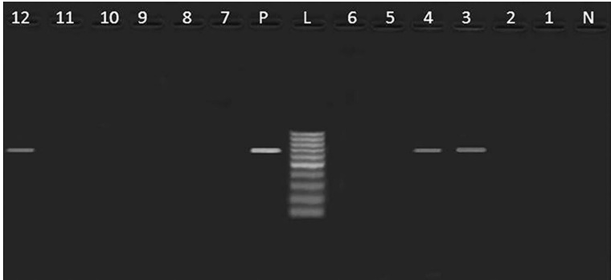
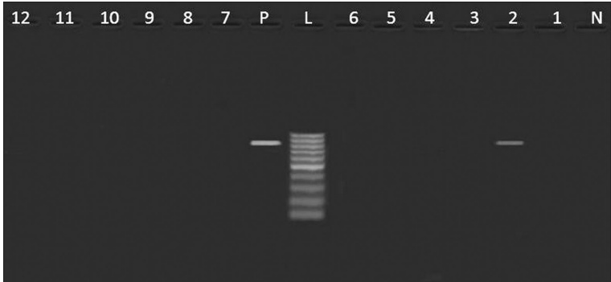

Fig. 1 Agarose gel electrophoresis showing an amplification of pefA gene (700 bp) in Salmonella isolates from poultry meat and humans. Lane N: negative control (pefA $ ^{-} $  Salmonella strain), lane L: DNA ladder (100 bp), lane P: positive control (pefA $ ^{+} $  Salmonella strain), lane 1: pefA $ ^{-} $  (S. Derby, duck), lane 2: pefA $ ^{-} $  (S. Kiel, chicken), lane 3: pefA $ ^{+} $  (untypable, duck), lane 4: pefA $ ^{+} $  (S. Rubislaw, chicken), lanes 5, 6, 10, 11: pefA $ ^{-} $  (S. Typhimurium, chicken), lane 7: pefA $ ^{-} $  (untypable, duck), lanes 8, 9: pefA $ ^{-} $  (S. Typhimurium, humans), lane 12: pefA $ ^{+} $  (S. Typhimurium, chicken)

Fig. 2 Agarose gel electrophoresis showing an amplification of hilA gene (854 bp) in Salmonella isolates from poultry meat and humans. Lane N: negative control (hilA $ ^{-} $  Salmonella strain), lane L: DNA ladder (100 bp), lane P: Positive control (hilA $ ^{+} $  Salmonella strain), lane 1: hilA $ ^{-} $  (S. Derby, duck), lane 2: hilA $ ^{+} $  (S. Kiel, chicken), lane 3,7: hilA $ ^{-} $  (untypable, duck), lane 4: hilA $ ^{-} $  (S. Rubislaw, chicken), lanes 5, 6, 10, 11,12: hilA $ ^{-} $  (S. Typhimurium, chicken), lanes 8,9: hilA $ ^{-} $  (S. Typhimurium, humans)

of the variable amplicons of class I integrons denoted by asterisks (Fig. 5) revealed the presence of gene cassettes containing aminoglycoside acetyltransferase [aac(3)-Id or aacCA5] gene which confers resistance against gentamycin, aminoglycoside adenyltransferase (aadA2, aadA4, aadA7) genes that confer resistance to streptomycin and spectinomycin, streptothricin acetyltransferase (sat) encoding resistance against streptothricin, dihydrofolate reductase type 15 (dfrA15) that confers resistance to trimethoprim, lnuF gene that codes for lincosamides resistance (lincomycin and clindamycin) and putative esterase (estX). Interestingly, the aac (3)-Id plus aadA7 were the most predominant resistance genes identified in class I integron gene cassettes of 1600 bp (S. Derby, duck), 1500 bp (untypable strain, duck) and 1550 bp (S. Typhimurium, chicken). The same cassettes harboring aac (3)-Id and aadA7 genes were previously identified in class I integron of S. Haifa (GenBank accession no. AY563051) [21], S. Newport (AY458224) [22] and S. Kentucky (AY463797) [23]. Despite the presence of these genes, some strains such as S. Derby was susceptible to gentamycin and S. Typhimurium strains (chicken) were

