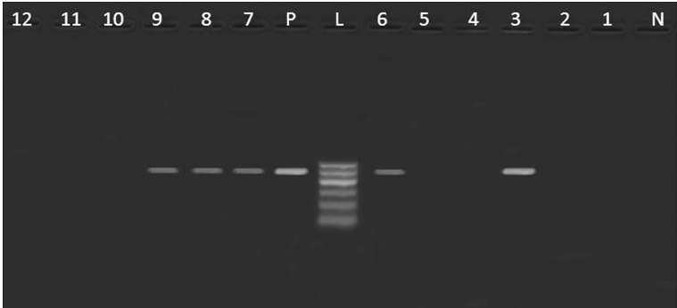
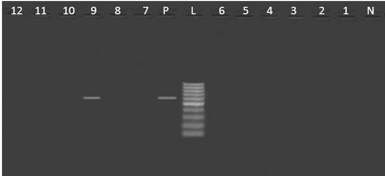

Gharieb et al. Gut Pathog (2015) 7:34

Page 6 of 11

Fig. 3 Agarose gel electrophoresis showing an amplification of sopB gene (517 bp) in Salmonella isolates from poultry meat and humans. Lane N: negative control (sopB $ ^{-} $  Salmonella strain), lane L: DNA ladder (100 bp), lane P: Positive control (sopB $ ^{+} $  Salmonella strain), lane 1: sopB $ ^{-} $  (S. Derby, duck), lane 2: sopB $ ^{-} $  (S. Kiel, chicken), lanes 3, 7: sopB $ ^{+} $  (untypable, duck), lane 4: sopB $ ^{-} $  (S. Rubislaw, chicken), lanes 5: sopB $ ^{-} $  (S. Typhimurium, chicken), lane 6: sopB $ ^{+} $  (S. Typhimurium, chicken), lanes 8, 9: sopB $ ^{+} $  (S. Typhimurium, humans), lane 10, 11, 12: sopB $ ^{-} $  (S. Typhimurium, chicken)

Fig. 4 Agarose gel electrophoresis showing an amplification of stn gene (617 bp) in Salmonella isolates from poultry meat and humans. Lane N: negative control (stn $ ^{-} $  Salmonella strain), lane L: DNA ladder (100 bp), lane P: Positive control (stn $ ^{+} $  Salmonella strain), lane 1: stn $ ^{-} $  (S. Derby, duck), lane 2: stn $ ^{-} $  (S. Kiel, chicken), lanes 3,7: stn $ ^{-} $  (untypable, duck), lane 4: stn $ ^{-} $  (S. Rubislaw, chicken), lanes 5,6,10,11,12: stn $ ^{-} $  (S. Typhimurium, chicken), lane 8: stn $ ^{-} $  (S. Typhimurium, humans), lane 9: stn $ ^{+} $  (S. Typhimurium, humans)

sensitive to streptomycin and this could be attributed to point mutations in the  $ aac(3) $ -Id gene of S. Derby [24] and frame shift mutation in S. Typhimurium [25, 26]. Nucleotide sequence analysis revealed point mutations in the  $ aac(3) $ -Id gene of S. Derby leading to the amino acid changes at codon 36 (glutamine CAG→proline CCG), codon 166,172 (arginine AGA→threonine ACA), codon 187 (arginine CGA→CTA leucine) and codon 189 (cysteine TGC→arginine CGC). C-to-T transition at position 208 of the deduced polypeptide resulted in a leucine to phenylalanine substitution and A to C transversion at codon 214 resulted in asparagine to histidine substitution. Silent mutation was recorded only at nucleotide 138 and didn't result in amino acid substitution (CCA→CCG, both are proline). Moreover, sequence analysis of aadA7 gene showed frame shift mutation due to additional cytosine at position 969 of the deposited sequence of S. Typhimurium from chicken.

In the present study, only one isolate of S. Typhimurium from human was found to harbor class I integrons of 650, 750 and 1600 bp. Sequence analysis of 650 bp revealed the presence of gene cassette containing aadA4.