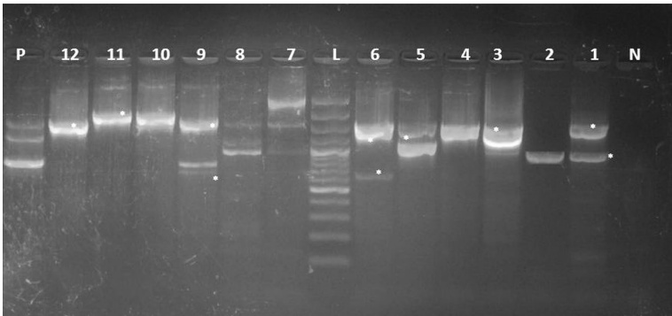

Fig. 5 Amplification of conserved regions (5'-CS and 3'-CS) of class 1 integron and integron profiles (IPs) detected in Salmonella isolates from poultry meat and humans. Asterisks represent the bands selected for sequencing. Lane N: negative control, lane L: DNA ladder (100 bp), lane P: Positive control, lane 1: IP I (S. Derby, duck), lane 2: IP II (S. Kiel, chicken), lanes 3,4: IP III (untypable, duck & S. Rubislaw, chicken), lanes 5, 6, 10, 11, 12: IP IV, V, IX, X (S. Typhimurium, chicken), lanes 8, 9: IPs VII, VIII (S. Typhimurium, humans)

which showed 100 % identity with aadA4 previously identified in class I integron of S. Newport (CP006631) and plasmid of S. Indiana (ref|NG_041636). In addition, the 1600 bp integron carried gene cassette containing dfrA15 gene that showed 100 % amino acid and nucleotide homology with dfrA15 gene previously reported in S. enterica strain (KM823524).

The sat gene detected in the gene cassette of class I integron (650 bp) of S. Typhimurium in this study was previously identified in S. Kedougou (DQ284538) $ ^{[27]} $  and plasmid of S. Choleraesuis (AY509004) $ ^{[28]} $ . Moreover, the 1500 bp amplicon identified in S. Typhimurium contained estX-sat gene cassette that is identical to estX gene previously identified in S. Typhimurium (EF051039), sat gene of S. Choleraesuis plasmid (ref|NG_036624) and SC-B67 strain (AY509004). Point mutations were observed in estX-sat gene cassette in this study compared to the classical estX and sat genes (99 % nucleotide identity); these genes displayed both missense and silent mutations. The nucleotide number 763 of estX was exchanged from T to C resulting in exchange of amino acid (phenylalanine) into leucine. Furthermore, at codon 288 (histidine  $ \underline{TAC}\rightarrow $ tyrosine  $ \underline{CAC} $ ) and 290 (threonine  $ \underline{ACA}\rightarrow $ alanine  $ \underline{GCA} $ ). Silent mutations were recorded at nucleotides 894 (GTC $ \rightarrow $ GTA, alanine), 903 (TAT $ \rightarrow $ TAC, tyrosine) and 927 (GTC $ \rightarrow $ GTA, both are valine). While in sat gene, silent mutations were detected at codon 418 (ACT $ \rightarrow $ ACC, tyrosine), 428 (GTC $ \rightarrow $ GTA, valine), 451 and 453 (GGC $ \rightarrow $ GGT, GGA $ \rightarrow $ GGG both are glycine). Amino acids replacement was recorded in sat gene at codon 459 (lysine  $ \underline{AAA}\rightarrow $ glutamic acid  $ \underline{GAA} $ ), 462 (proline  $ \underline{CCG}\rightarrow $ leucine  $ \underline{CTG} $ ) and 465 (isoleucine  $ \underline{ATC}\rightarrow $ threonine  $ \underline{ACC} $ ). Nonsense mutation was predicted at nucleotide 1418 (serine  $ \underline{TCA}\rightarrow $ stop codon  $ \underline{TAA} $ ). Antimicrobial drug resistance can occur by point mutations in the bacterial genome $ ^{[29]} $  or through mobile genetic elements called integrons which are able to disseminate the antimicrobial resistance among the enterobacteriaceae by horizontal transfer $ ^{[30]} $ .

In fact, this study reports for the first time the presence of aadA2 plus lnuF genes within the same integron gene cassette of 1900 bp in S.typhimurium from chicken. The nucleotide sequence of aadA2 and lnuF genes, respectively showed 99 and 100 % identity with aadA2 and lnuF genes previously reported in S. enterica serovar Stanley (EU118119). Moreover, the aadA2 gene had 99 % amino acid and nucleotide homology with aadA2 previously identified in S. Typhimurium isolated from food-animals and humans in Mexico (FJ460233)  $ [31] $ . On the other hand, the 1900 bp of class I integron was found to harbor aadA2 plus dfrA12 in S. enterica serovar Typhimurium isolated from food-animals, chicken and humans in Malaysia  $ [32] $ .

The nucleotide sequence of aadA2 showed four base differences from other aadA2 in GenBank reported cassettes and this caused point mutation which are responsible for an alteration in the codon 60 (glycine GGA→arginine CGA), codon 61 (isoleucine ATC→threonine ACC), codon 62 (asparagine AAC→aspartic acid GAC) and codon 105 (proline CCT→TCT serine) (Fig. 6). Similarly, point mutation in the aadA2 gene of NTS enterica isolates was reported  $ [29] $ .