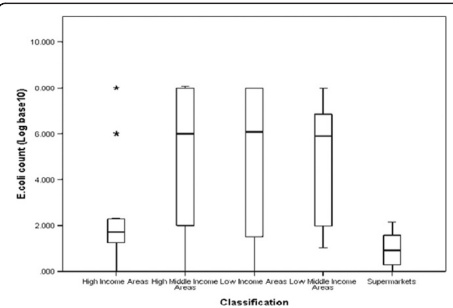
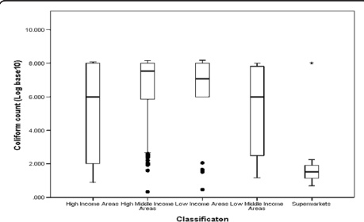

Odwar et al. BMC Research Notes 2014, 7:627 http://www.biomedcentral.com/1756-0500/7/627

Page 5 of 8

Figure 1 Distribution of E. coli count among the 5 retail outlet classifications. Counts were evenly distributed, the size of the boxes for high-middle income, low-middle income and low income areas indicate that the middle 50% E. coli counts are spread out for these groups while for high class butcheries and supermarkets the box sizes indicate that the middle 50% of the counts are clumped together.

multiplication. Studies in Iran and Switzerland showed that there were significant differences in contamination rates between individually packed and unpacked chicken meat samples [38,39]. Use of freezers and cooling temperatures for storage and display in some outlets from high middle income and low income areas could have resulted in few samples falling under the acceptable food safety range in these outlets as seen from the outliers in Figure 1 [40,41]. In most retail outlets, the degree of physical contact between different kinds of meat on display such as beef, fish and mutton may have led to cross contamination of different meats. Also, use of bare hands in handling meat, utensils and money at the same time as observed may have increased chances of microbial contamination [42]. In contrast to the findings in this study, a similar recent

Figure 2 Distribution of Coliform count among the 5 retail outlet classifications. Apart from supermarkets, the other 4 retail outlet classifications have bulk of the count concentrated on the high end of the scale.

Table 3 Antimicrobial resistance profiles among E. coli isolated in retail chicken meat (n = 156)

<table border=1 style='margin: auto; width: max-content;'><tr><td style='text-align: center;'>Antibiotic</td><td style='text-align: center;'>Frequency of resistant isolates</td><td style='text-align: center;'>%</td></tr><tr><td style='text-align: center;'>AMC</td><td style='text-align: center;'>4</td><td style='text-align: center;'>2.6</td></tr><tr><td style='text-align: center;'>SXT</td><td style='text-align: center;'>77</td><td style='text-align: center;'>49.4</td></tr><tr><td style='text-align: center;'>TE</td><td style='text-align: center;'>94</td><td style='text-align: center;'>60.3</td></tr><tr><td style='text-align: center;'>AMP</td><td style='text-align: center;'>53</td><td style='text-align: center;'>34</td></tr><tr><td style='text-align: center;'>CIP</td><td style='text-align: center;'>7</td><td style='text-align: center;'>4.5</td></tr><tr><td style='text-align: center;'>CAZ</td><td style='text-align: center;'>0</td><td style='text-align: center;'>0</td></tr><tr><td style='text-align: center;'>K</td><td style='text-align: center;'>8</td><td style='text-align: center;'>5.1</td></tr><tr><td style='text-align: center;'>S</td><td style='text-align: center;'>47</td><td style='text-align: center;'>30.1</td></tr><tr><td style='text-align: center;'>CRO</td><td style='text-align: center;'>18</td><td style='text-align: center;'>11.5</td></tr><tr><td style='text-align: center;'>CN</td><td style='text-align: center;'>1</td><td style='text-align: center;'>0.6</td></tr><tr><td style='text-align: center;'>NA</td><td style='text-align: center;'>23</td><td style='text-align: center;'>14.7</td></tr><tr><td style='text-align: center;'>C</td><td style='text-align: center;'>21</td><td style='text-align: center;'>13.5</td></tr></table>

study in Accra, Ghana found that even though hygienic conditions in supermarkets were generally better than those in local markets and farms, there was no significant difference between the microbial counts for these retail outlets and they all had low microbial counts [43]. The authors attributed this observation to the deliberate efforts by the food sector in improving the hygienic procedures in the processing of poultry over the years.

Similar prevalence of antibiotic resistance in  $ E.\ coli $  isolated from retail chicken have been observed in other studies ranging from 40.6% in Japan, 52% in Iceland, 84.6% in Minneapolis, U.S.A, 83.8% in Vietnam and even 100% isolates in Senegal being resistant to one or more antibiotics  $ [31,44-47] $ . The high prevalence of resistance in poultry meat isolates is alarming given the evidence of possible transmission of antibiotic resistant food borne bacteria to consumers and food handlers  $ [48] $ . Similar multi-drug resistance phenotypes of  $ E.\ coli $  isolated from retail chicken have been reported in studies conducted in Japan, Vietnam, Saudi Arabia and Slovakia  $ [30,31,49,50] $ . The common resistance phenotypes observed are of great clinical significance since these antimicrobials are considered to be among the frontline therapeutic drugs for treatment of most bacterial infections in

Table 4 Classification of pathogenic E. coli identified from retail chicken meat

<table border=1 style='margin: auto; width: max-content;'><tr><td style='text-align: center;'>Classification of pathogenic  $ E.\ coli $</td><td style='text-align: center;'>Frequency of isolates</td><td style='text-align: center;'>%</td></tr><tr><td style='text-align: center;'>EPEC</td><td style='text-align: center;'>13</td><td style='text-align: center;'>20.6</td></tr><tr><td style='text-align: center;'>ETEC</td><td style='text-align: center;'>38</td><td style='text-align: center;'>60.3</td></tr><tr><td style='text-align: center;'>EIEC</td><td style='text-align: center;'>4</td><td style='text-align: center;'>6.3</td></tr><tr><td style='text-align: center;'>EaggEC</td><td style='text-align: center;'>3</td><td style='text-align: center;'>4.8</td></tr><tr><td style='text-align: center;'>STEC</td><td style='text-align: center;'>5</td><td style='text-align: center;'>7.9</td></tr></table>