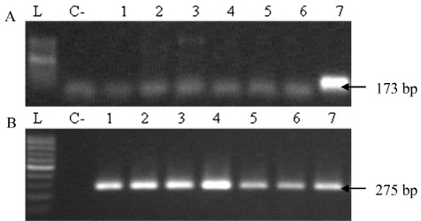

W. Oueslati et al. / Meat Science 119 (2016) 154–159

157

Fig. 2. Agarose gel electrophoresis of bands generated by simple PCR of strains using the primer specific for the genus Salmonella (1 kb). L: 100 bp ladder; C—: negative control; C+: positive control; Lanes 1 to 8: Salmonella bands (1 kb) of isolated strains.

The experimental protocol was approved by the Tunisian Association of Laboratory Animal Science, Tunisia. The restraint and slaughter of animals were monitored and carried out by trained and competent staff, in order to minimize animals' suffering.

All the stages were realized under the responsibility and supervision of an official sanitary veterinarian.

### 3. Results

##### 3.1. Prevalence of Salmonella spp. in beef

The deep meat contamination prevalence by Salmonella spp. was 5.7% (17/300). The 17 isolates were positive to PCR using Salmonella specific primers (Fig. 1). This rate varies from naught (0/100) for bulls' meat to 14% (14/100) for culled cows' meat (p < 0.001). Salmonella spp. beef meat prevalence was higher during the summer season (13.3%; 10/75) compared to winter (1.3%; 1/75) (p < 0.05).

A total number of 6 serotypes were identified, namely S. Montevideo (8/17), S. Anatum (3/17), S. Minnesota (2/17), S. Amsterdam (2/17), S. Kentucky (1/17) and S. Brandenburg (1/17) (p < 0.05) (Table 1). Unlike other serotypes, S. Montevideo was present during the whole year except winter. It showed a prevalence peak during the summer season (6.7%; 5/75) (p < 0.05) (Fig. 1).

Digestive disorders (chronic gastroenteritis (6/17), traumatic peritonitis (3/17) and intestinal obstruction (2/17)) were significantly related to Salmonella spp. meat contamination (p < 0.0001) (Table 1). Moreover, chronic feet diseases (4/17) and chronic mastitis (2/17) were factors for deep meat Salmonella spp. contamination.

Prevalence of Salmonella contamination was significantly higher in culled cows' meat with digestive disorders (23.5%; 8/34) compared to cows with chronic feet diseases (12.1%; 4/33) and cows with chronic mastitis (6.1%; 2/33) (p < 0.001).

#### 3.2. Prevalence of pathogenic genes and antibiotic resistance

Salmonella strains (17) were positive for invasion gene invA and negative for the virulence gene spvC. Only one isolate (S. Kentucky) serotype was positive for h-li gene (Table 1, Fig. 3).

Almost all (16/17) of the strains were resistant to at least one of the antibiotics. Multi-resistance concerned 14/17 of the strains, including Amoxicillin (13/17), Tetracycline (12/17), Streptomycin (10/17) and Nalidixic acid (6/17). Furthermore, all strains were sensitive to the association (Amoxicillin + Clavulanic acid), Cefoxitin and Ceftazidime (Table 1).

### 4. Discussion

The results of our study showed that Salmonella spp. beef contamination rate was 5.7% (17/300). It varies from naught (0/100) in bulls' meat to 14% (14/100) in culled cows' meat (p < 0.001). Our results were comparable to those of Ben Jaafar, Jiridi, Fodha, and Salem (2002) who found a prevalence of 4.2% in Tunisian beef meat catering. This rate was lower to the results of Derouiche (2001) in Tunisia (9.3%). This difference could be explained by the fact that Derouiche collected samples from culled cattle.

Fig. 3. Agarose gel electrophoresis of h-li and invA genes products. L: 100 bp ladder; C—: negative control; Lanes 1 to 7: positive samples (h-li, invA); A panel: h-li positive samples; B panel: invA positive samples.

Our study revealed that the contamination prevalence of the culled cows' meat (14%) was significantly higher than that of culled heifers and bulls' meat (3% and 0% respectively) (p < 0.001) (Table 1). This is likely due to the high prevalence of latent carriage in culled cows, immunodepression in some animals, the absence of water diet and fatigue before slaughtering (Labadie, 1999).

Seasonal fluctuation of Salmonella spp. beef meat contamination showed a significant difference between the prevalence of Salmonella spp. during the summer season (13.3%; 10/75) and winter (1.3%; 1/75) (p < 0.05). Our results were comparable to those of Ayaz, Ormeci, and Oz (2010) who found a higher prevalence of Salmonella spp. in Turkish beef meat in summer than in other seasons. In Nepal, Maharjan, Vandana, Durga, and Poornima (2006) indicated that the seasonal prevalence of Salmonella spp. in beef meat was highest in the months of April and May (summer season).

Of the 17 Salmonella isolates, 6 serotypes were identified, namely, S. Montevideo (8/17), S. Anatum (3/17), S. Minnesota (2/17), S. Amsterdam (2/17), S. Kentucky (1/17) and S. Brandenburg (1/17) (p < 0.05) (Table 1). Seasonal distribution of Salmonella spp. serotypes indicated that unlike other serotypes, S. Montevideo was present during the whole year except winter and peaking during the summer season (6.7%; 5/75) (p < 0.05) (Fig. 1). S. Montevideo is frequently isolated from diarrhea cattle in France (AFSSA, 2006). Since 2000, S. Montevideo was the third most frequent serotype in cattle digestive diseases in France (7%) (AFSSA, 2006). However, our results do not agree with those of Derouiche (2001) and Ben Jaafar et al. (2002) who revealed the predominance of S. Anatum (40%) followed by S. Corvallis. S. Montevideo rate was 6% (Derouiche, 2001) but not isolated by Ben Jaafar et al. (2002).

Our study did not reveal the presence of the two most frequent serotypes involved in collective food poisoning namely S. Enteritidis and S. Typhimurium. Ben Jaafar et al. (2002) showed fairly significant levels of contamination of beef with S. Enteritidis and S. Typhimurium (12%) but Derouiche (2001) indicated a low level of contamination with S. Enteritidis (4%) but no S. Typhimurium contamination was found.

Digestive disorders (chronic gastroenteritis (6/17), traumatic peritonitis (3/17) and intestinal obstruction (2/17)) were the main cattle disease history (Table 1). This is explained by the fact that digestive tract disturbances increase Salmonella absorption from the intestinal lumen (Labadie, 1999).

Our study showed that all studied Salmonella strains  $ (n = 17) $  were positive for invasion gene invA and negative for spvC virulence gene. Only one isolate (S. Kentucky) was positive for h-li gene (Table 1, Figs. 2 and 3). Our results were similar to those of Karraouan et al. (2010) who indicated that all strains  $ (n = 39) $  of Salmonella were positive for the invasion gene invA. Several serotypes (Muenster, Newport, Corvallis, Albert, Bredeney, Hadar, Derby, Kiel, Altona and Infantis) were negative for both virulence genes spvC and h-li, while 4/8 of S. Kentucky serotype were positive for the gene h-li. Only S. Gallinarum was positive.