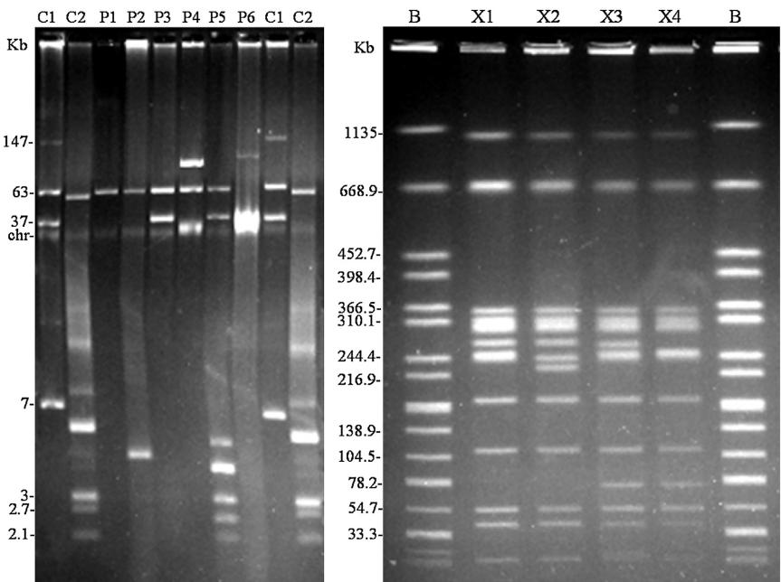

# Antimicrobial drug resistance and genetic properties of Salmonella enterica serotype Enteritidis circulating in chicken farms in Tunisia

Rakia Ben Salem $ ^{a,b} $ , Mohamed S. Abbassi $ ^{a,b,**} $ , Vanesa García $ ^{c,1} $ , Raquel García-Fierro $ ^{c} $ , Javier Fernández $ ^{c} $ , Hajer Kilani $ ^{a,b} $ , Imen Jaouani $ ^{a,b} $ , Monia Khayeche $ ^{d} $ , Lilia Messadi $ ^{e} $ , María R. Rodicio $ ^{c,*} $

a Veterinary Research Institute of Tunisia, 20 Street Jebel Lakhdhar, Bab Saadoun, 1006 Tunis, Tunisia

b Faculté des Sciences de Bizerte, Université de Carthage, Tunis, Tunisia

c Universidad de Oviedo, Departamento de Biología Funcional, Área de Microbiología, Julián Clavería 6, 33006 Oviedo, Spain

d Regional Center of Veterinary Research, 4000 Sousse, Tunisia

 $ ^{e} $  National School of Veterinary Medicine, Department of Microbiology and Immunology, University of La Manouba, Tunisia

## ARTICLE INFO

Article history:

Received 5 August 2016

Received in revised form

21 November 2016

Accepted 28 January 2017

Keywords:

Poultry

Antimicrobial drug resistance

qnrB

Virulence genes

PFGE

## A B S T R A C T

This study focused on 77 isolates of Salmonella enterica serotype Enteritidis collected during 2009 to 2013 from healthy and sick chickens and environmental farm samples in Tunisia. Resistance to 14 antimicrobials and the encoding genes were analyzed. 66, 26, 6.5, 3.9 and 1.3% were pan-susceptible or showed resistance to nalidixic acid (Asp87 to Tyr and Asp87 to Asn substitutions in GyrA), ampicillin ( $ bla_{TEM-1} $ -like and  $ bla_{SHV} $ ), sulfonamides (sul1 and sul3) and streptomycin (strB), respectively. A single isolate with intermediate susceptibility to ciprofloxacin was positive for qnrB, whereas qnrA, qnrS or aac(6')-Ib-cr were not detected. The virulotype of the isolates was established by testing ten virulence genes. The orgA, ssaQ, mgtC, siidC, sopB genes, located on Salmonella pathogenicity islands, and spvC of the serotype-specific virulence plasmid, were common to all isolates. In contrast, the prophage-associated sopE-1, sodC1 and gipA genes and the fimbrial bcfC gene were variably represented. All isolates except one contained the virulence plasmid, which appeared either alone or together with one or more additional plasmids. One isolate carried a single plasmid of ca. 90 Kb which may be derived from the virulence plasmid (60 Kb). Overall, seven resistotypes, six virulotypes and six plasmid profiles were identified. XbaI-PFGE revealed four related pulsotypes (X1-X4), with 80% of the isolates sharing the X1 pattern. The latter isolates exhibited different resistance, virulence and plasmid profiles, suggesting that mobile genetic elements, particularly prophages and plasmids, are of central importance for the evolution and adaptation of S. Enteritidis circulating in chicken farms in Tunisia.

© 2017 The Authors. Published by Elsevier Limited. This is an open access article under the CC BY-NC-ND license (http://creativecommons.org/licenses/by-nc-nd/4.0/).

## I ntroduction

Salmonella enterica is a major zoonotic food-borne pathogen causing outbreaks and sporadic cases of gastroenteritis in humans worldwide  $ [1,2] $ . Among more than 2500 serotypes of S. enterica, serotype Enteritidis (S. Enteritidis), which is mainly transmitted through consumption of contaminated poultry meat and egg products  $ [3] $ , is the primary cause of human salmonellosis in many countries, including Tunisia  $ [4–6] $ . The infection develops with diarrhea, nausea, vomiting and abdominal cramps, and is usually self-limiting. However, S. enterica can also cause severe invasive infections, particularly in immune-compromised hosts, the elderly and the very young  $ [7,8] $ . Antimicrobial agents are not essential to control most Salmonella infections, but severe, life-threatening infections require treatment. In these instances, fluoroquinolones and broad spectrum cephalosporins are the drugs of choice  $ [8] $ . Development of resistance to these key antimicrobials is hence a major problem for public health.

Multiple factors determine the virulence of S. enterica, which are primarily encoded by chromosomal genes, unlinked or clustered in islets (composed by a few genes) and larger pathogenicity islands (SPIs). In Salmonella more than 20 SPIs have been detected so far, with SPI1 to SPI5 being linked to well-defined pathogenic processes  $ [9] $ . SPI-1 and SPI-2 encode different type III secretion systems which deliver effector proteins into the cytosol of the host cell, leading to bacterial invasion of the intestinal epithelium as well as proliferation of Salmonella within eukaryotic cells. SPI-3 encodes a magnesium transporter involved in adaptation of Salmonella to the adverse intracellular environment. SPI-4 encodes a giant non-fimbrial adhesin (SiiE) and a type I secretion system responsible for its transport. SiiE mediates close interaction with microvilli at the apical side of epithelial cells. SPI-5 is connected with inflammation and chloride secretion during the enteric phase of the disease  $ [9,10] $ . Other non SPI-associated genes also play an important role during infection, for example, prophage-encoded genes and fimbrial gene clusters  $ [11,12] $ . In addition, some serotypes of S. enterica, including S. Enteritidis, harbor virulence-plasmids of variable size, which share the spv (Salmonella plasmid virulence) locus. The spv region seems to promote rapid growth and survival of S. enterica within the host cells and is thus believed to play an important role in systemic infections  $ [13] $ .

In Tunisia, a retrospective study on the occurrence of S. enterica during an 11-year period (1994–2004), revealed S. Enteritidis as the most common serotype recovered from human specimens (24.1%; 1640/6815) and animals (69%; 1551/2249), and the second serotype found in food products (15.8%; 877/5539), only preceded by S. Anatum. In addition, S. Enteritidis was the most common serotype in poultry (70.3%; 1378/1959) and poultry meat (27.7%; 415/1496) [4]. A more recent study also supported the predominance of S. Enteritidis in chicken products along the 2008–2011 years [6]. Despite this, information available on the resistance and genetic properties of isolates from chickens and environmental farm samples in Tunisia is rather limited. The aim of the present study was the characterization of a collection of S. Enteritidis isolates obtained from these sources with respect to their resistance properties, virulence gene content, plasmid patterns and XbaI pulsed-field gel electrophoresis (PFGE) profiles.

## Materials and methods

## Bacterial isolates

During the period 2009–2013, we have collected 142 Salmonella isolates, which were identified as S. Enteritidis (85; 60%), S. Eppendorf (22; 15.5%), S. Zanzibar (17; 12%), S. Typhimurium (7; 5%), S. Anatum (5; 3.5%), S. Kentucky (3; 2.1%), S. Seftenberg (2; 1.3%), S. Virchow (1; 0.7%) and S. Solt (1; 0.7%). Phenotypic and genotypic characterization of the S. Eppendorf isolates have previously been reported [14]. In the present study we focused on S. Enteritidis isolates owing to their high incidence. Only 77 out of the 85 originally detected isolates could be recovered for further analysis. They were obtained from samples (feces, organs and/or embryonic eggs) of healthy (38) and sick chickens (8; suffering from colibacillosis or pasteurellosis), and of the farm environment (31; waste of hatching, feathers, dust and water). The isolates were collected in 17 farms (located in central and north eastern regions of the country) or during official controls along the period of four years. Initial detection was done according to ISO method 6579/2002 and the isolates were confirmed as Salmonella by API 20E (Bio-Mérieux, Marcy l'Etoile, France). Serotype was determined by slide agglutination with the use of antisera (Bio-Rad, Marnes-la-Coquette, France) to identify somatic O antigens and flagellar H antigens, according to the Kauffmann–White–Le Minor scheme [15].

## Antimicrobial susceptibility testing by disk diffusion

Antimicrobial susceptibilities for all S. Enteritidis isolates were tested by the disk diffusion method on Mueller–Hinton agar using commercial disks (Oxoid, Madrid, Spain), and results were interpreted according to the Clinical and Laboratory Standards Institute guidelines [16]. The following antimicrobials were used: ampicillin 10  $ \mu $ g (AMP), amoxicillin/clavulanic acid 30  $ \mu $ g (AMC), cefotaxime 30  $ \mu $ g (CTX), cefoxitin 30  $ \mu $ g (FOX), apramycin 15  $ \mu $ g (APR), chloramphenicol 30  $ \mu $ g (CHL), gentamycin 10  $ \mu $ g (GEN), ciprofloxacin 5  $ \mu $ g (CIP), nalidixic acid 30  $ \mu $ g (NAL), streptomycin 10  $ \mu $ g (STR), sulfonamides 30  $ \mu $ g (SUL), tetracycline 30  $ \mu $ g (TET), tobramycin 10  $ \mu $ g (TOB) and trimethoprim 5  $ \mu $ g (TMP). S. Enteritidis ATCC 13076 and S. Typhimurium ATCC 14028 were used as control strains.

## Genes encoding antimicrobial resistance

Genes encoding resistance to ampicillin  $ [bla_{OXA-1}, bla_{PSE-1}, bla_{SHV}, bla_{TEM-1-like}] $ , streptomycin  $ [aadA1-like, aadA2, strA and strB] $  and sulfonamides  $ [sul1, sul2, sul3] $ , selected according to the resistance phenotypes, were screened by PCR, using previously reported primers and conditions [17]. The genetic bases of nalidixic acid resistance were established by PCR amplification and sequencing of the quinolone resistance-determining region (QRDR) of the gyrA gene of nine isolate selected as representative of different resistance profiles [18]. Sequencing was conducted at Macrogen Europe (Amsterdam, Netherlands). For all S. Enteritidis isolates, the qnrA, qnrB, qnrS and  $ aac(6')-Ib-cr $  genes, coding for plasmid-mediated quinolone resistance (PMQR) were also screened by PCR [19]. To investigate the presence of class 1 integrons in sul1- and sul3-positive isolates, the presence of the int1 gene was investigated [17].

## V irulence genotyping

All S. Enteritidis isolates were tested for 10 virulence genes, selected for their established association with Salmonella pathogenicity  $ [9-13] $ . For this, PCR amplifications were performed using previously published primers and conditions  $ [20,21] $ . Five target genes  $ [orgA, ssaQ, mgtC, spi\_4D (siiD) $  and  $ sopB] $  are located on SPI1 to SPI5, one (spvC) on the virulence plasmid, three (gipA, sodC1 and sopE1) on prophages, and one (bcfC) on a fimbrial gene cluster.

## Plasmid profiles

Plasmid DNA was extracted by the technique of Kado and Liu  $ [22] $  and analyzed by electrophoresis on 0.6% agarose gels. Plasmids from Escherichia coli strains 39R861 and V517 were included as size controls.

## Pulsed-field gel electrophoresis analysis

Thirty six representative isolates with different resistance, virulence and plasmid combined profiles were typed by PFGE, using the PulseNet protocol with the XbaI (40U; Takara Biomedical, Madrid, Spain) enzyme (http://www.pulsenetinternational.org/). Electrophoresis was performed in a CHEF-DR III (Bio-Rad Laboratories, Madrid, Spain) with the following settings: initial switch time 2 s, final switch time 63 s, a gradient of 6 V/cm, 120° angle and 21 h of electrophoresis. Migration of the DNA fragments was achieved in 1% agarose gels (w/v; Ultra-Pure DNA Grade Agarose, Bio-Rad) submerged in 0.5X TBE buffer. XbaI-digested DNA of S. Braenderup H9812 was included as size marker. The gels were visualized under

312 nm UV light and the images were taken with Gel Doc TM XR (Bio-Rad).

## Results

Amongst the 77 S. Enteritidis isolates, resistances to nalidixic acid, ampicillin, sulfonamides and streptomycin were observed in 20 (26%), five (6.5%), three (3.9%) and one (1.3%) isolates, respectively. In addition, a single isolate showed intermediate susceptibility to ciprofloxacin, but resistances to cefotaxime, cefoxitin, chloramphenicol, gentamicin, tobramycin and trimethoprim were not detected (Table 1). Overall, 51 isolates (66.2%) were susceptible to all antimicrobials tested while only 26 (33.8%) were resistant to one or more compounds. The genes responsible for the observed resistances are shown in Table 1. Sulfonamide resistance was encoded by sul1 or sul3, detected in one and two isolates, respectively. The streptomycin-resistant isolate harbored the strB gene but was negative for strA. The  $ bla_{TEM-1-like} $  and  $ bla_{SHV} $  genes were found in four and one of the ampicillin resistant isolates, respectively. The gene intI1, encoding the integrase of class 1 integrons, was not detected in the sul1- or sul3-positive S. Enteritidis isolates. Two mutations in the gyrA gene, changing Asp87 (GAC) to Tyr (TAC) and Asp87 (GAC) to Asn (AAC) were identified as responsible for nalidixic acid resistance in three and two of the isolates tested, respectively. In four other cases, mutations in the QRDR of gyrA were not detected; thus further research will be needed to establish the genetic basis of their resistance. With regard to PMQR genes, qnrB was present in the single isolate with intermediate susceptibility to ciprofloxacin (1.3%), while qnrA, qnrS and  $ aac(6')-Ib-cr $  genes were not observed. By combining resistant-phenotypes and genes involved, a total of seven profiles (R1 to R7) were identified (Table 1).

The presence or absence of ten virulence genes was investigated in the panel of 77 S. Enteritidis isolates by PCR amplification with specific primer pairs (Table 1). The orgA, ssaQ, mgtC, siid (spi4_D) and sopB, selected as markers of SPI1 to SPI5, and the spvC used as indicator of the virulence plasmid of S. Enteritidis, were found in all isolates. The prophage-associated sopE1, gipA and sodC genes were detected in 75 (97.4%), 74 (96.1%) and 37 (48%) isolates, respectively. The bcfC fimbrial gene was present in 75 (97.4%) isolates. Overall, we observed six distinct virulence profiles (V). The V1 profile that included all tested genes was found in 34 (44.1%) isolates; the V2 profile lacking the sodC1 gene was found in 36 (46.8%) isolates; the V3, V4 and V5 profiles lacking bcfC, sopE plus sodC1 and sodC1 plus gipA, respectively, were each shown by two isolates; and the V6 profile lacking gipA was represented by a single isolate.

Six plasmid patterns (P1–P6) were found in the present study (Fig. 1A; Table 1). All except one isolate harbored a plasmid of ca. 60 Kb, which is the size expected for the virulence plasmid of S. Enteritidis. This plasmid appeared either alone (67 isolates; 87%; P1 profile) or together with one or more additional plasmids ranging in size from ca. 2 Kb up to 80 Kb (profiles P2–P5, with two, five, one and one isolates, respectively). The remaining isolate carried a single plasmid of ca. 90 Kb (profile P6).

Altogether, 19 combinations of resistance, virulence and plasmid profiles were identified (Table 1). The most frequent combination (35.1%) corresponded to susceptible isolates (R0), carrying all virulence genes tested (V1) and containing the virulence plasmid alone (P1). Isolates positive for the virulence plasmid, lacking sodC1 and being either susceptible (23.4%) or resistant to nalidixic acid (15.6%) were also very common. The genetic relatedness of 36 isolates covering different combinations of resistance, virulence and plasmid profiles, were investigated by PFGE. Four closely related pulsotypes, named X1–X4, were found (Fig. 1B; Table 1). The major pulsotype was X1 that encompassed 29 isolates, while X2, X3 and X4 included only one, two and four isolates, respectively. X1 was associated with isolates of different origin (healthy and sick chickens as well as environmental samples) and with diverse resistance, virulence and plasmid profiles.

## Discussion

In this study, 77 S. Enteritidis isolates recovered in Tunisia from chicken facilities (healthy and sick animals as well as the farm environment) during a period of five years were examined for antimicrobial susceptibility and the genetic basis of the observed resistances. More than half of the isolates were susceptible to all antimicrobials tested, which is consistent with other studies indicating that antimicrobial drug resistance is uncommon in S. Enteritidis  $ [23–25] $ . In the present study, a low incidence of streptomycin, ampicillin and sulfonamides resistance (1.3%, 3.9% and 6.5%, respectively), and a relatively high level of nalidixic acid resistance (26%) were observed. The spread of sulfonamides resistance in Enterobacteriaceae including S. enterica is largely due to the frequent location of sul1 and sul3 genes in class 1 integrons, which often contain gene cassettes encoding resistance also to other antimicrobials. Although these genes were identified as responsible for sulfonamides resistance in the S. Enteritidis isolates from Tunisia, neither intI1 nor any gene cassette characteristically associated with class 1 integrons, were detected  $ [26] $ . However, the presence of defective class 1 integrons cannot be ruled out.

Resistance to quinolones has increasingly been reported in Enterobacteriaceae from animal and human origin worldwide. Particularly, poultry-derived S. Enteritidis isolates have been shown to be highly resistant to nalidixic acid, probably due to the widespread use of quinolones in poultry production systems  $ [27] $ . Antimicrobial agents used to be widely administered in animal husbandry for growth promotion, a practice now banned in many countries, but still common in others. In Tunisia it was banned since 1999, although the law is not enforced. Unfortunately, official documents about the use of antimicrobials in Tunisian avian husbandry are not available. However, according to veterinarians and farmers, florfenicol (fenicol), ofloxacin (second generation fluoroquinolone) and doxycycline (tetracycline) are commonly administered in avian farms to treat some infections, specifically chronic respiratory diseases, colibacillosis or necrotic enteritis. These antimicrobials are sometimes excessively applied with a concurrent lack of bacteriological analysis. Thus, a better control of antimicrobial usage in chicken production systems in Tunisia is required.

Quinolone resistance is usually associated with alterations in the gyrA gene which encodes the A subunit of the target DNA gyrase. In fact, Asp87 to Tyr or Asp87 to Asn mutations were found in the gyrA genes of five isolates tested, these being the most common mutations associated with nalidixic acid resistance in S. Enteritidis  $ [23,28,29] $ . A single isolate carried the qnrB gene, but none of the isolates was positive for qnrA, qnrS and  $ aac(6^{\prime})-Ib-cr $  genes. This is consistent with a low-level rate of dissemination of PMQR among chicken-associated isolates of S. Enteritidis in Tunisia. In fact, PMQR genes (qnrA, qnrB, qnrS and  $ aac(6^{\prime})-Ib-cr $ ) have been previously reported in only five out of 113 nalidixic acid resistant isolates of this serotype (4.4%) recovered from different food sources, but mainly from chicken, during the 2008–2011 period in Tunisia  $ [6] $ . The frequency of nalidixic acid resistance reported in the latter study (31.4%) was close to the value obtained for the 2009–2013 period reported herein (26%).

The 77 S. Enteritidis isolates were further characterized according to virulotype and plasmid content, which resulted in six profiles each. Nearly half of the isolates (44%) shared the same virulotype (V1), which included all virulence genes tested. These genes were selected as markers of regions known to be highly conserved (SPIs).

Table 1

Resistance properties, virulotypes, plasmid profiles and XbaI-PFGE profiles of Salmonella enterica serotype Enteritidis from chicken and farm environmental samples.

<table border=1 style='margin: auto; width: max-content;'><tr><td style='text-align: center;'>R&lt;sup&gt;a&lt;/sup&gt; (N&lt;sup&gt;b&lt;/sup&gt;)</td><td style='text-align: center;'>Phenotype&lt;sup&gt;c&lt;/sup&gt;</td><td style='text-align: center;'>Genotype (N&lt;sup&gt;b&lt;/sup&gt;)</td><td style='text-align: center;'>V&lt;sup&gt;d&lt;/sup&gt; (N&lt;sup&gt;b&lt;/sup&gt;)</td><td style='text-align: center;'>Detected virulence genes</td><td style='text-align: center;'>RV&lt;sup&gt;e&lt;/sup&gt;</td><td style='text-align: center;'>P&lt;sup&gt;f&lt;/sup&gt; (N&lt;sup&gt;b&lt;/sup&gt;)</td><td style='text-align: center;'>RVP&lt;sup&gt;g&lt;/sup&gt; (N&lt;sup&gt;b&lt;/sup&gt;)</td><td style='text-align: center;'>R1&lt;sup&gt;h&lt;/sup&gt; (O&lt;sup&gt;i&lt;/sup&gt;)</td><td style='text-align: center;'>X&lt;sup&gt;i&lt;/sup&gt;</td></tr><tr><td rowspan="6">R0 (51)</td><td rowspan="6"></td><td rowspan="6"></td><td style='text-align: center;'>V1 (28)</td><td style='text-align: center;'>orgA-ssaQ-mgtC-siiD-sopB-sopE1-sodC1-gipA-bcfC-spvC</td><td style='text-align: center;'>R0V1</td><td style='text-align: center;'>P1 (27)</td><td style='text-align: center;'>R0V1P1 (27)</td><td style='text-align: center;'>432I (HCk)</td><td style='text-align: center;'>X1</td></tr><tr><td rowspan="3">V2 (20)</td><td rowspan="3">orgA-ssaQ-mgtC-siiD-sopB-sopE1-gipA-bcfC-spvC</td><td rowspan="3">R0V2</td><td style='text-align: center;'>P4</td><td style='text-align: center;'>R0V1P4</td><td style='text-align: center;'>49I (HCk)</td><td style='text-align: center;'>X1</td></tr><tr><td style='text-align: center;'>P1 (18)</td><td style='text-align: center;'>R0V2P1 (18)</td><td style='text-align: center;'>816/09lit (Fenv)</td><td style='text-align: center;'>X1</td></tr><tr><td style='text-align: center;'>P2</td><td style='text-align: center;'>R0V2P2</td><td style='text-align: center;'>1990Dv (Fenv)</td><td style='text-align: center;'>X3</td></tr><tr><td style='text-align: center;'>V3</td><td style='text-align: center;'>orgA-ssaQ-mgtC-siiD-sopB-sopE1-sodC1-gipA-spvC</td><td style='text-align: center;'>R0V3</td><td style='text-align: center;'>P6</td><td style='text-align: center;'>R0V2P6</td><td style='text-align: center;'>198/09Dv3 (Fenv)</td><td style='text-align: center;'>X3</td></tr><tr><td style='text-align: center;'>V5 (2)</td><td style='text-align: center;'>orgA-ssaQ-mgtC-siiD-sopB-sopE1-bcfC-spvC</td><td style='text-align: center;'>R0V5</td><td style='text-align: center;'>P1</td><td style='text-align: center;'>R0V3P1</td><td style='text-align: center;'>510/09 (Fenv)</td><td style='text-align: center;'>X1</td></tr><tr><td rowspan="7">R1 (17)</td><td rowspan="7">NAL</td><td style='text-align: center;'>GAC/AAC (Asp87Asn)</td><td rowspan="2">V1 (3)</td><td rowspan="2">orgA-ssaQ-mgtC-siiD-sopB-sopE1-sodC1-gipA-bcfC-spvC</td><td rowspan="2">R1V1</td><td style='text-align: center;'>P1 (2)</td><td style='text-align: center;'>R1V1P1 (2)</td><td style='text-align: center;'>728/09Dch (Fenv)</td><td style='text-align: center;'>X1</td></tr><tr><td style='text-align: center;'>ni</td><td style='text-align: center;'>P2</td><td style='text-align: center;'>R1V1P2</td><td style='text-align: center;'>Ssp1 (HCk)</td><td style='text-align: center;'>X4</td></tr><tr><td style='text-align: center;'>GAC/TAC (Asp87Tyr)</td><td rowspan="3">V2 (12)</td><td rowspan="3">orgA-ssaQ-mgtC-siiD-sopB-sopE1-gipA-bcfC-spvC</td><td rowspan="3">R1V2</td><td rowspan="3">P1 (12)</td><td rowspan="3">R1V2P1 (12)</td><td rowspan="3">ST2 (HCk)</td><td rowspan="3">X1</td></tr><tr><td rowspan="2">GAC/AAC (Asp87Asn)</td></tr><tr></tr><tr><td style='text-align: center;'>GAC/TAC (Asp87Tyr)</td><td style='text-align: center;'>V3</td><td style='text-align: center;'>orgA-ssaQ-mgtC-siiD-sopB-sopE1-sodC1-gipA-spvC</td><td style='text-align: center;'>R1V3</td><td style='text-align: center;'>P1</td><td style='text-align: center;'>R1V3P1</td><td style='text-align: center;'>312I (HCk)</td><td style='text-align: center;'>X1</td></tr><tr><td style='text-align: center;'>ni</td><td style='text-align: center;'>V6</td><td style='text-align: center;'>orgA-ssaQ-mgtC-siiD-sopB-sopE1-sodC1-bcfC-spvC</td><td style='text-align: center;'>R1V6</td><td style='text-align: center;'>P1</td><td style='text-align: center;'>R1V6P1</td><td style='text-align: center;'>685/09lit (Fenv)</td><td style='text-align: center;'>X1</td></tr><tr><td rowspan="2">R2 (3)</td><td rowspan="2">AMP</td><td style='text-align: center;'>bla&lt;sub&gt;TEM-1-like&lt;/sub&gt;(2)</td><td rowspan="2">V2 (3)</td><td rowspan="2">orgA-ssaQ-mgtC-siiD-sopB-sopE1-gipA-bcfC-spvC</td><td rowspan="2">R2V2</td><td rowspan="2">P3 (3)</td><td rowspan="2">R2V2P3 (3)</td><td rowspan="2">11/013 (SCk)</td><td rowspan="2">X1</td></tr><tr><td style='text-align: center;'>bla&lt;sub&gt;SHV&lt;/sub&gt;</td></tr><tr><td style='text-align: center;'>R3</td><td style='text-align: center;'>STR</td><td style='text-align: center;'>strB</td><td style='text-align: center;'>V1</td><td style='text-align: center;'>orgA-ssaQ-mgtC-siiD-sopB-sopE1-sodC1-gipA-bcfC-spvC</td><td style='text-align: center;'>R3V1</td><td style='text-align: center;'>P1</td><td style='text-align: center;'>R3V1P1</td><td style='text-align: center;'>58/013 (SCk)</td><td style='text-align: center;'>X1</td></tr><tr><td rowspan="2">R4 (2)</td><td rowspan="2">SUL</td><td rowspan="2">sul3</td><td style='text-align: center;'>V1</td><td style='text-align: center;'>orgA-ssaQ-mgtC-siiD-sopB-sopE1-sodC1-gipA-bcfC-spvC</td><td style='text-align: center;'>R4V1</td><td style='text-align: center;'>P1</td><td style='text-align: center;'>R4V1P1</td><td style='text-align: center;'>238S (HCk)</td><td style='text-align: center;'>X1</td></tr><tr><td style='text-align: center;'>V2</td><td style='text-align: center;'>orgA-ssaQ-mgtC-siiD-sopB-sopE1-gipA-bcfC-spvC</td><td style='text-align: center;'>R4V2</td><td style='text-align: center;'>P1</td><td style='text-align: center;'>R4V2P1</td><td style='text-align: center;'>539W (HCk)</td><td style='text-align: center;'>X1</td></tr><tr><td style='text-align: center;'>R5</td><td style='text-align: center;'>AMP-NAL</td><td style='text-align: center;'>bla&lt;sub&gt;TEM-1-like&lt;/sub&gt;(GAC/AAC (Asp87Asn)</td><td style='text-align: center;'>V4</td><td style='text-align: center;'>orgA-ssaQ-mgtC-siiD-sopB-gipA-bcfC-spvC</td><td style='text-align: center;'>R5V4</td><td style='text-align: center;'>P3</td><td style='text-align: center;'>R5V4P3</td><td style='text-align: center;'>1024E (Fenv)</td><td style='text-align: center;'>X4</td></tr><tr><td style='text-align: center;'>R6</td><td style='text-align: center;'>SUL-NAL</td><td style='text-align: center;'>sul1-ni</td><td style='text-align: center;'>V1</td><td style='text-align: center;'>orgA-ssaQ-mgtC-siiD-sopB-sopE1-sodC1-gipA-bcfC-spvC</td><td style='text-align: center;'>R6V1</td><td style='text-align: center;'>P3</td><td style='text-align: center;'>R6V1P3</td><td style='text-align: center;'>595/09Dch (Fenv)</td><td style='text-align: center;'>X1</td></tr><tr><td style='text-align: center;'>R7</td><td style='text-align: center;'>AMP-NAL-CIP&lt;sup&gt;l&lt;/sup&gt;</td><td style='text-align: center;'>bla&lt;sub&gt;TEM-1-like&lt;/sub&gt;-ni-qnrB</td><td style='text-align: center;'>V4</td><td style='text-align: center;'>orgA-ssaQ-mgtC-siiD-sopB-gipA-bcfC-spvC</td><td style='text-align: center;'>R7V4</td><td style='text-align: center;'>P5</td><td style='text-align: center;'>R7V4P5</td><td style='text-align: center;'>1025E (Fenv)</td><td style='text-align: center;'>X4</td></tr></table>

+, positive and −, negative for the indicated gene; ni, not identified.

 $ ^{a} $  Resistance profile.

 $ ^{b} $  Number of isolates when more than one.

 $ ^{c} $  AMP, ampicillin; CIP, ciprofloxacin; I, intermediate susceptibility; NAL, nalidixic acid; STR, streptomycin; SUL, sulfonamides.

 $ ^{d} $  V. Virulence profile.

RV, combined Resistance and Virulence profile.

P. Plasmid profile.

RVP, combined Resistance, Virulence and Plasmid profile.

 $ ^{h} $  RI. Representative Isolate.

i O, Origin; HcK, Healthy Chicken; SCk, Sick Chicken; Fenv, Farm environment.

X, Xbal-pulsed-field gel electrophoresis profile.

A

B

Fig. 1. Plasmid (A) and XbaI-pulsed-field gel electrophoresis (B) profiles of Salmonella enterica serotype Enteritidis isolates recovered from chicken samples in Tunisia (2009–2013). (A) Lanes C1 and C2, plasmids obtained from Escherichia coli 39R861 (NCTC 50192) and V517 (NCTC 50193) used as size standards for undigested DNA; lanes P1 to P6, plasmid profiles; Chr, chromosomal DNA. (B) lane B, XbaI-digested DNA of Salmonella enterica serovar Braenderup H9812 used as size standard; lanes X1 to X4, XbaI-PFGE profiles.

and virulence plasmid) or variable (prophages and fimbrial operons) in S. Enteritidis. It is well known that prophages play a key role in the evolution of pathogenic bacteria such as S. enterica  $ [11] $ , leading to genotypic and phenotypic diversity even between isolates of the same serotype. Fimbriae also contribute to bacterial diversity and are considered to be important for host adaptation. Accordingly, all isolates tested here were positive for targets located on SPIs and for spvC, while the observed variations were related to the gipA, sodC1 and sopE1 genes, carried by prophages Gifsy-1, Gifsy-2 and a cryptic  $ \lambda $ -like phage in S. Enteritidis, as well as to the bcfC fimbrial gene  $ [11,12,30] $ . The least frequent virulence target was sodC1, found in less than half of the isolates, while the frequency of all other variable genes was  $ \geq95\% $ . The gene sodC1 encodes a periplasmic Cu-Zn superoxide dismutase that promotes survival of S. Typhimurium in macrophages  $ [31] $ . In contrast to the present study, high and low frequencies were respectively reported for sodC1 and gipA in S. Enteritidis isolates from different sources (human, poultry and food) in nine European countries  $ [21,32] $ . This raises the interesting possibility of geographical variations between Europe and North Africa, but similar variations have not been observed within Europe  $ [21] $ .

As mentioned above, the spvC gene was detected in all isolates analyzed in the present study, although S. Enteritidis isolates lacking the virulence plasmid have occasionally been reported  $ [20,21,23,33] $ . It should be noted that all except one of the isolates carried a 60 Kb plasmid, which is the size expected for the virulence plasmid. The remaining isolate contained a ca. 90 Kb plasmid which may have originated from the smaller version, as the isolate was positive for spvC. In fact, larger derivatives of the virulence plasmid, most carrying multiple resistance genes, have previously been reported in clinical isolates of S. Enteritidis  $ [20,34,35] $ . However, the Tunisian isolate harboring the 90 Kb plasmid was pan-susceptible, so the role of the DNA which was possibly acquired remains unknown. In S. Enteritidis, plasmids of different sizes (ca. 7, 40, 90 and 100 Kb) have been implicated in the spread of the  $ bla_{TEM-1} $  gene for ampicillin resistance  $ [23,36] $ . In this study, all ampicillin resistant isolates carried a 40 Kb plasmid where the  $ bla_{TEM-1} $  gene could be located. Similarly, PMQR genes have been found on plasmids of variable size and incompatibility groups, indicating that multiple plasmids are responsible for the worldwide spread of these genes  $ [37] $ . Together with 60 Kb and 40 Kb plasmids, several small plasmids, ranging in size from 2 to 6 Kb, were detected in the single qnrB-positive isolate identified in this study, which was additionally resistant to ampicillin.

XbaI-PFGE analysis conducted for representative isolates identified four closely or possibly related pulsotypes, according to the criteria of Tenover et al.  $ [38] $ , with a clear predominance of one of them (X1). This pulsotype was previously associated with human isolates recovered from diarrheagenic stool samples in Tunisia, as well as from feces and other clinical samples in different countries  $ [5,20,39] $ . Interestingly, X1 isolates exhibited different resistance, virulence and plasmid patterns, suggesting that mobile genetic elements, particularly prophages and plasmids, are playing an active role in the evolution of S. Enteritidis circulating in chicken farms in Tunisia.

## Funding

Work in Spain was supported by project PI11-00808 from the "Fondo de Investigación Sanitaria" of the "Instituto de Salud Carlos III", cofunded by European Regional Development Fund of the European Union: a way to making Europe.

## Competing interest

Not declared.

Ethical approval

Not required.

## Acknowledgments

Raquel García-Fierro was the recipient of a grant from the 'Fundación para el Fomento en Asturias de la Investigación Científica Aplicada y la Tecnología' (FLCYT BP11-050). Rakia Ben Salem has a fellowship from the Tunisian Ministry of Higher Education and Scientific Research. This work has been partially performed during two short-term stays of Rakia Ben Salem at the Laboratory of Microbiology, Faculty of Medicine, University of Oviedo, Oviedo, Spain. She is very grateful for the kind help and the technical support received. The authors are most grateful to Dr. J. J. Gónzález-López, from the Department of Microbiology, Hospital Vall d'Hebron, Universitat Autònoma de Barcelona, Barcelona, Spain for kindly providing the qnrA, qnrB, qnrS and  $ aac(6') $ lb-cr strains used as positive controls.
