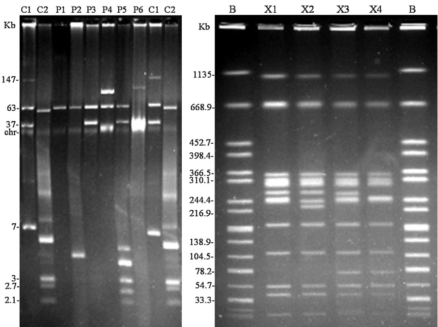

A

B

Fig. 1. Plasmid (A) and XbaI-pulsed-field gel electrophoresis (B) profiles of Salmonella enterica serotype Enteritidis isolates recovered from chicken samples in Tunisia (2009–2013). (A) Lanes C1 and C2, plasmids obtained from Escherichia coli 39R861 (NCTC 50192) and V517 (NCTC 50193) used as size standards for undigested DNA; lanes P1 to P6, plasmid profiles; Chr, chromosomal DNA. (B) lane B, XbaI-digested DNA of Salmonella enterica serovar Braenderup H9812 used as size standard; lanes X1 to X4, XbaI-PFGE profiles.

and virulence plasmid) or variable (prophages and fimbrial operons) in S. Enteritidis. It is well known that prophages play a key role in the evolution of pathogenic bacteria such as S. enterica  $ [11] $ , leading to genotypic and phenotypic diversity even between isolates of the same serotype. Fimbriae also contribute to bacterial diversity and are considered to be important for host adaptation. Accordingly, all isolates tested here were positive for targets located on SPIs and for spvC, while the observed variations were related to the gipA, sodC1 and sopE1 genes, carried by prophages Gifsy-1, Gifsy-2 and a cryptic  $ \lambda $ -like phage in S. Enteritidis, as well as to the bcfC fimbrial gene  $ [11,12,30] $ . The least frequent virulence target was sodC1, found in less than half of the isolates, while the frequency of all other variable genes was  $ \geq95\% $ . The gene sodC1 encodes a periplasmic Cu-Zn superoxide dismutase that promotes survival of S. Typhimurium in macrophages  $ [31] $ . In contrast to the present study, high and low frequencies were respectively reported for sodC1 and gipA in S. Enteritidis isolates from different sources (human, poultry and food) in nine European countries  $ [21,32] $ . This raises the interesting possibility of geographical variations between Europe and North Africa, but similar variations have not been observed within Europe  $ [21] $ .

As mentioned above, the spvC gene was detected in all isolates analyzed in the present study, although S. Enteritidis isolates lacking the virulence plasmid have occasionally been reported  $ [20,21,23,33] $ . It should be noted that all except one of the isolates carried a 60 Kb plasmid, which is the size expected for the virulence plasmid. The remaining isolate contained a ca. 90 Kb plasmid which may have originated from the smaller version, as the isolate was positive for spvC. In fact, larger derivatives of the virulence plasmid, most carrying multiple resistance genes, have previously been reported in clinical isolates of S. Enteritidis  $ [20,34,35] $ . However, the Tunisian isolate harboring the 90 Kb plasmid was pan-susceptible, so the role of the DNA which was possibly acquired remains unknown. In S. Enteritidis, plasmids of different sizes (ca. 7, 40, 90 and 100 Kb) have been implicated in the spread of the  $ bla_{TEM-1} $  gene for ampicillin resistance  $ [23,36] $ . In this study, all ampicillin resistant isolates carried a 40 Kb plasmid where the  $ bla_{TEM-1} $  gene could be located. Similarly, PMQR genes have been found on plasmids of variable size and incompatibility groups, indicating that multiple plasmids are responsible for the worldwide spread of these genes  $ [37] $ . Together with 60 Kb and 40 Kb plasmids, several small plasmids, ranging in size from 2 to 6 Kb, were detected in the single qnrB-positive isolate identified in this study, which was additionally resistant to ampicillin.

XbaI-PFGE analysis conducted for representative isolates identified four closely or possibly related pulsotypes, according to the criteria of Tenover et al.  $ [38] $ , with a clear predominance of one of them (X1). This pulsotype was previously associated with human isolates recovered from diarrheagenic stool samples in Tunisia, as well as from feces and other clinical samples in different countries  $ [5,20,39] $ . Interestingly, X1 isolates exhibited different resistance, virulence and plasmid patterns, suggesting that mobile genetic elements, particularly prophages and plasmids, are playing an active role in the evolution of S. Enteritidis circulating in chicken farms in Tunisia.