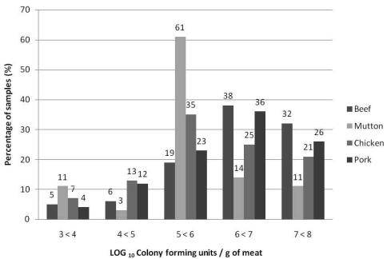

# Prevalence and Antimicrobial Susceptibility of Salmonella Isolated from a Variety of Raw Meat Sausages in Gaborone (Botswana) Retail Stores

RONALD GAELEKOLWE SAMAXA, MAITSHWARELO IGNATIUS MATSHEKA, $ ^{*} $  SUNUNGUKO WATA MPOLOKA, AND BERHANU ABEGAZ GASHE

Department of Biological Sciences, University of Botswana, Private Bag UB00704, Gaborone, Botswana

MS 11-438: Received 25 September 2011/Accepted 22 November 2011

## ABSTRACT

The objective of the study was to provide baseline data on the prevalence and antimicrobial susceptibility of Salmonella in different types of raw meat sausages directly accessible to the consumers in Gaborone, Botswana. A total of 300 raw sausages comprising 79 beef, 78 pork, 72 chicken, and 71 mutton samples were concurrently analyzed for the presence of Salmonella using a conventional culture method and a validated PCR method. The PCR assay results were in full concordance with those of the conventional culture method for the detection of Salmonella. Sixty-five (21.7%) of 300 samples were positive for Salmonella by both the conventional culture method and PCR assay. Even though more chicken samples contained Salmonella than did any other sausage type, the difference in the presence of Salmonella among the four sausages types was not significant. Eleven serotypes were identified, and Salmonella enterica subsp. salamae II was most prevalent in all the sausage types. Beef sausages generally had higher mesophilic bacterial counts than did the other three sausage types. However, higher microbial counts were not reflective of the presence of salmonellae. Susceptibility of the Salmonella enterica serotypes to 20 antimicrobial agents was determined, and Salmonella Muenchen was resistant to the widest array of agents and was mostly isolated from chicken sausages. Regardless of the meat of origin, all 65 Salmonella isolates were resistant to at least four antimicrobial agents: amikacin, gentamicin, cefuroxime, and tombramycin. This resistance profile group was the most common in all four sausage types, comprising 90% of all Salmonella isolates from beef, 71% from pork, 63% from mutton, and 35% from chicken. These results suggest that raw sausages pose a risk of transmitting multidrug-resistant Salmonella isolates to consumers.

Salmonella continues to be a principal worldwide foodborne bacterial pathogen. According to a surveillance report from the Centers for Disease Control and Prevention for 2007, Salmonella was second to norovirus as the most common causal agent for foodborne outbreaks (7). In Botswana, a retrospective study of enteropathogens isolated from stool specimens by the Botswana National Health Laboratory from February 2003 to July 2008 revealed that Salmonella and Shigella were the most common bacterial pathogens responsible for diarrhea (24). Salmonella-induced gastroenteritis remains a significant primary health concern contributing to the overall disease burden in Botswana, where almost a quarter of the population is afflicted with human immunodeficiency virus (18). Infections such as foodborne salmonellosis, which are preventable with proper health care and hygiene practices, must be minimized to enable prudent utilization of health resources.

Meat products are important vehicles for transmission of salmonellae in food. Botswana is a primary beef producer, and meat exported to the European Union by the Botswana Meat Commission is subject to rigorous inspection. However, meat produced by local abattoirs and sold in local retail outlets is not subject to the same stringent regulations (12). In Botswana, virtually every meal includes meat. However, few studies have been conducted on the incidence of Salmonella in meat products consumed locally. In previous studies, salmonellae have been isolated from meat products supplied by local butchers (12, 17) and from abattoir environments (16). Continuous monitoring of Salmonella in food remains important and relevant to mitigate the risk of foodborne salmonellosis. Monitoring should be implemented more regularly and synchronized with the tracking of antimicrobial susceptibilities of strains of this pathogen over time. Information generated from susceptibility studies is of critical importance for informing health care practitioners about the appropriate treatment for Salmonella-induced systemic infections and for evaluating the use of antibiotics in animal husbandry.

Mrema et al. (17) found that of all the meat products evaluated, sausages had the highest likelihood of being contaminated with Salmonella. Sausages are predisposed to cross-contamination during processing from ground meat originating from cuts of different animals and from flavorants, such as spices and herbs. Sausages also are a high risk food because of the manner in which they are prepared before

consumption. Sausages usually are only lightly cooked by frying when served for breakfast or by grilling when served at popular social gatherings such as barbecues. Although Salmonella is known to be heat labile, when deeply embedded in sausages the pathogen may be insulated from heat treatment and thus remain viable for causing disease.

The International Commission on Microbiological Specifications for Foods and the European Union have a zero tolerance limit for Salmonella in food (9). Thus, detection of Salmonella contamination in food is an essential quality control practice of food manufacturers and processors. Rapid identification methods for the detection of foodborne bacterial pathogens have become an important aspect of the food industry. However, these new methods must be rigorously examined for their applicability in diverse and unique food matrices before they can be routinely accepted. In line with global trends, modern animal husbandry in Botswana has increased the use of antimicrobials for both disease therapy and as prophylactics to prevent the onset of infectious diseases and enhance growth. This increased use has resulted in a rise in the number of antimicrobial resistant pathogens (1), which poses a major public health problem because these resistant strains can spread from their animal reservoirs to humans, hence decreasing the number of antimicrobials that are effective for treating human infections.

The aim of this study was to provide data on the prevalence of Salmonella in different types of raw meat sausages directly accessible to consumers in Botswana. The reliability of a rapid PCR method designed for detection of Salmonella in foods (4) also was evaluated. The Salmonella isolates were subjected to antibiotic susceptibility testing using a wider array of antibiotics than has been used previously in studies in Botswana.

## MATERIALS AND METHODS

Sample collection. A total of 300 raw meat sausages were collected from various retail outlets (supermarkets and butcheries) in Gaborone, Botswana, from January 2008 to March 2009. The samples were transported to the laboratory in a cooler box with ice packs. Sausages were collected at 3-day interval to avoid sampling from the same consignment. Four types of raw meat sausages were analyzed: beef (79 sausages), pork (78), chicken (72), and mutton (71). Analysis of the samples was carried out immediately (2 to 3 h) after collection.

Sample dilution. For each sample, a representative subsample (approximately 25 g) was aseptically removed with a pair of scissors and forceps. This subsample was homogenized with 225 ml of buffered peptone water (C 134, Merck, Darmstadt, Germany) in a Stomacher 400 lab blender (Seward, London, UK) for 60 s to make a  $ 10^{-1} $  dilution. Further 10-fold dilutions were made as necessary.

Enumeration of aerobic mesophilic bacteria in samples. To determine the microbiological quality of the meat types, 1 ml of sample was removed from the  $ 10^{-1} $  dilution of and further diluted up to  $ 10^{-6} $ . One milliliter from the  $ 10^{-4} $  to  $ 10^{-6} $  dilutions was put into separate duplicate sterile 9-cm-diameter petri dishes. Plate count agar (CM 325, Oxoid, Basingstoke, UK) was cooled to  $ 45 \pm 1^{\circ}C $ , and 10 to 15 ml was added and swirled to thoroughly and uniformly mix the sample and medium. When the medium had solidified, the plates were inverted and incubated for  $ 48 \pm 2 $  h at  $ 35 \pm 1^{\circ}C $ .

Enrichment of salmonellae from sausages by conventional culture method. The  $ 10^{-1} $  dilution was incubated at  $ 37 \pm 1^{\circ}C $  for 16 to 20 h as a preenrichment step. A 0.1-ml aliquot of overnight preenrichment broth culture was inoculated into 10 ml of Rappaport Vassiliadis (RV) broth (CM 699, Oxoid), and 1 ml was transferred to 10 ml of mannitol selenite cystine (MSC) broth (CM 399, Oxoid). Inoculated RV broth tubes were incubated at  $ 42 \pm 1^{\circ}C $  for 18 to 24 h, and inoculated MSC broths were incubated at  $ 37 \pm 1^{\circ}C $  for 18 to 24 h.

Culturing of salmonellae on selective agar plates. After  $ 24 \pm 3 $  h of incubation, all samples from the MSC and RV cultures were inoculated onto three plates of xylose lysine desoxycholate agar (XLD; CM 469, Oxoid) and three plates of brilliant green agar (BGA; CM 263, Oxoid) for growth of Salmonella colonies. From XLD plates, suspect Salmonella colonies, which were red with a black center, were picked and further purified on fresh XLD plates. Suspect Salmonella colonies (small gray to reddish pink) on BGA plates were purified on fresh BGA plates, which were incubated at  $ 37 \pm 1^{\circ} $ C for 22 to 26 h. Purified colonies with morphological characteristics similar to those of Salmonella were then subcultured onto nutrient agar plates (CM 003, Oxoid). Genus identity was confirmed with biochemical and serological tests.

Biochemical identification. The presumptive identification of Salmonella colonies was carried out by stabbing the butt of triple sugar iron (TSI) slants and then streaking the slope. The inoculated TSI slants were incubated at  $ 37^{\circ} $ C and examined after 18 to 24 h for carbohydrate fermentation, gas production, and hydrogen sulfide production. Five individual colonies of the presumptive Salmonella isolates from the 24-h nutrient agar plates were subjected to the urease test by inoculation into urea broth and incubation at  $ 37^{\circ} $ C for 18 to 24 h. The presumptive Salmonella isolates were also identified with the VITEK 2 (bioMérieux, Hazelwood, MO) automated system. The bioMérieux VITEK 2 GN ID card (ref. 21341) was used for identification. This system is based on analysis of 64 biochemical and enzymatic tests conducted in microwell plates.

Serological identification with the slide agglutination test. Commercially prepared Salmonella antisera (Mast Assure, Davies Diagnostics Pty. Ltd., Randburg, South Africa) was used for serological identification. The antisera had Poly O (A through S) and H phase 1 + 2 (a through  $ z_{29} $ ) and their various monovalent factors. The isolates were grouped by the polyvalent factors and then further typed by the monovalent factors until the isolate was fully identified. The serotyping of the Salmonella isolates was performed according to the Kauffmann-White classification scheme (13).

Detection of Salmonella in sausages by PCR assay. The salmonellae were recovered from either 1 ml of RV or MSC selective enrichment broths by centrifuging at 5,000 rpm (Biofuge Stratos, Heraeus Instruments, Hanau, Germany) for 2 min. The salmonellae were washed in 1 ml of  $ 1 \times $  phosphate-buffered saline. The pellet was then resuspended in 200  $ \mu $ l of sterile distilled water, and DNA was released by heating at 96°C for 12 to 15 min in a water bath. The cellular debris was removed by centrifuging at 12,000 rpm for 10 min, and 5  $ \mu $ l of the clear supernatant containing nucleic acids was used for subsequent PCR assays.

The oligonucleotides ST 11 (5'-AGCCAACCATTGCTAAA-TTGGCGCA-3') and ST 15 (5'-GGTAGAATTCCCAGCGGG-

TACTG-3') as documented by Bansal et al. (4) were synthesized by Inqaba Biotechnology Industries (Hatfield, South Africa), and the PCR reagents including the Taq polymerase were from Fermentas (Life Sciences, Pretoria, South Africa). A PCR mix was prepared containing 0.2 mM concentrations of each deoxynucleoside triphosphate, 250 nM concentrations of the primers, 2.0 mM MgCl $ _{2} $ , and 1 U of Taq polymerase, and the mix was made up to 50  $ \mu $ l with sterile double-distilled water. The PCR was carried out with Gene Amp 2400 PCR system (Applied Biosystems, Singapore). The amplification conditions were as described by Bansal et al. (4), with an initial denaturation for 5 min at 94°C followed by 30 cycles of 30 s at 94°C, 20 s at 55°C, and 30 s at 72°C. After the last cycle, the PCR tubes were incubated at 72°C for 7 min and then held at 4°C. The PCR products were analyzed by gel electrophoresis with a 1.2% agarose gel in 1 × Tris-EDTA-acetate buffer at 60 V for 60 min. The gel was stained with 0.1% ethidium bromide, and electrophoresis products were visualized and images captured using the Syngene Gene Genius BioImaging System (Cambridge, UK).

Antimicrobial susceptibility testing. Individual Salmonella colonies were aseptically suspended in 3 ml of sterile saline (aqueous 0.45% NaCl, wt/vol, pH 5.0 to 7.2), and the optical density was measured with the Densichek system (bioMérieux) with an optimum turbidity of 0.6 McFarland units. Colonies were then analyzed for antibiotic susceptibility using the VITEK 2 automated system with AST cards from bioMérieux South Africa. Each card included the following antibiotics: amikacin, amoxicillin-clavulanic acid, ampicillin, aztreonam, cefepime, cefotaxime, cefoxitin, ceftazidime, cefuroxime, ciprofloxacin, colistin, ertapenem, gentamicin, imipenem, meropenem, nitrofurantoin, piperacillin-tazobactam, tigecycline, tombramycin, and trimethoprim-sulfamethoxazole. Salmonella Typhimurium ATCC 14028 and Escherichia coli ATCC 25922 were also included as quality control organisms for determining MICs.

Statistical analysis. The Salmonella detection data for the four sausages types were analyzed using the Statistical Package for Social Sciences (SPSS 12.0, SPSS, Chicago, IL). The Pearson chi-square test was used to evaluate differences in the proportion of Salmonella culture-positive sausages among the four meat types.

## RESULTS

Microbiological quality of sausages. The sanitation, freshness, extent of contamination, and level of temperature abuse of food can be assessed by determining the aerobic mesophilic bacterial count of samples. In this study, 85% of the pork, 89% of the beef, 81% of the chicken, and 86% of the mutton sausages had counts above  $ 10^{6} $  CFU/g (Fig. 1). Of these contaminated sausages, 62% of pork, 70% of beef, 25% of mutton, and 46% of chicken sausages had mesophilic aerobic counts  $ >10^{7} $  CFU/g. Few of the samples (11 to 22%) had counts  $ <10^{5} $  CFU/g.

Prevalence of salmonellae in sausages. Sixty-five of the 300 samples were positive for Salmonella by both the conventional culture method and the PCR assay. Salmonella was more often observed in chicken samples (27.8% of samples tested) than in the other types. Mutton had the lowest prevalence of Salmonella contamination (15.5%), closely followed by pork, at 17.9% (Table 1). However, the prevalences in all four sausage types were not significantly different based on the Pearson chi-square test (P < 0.05).

FIGURE 1. Distribution of mean aerobic mesophilic bacterial counts for different sausage types.

Serotyping of all the 65 Salmonella isolates indicated that Salmonella enterica subsp. salamae serotype (II) was the most frequently isolated serotype (35.4% of all isolates). This serotype was isolated in all the four sausage types. S. enterica subsp. salamae II was predominantly found in beef; in all other meat types its prevalence was less than 8%. Salmonella enterica subsp. enterica serotype Muenchen was the second most prevalent serotype (30.8%) and was found in all sausage types except beef. This serotype occurred at a higher level in chicken sausages (20%) than in mutton and beef sausages. Salmonella Thompson and Salmonella Anatum were more prevalent than the other eight serotypes of S. enterica subsp. enterica, which were sporadically isolated (Table 2). Overall, the less frequently isolated serotypes represented 13.8% of all Salmonella isolates recovered.

Antibiotic resistance of Salmonella isolates. When the 65 Salmonella isolates were subjected to antibiotic susceptibility testing, all were resistant to four common aminoglycoside antibiotics: amikacin, cefuroxime, gentamicin, and tombramycin (resistance profile: AN, CXM, GM, TM). This particular resistance profile formed the core template from which other resistance patterns were derived. Variability was attained by permutation involving the addition of not more than three antibiotics, for a total of 12 antibiotic resistance patterns. Resistance was limited to amoxicillin, nitrofurantoin, trimethoprim, ampicillin, and cefoxitin from the 16 remaining antibiotics that were used for testing.

The AN, CXM, GM, TM resistance antibiogram was the most predominant in all four types of sausages, comprising 90% of all Salmonella isolates from beef, 71% from pork, 63% from mutton, and 35% of chicken sausages. Although beef and chicken sausages both had the highest numbers of Salmonella isolates (20 each), the isolates from chicken had the most diverse antibiotic resistant patterns, with all eight patterns, compared with beef, which only had three resistance patterns (Table 3). Salmonella Muenchen had the greatest diversity of antibiotic resistance, with all but one resistance pattern represented. Although S. enterica subsp. salamae II was the

TABLE 1. Presence of Salmonella in naturally contaminated raw meat sausages as determined by conventional culture method and PCR assay

<table border=1 style='margin: auto; width: max-content;'><tr><td style='text-align: center;'></td><td colspan="3">No. of samples</td><td style='text-align: center;'></td></tr><tr><td style='text-align: center;'></td><td rowspan="2">Total</td><td rowspan="2">Culture positive for Salmonella</td><td rowspan="2">PCR positive for Salmonella</td><td rowspan="2">% positive for Salmonella</td></tr><tr><td style='text-align: center;'>Sausage type</td></tr><tr><td style='text-align: center;'>Beef</td><td style='text-align: center;'>79</td><td style='text-align: center;'>20</td><td style='text-align: center;'>20</td><td style='text-align: center;'>25.3</td></tr><tr><td style='text-align: center;'>Mutton</td><td style='text-align: center;'>71</td><td style='text-align: center;'>11</td><td style='text-align: center;'>11</td><td style='text-align: center;'>15.5</td></tr><tr><td style='text-align: center;'>Chicken</td><td style='text-align: center;'>72</td><td style='text-align: center;'>20</td><td style='text-align: center;'>20</td><td style='text-align: center;'>27.8</td></tr><tr><td style='text-align: center;'>Pork</td><td style='text-align: center;'>78</td><td style='text-align: center;'>14</td><td style='text-align: center;'>14</td><td style='text-align: center;'>17.9</td></tr><tr><td style='text-align: center;'>Total</td><td style='text-align: center;'>300</td><td style='text-align: center;'>65</td><td style='text-align: center;'>65</td><td style='text-align: center;'>21.7</td></tr></table>

most frequently isolated serotype, all strains had the predominant antimicrobial resistance pattern (AN, CXM, GM, TM). Salmonella Enteritidis from the chicken sausage was resistant to seven antibiotics, the highest number for any isolate (Table 3).

## DISCUSSION

In this study, beef and pork sausages had the highest total viable bacterial counts; more than half of the samples had counts above the Food and Agriculture Organization recommended limit of  $ 1 \times 10^{6} $  CFU/g (10). The results for beef sausages were similar to those obtained by Odumeru and Belvedere (19), who found total viable bacterial counts of  $ 10^{2} $  to  $ 10^{8} $  CFU/g in ground beef, with 72% of the samples above the recommended limit. A high total viable bacterial count may be an indication of poor sanitation or problems with processing control or ingredients. Sausages are derived from a variety of meat cuts, which are ground and manipulated several times during processing; as a result, high microbial counts were expected.

Mutton sausages had the highest microbiological quality, i.e., low culturable microorganism counts, and the least amount of contamination with Salmonella, making them a better choice for human consumption. In contrast, chicken sausages had lower aerobic mesophilic bacterial counts than did beef and pork sausages but had the highest incidence of Salmonella. This result was expected because poultry is a principal reservoir for Salmonella (21). These results clearly indicate that aerobic bacterial counts provide information on the extent of sanitary quality but cannot assure the safety of the product with respect to the presence of pathogens. However, the incidence of Salmonella in the four types of sausage was not significantly different. For example, even though the prevalence of Salmonella was most disparate in chicken and mutton, this difference was not statistically significant.

In this study, the prevalence of Salmonella was 25.3% in beef sausages, similar to the 26% prevalence reported in an earlier study of Salmonella in beef sausages carried out by Mrema et al. (17). In that study, Salmonella prevalence was determined only for beef sausages. Similar prevalences (23 and 28%) were reported for two abattoir environments by Motsoela et al. (16), who inferred that environments in meat-cutting rooms of abattoirs, butchers, and supermarkets

TABLE 2. Salmonella serotypes isolated from raw meat sausages

<table border=1 style='margin: auto; width: max-content;'><tr><td style='text-align: center;'>Sausage type</td><td style='text-align: center;'>Salmonella serotype</td><td style='text-align: center;'>No. of samples</td><td style='text-align: center;'>% of samples</td></tr><tr><td rowspan="6">Beef</td><td style='text-align: center;'>II</td><td style='text-align: center;'>9</td><td style='text-align: center;'>13.8</td></tr><tr><td style='text-align: center;'>Thompson</td><td style='text-align: center;'>4</td><td style='text-align: center;'>6.2</td></tr><tr><td style='text-align: center;'>Anatum</td><td style='text-align: center;'>4</td><td style='text-align: center;'>6.2</td></tr><tr><td style='text-align: center;'>Bovismorbificans</td><td style='text-align: center;'>1</td><td style='text-align: center;'>1.5</td></tr><tr><td style='text-align: center;'>Saintpaul</td><td style='text-align: center;'>1</td><td style='text-align: center;'>1.5</td></tr><tr><td style='text-align: center;'>Typhimurium</td><td style='text-align: center;'>1</td><td style='text-align: center;'>1.5</td></tr><tr><td rowspan="5">Chicken</td><td style='text-align: center;'>Muenchen</td><td style='text-align: center;'>13</td><td style='text-align: center;'>20</td></tr><tr><td style='text-align: center;'>II</td><td style='text-align: center;'>4</td><td style='text-align: center;'>6.2</td></tr><tr><td style='text-align: center;'>Saintpaul</td><td style='text-align: center;'>1</td><td style='text-align: center;'>1.5</td></tr><tr><td style='text-align: center;'>Lawndale, II</td><td style='text-align: center;'>1</td><td style='text-align: center;'>1.5</td></tr><tr><td style='text-align: center;'>Enteritidis</td><td style='text-align: center;'>1</td><td style='text-align: center;'>1.5</td></tr><tr><td rowspan="4">Mutton</td><td style='text-align: center;'>II</td><td style='text-align: center;'>5</td><td style='text-align: center;'>7.7</td></tr><tr><td style='text-align: center;'>Muenchen</td><td style='text-align: center;'>3</td><td style='text-align: center;'>4.6</td></tr><tr><td style='text-align: center;'>Reading</td><td style='text-align: center;'>2</td><td style='text-align: center;'>3.1</td></tr><tr><td style='text-align: center;'>Thompson</td><td style='text-align: center;'>1</td><td style='text-align: center;'>1.5</td></tr><tr><td rowspan="5">Pork</td><td style='text-align: center;'>II</td><td style='text-align: center;'>5</td><td style='text-align: center;'>7.7</td></tr><tr><td style='text-align: center;'>Muenchen</td><td style='text-align: center;'>4</td><td style='text-align: center;'>6.2</td></tr><tr><td style='text-align: center;'>Thompson</td><td style='text-align: center;'>2</td><td style='text-align: center;'>3.1</td></tr><tr><td style='text-align: center;'>Anatum</td><td style='text-align: center;'>2</td><td style='text-align: center;'>3.1</td></tr><tr><td style='text-align: center;'>Brenzany</td><td style='text-align: center;'>1</td><td style='text-align: center;'>1.5</td></tr><tr><td style='text-align: center;'>Total</td><td style='text-align: center;'></td><td style='text-align: center;'>65</td><td style='text-align: center;'>100</td></tr></table>

were avenues for Salmonella cross-contamination and that the composition of the bacterial flora on meat at retail outlets was a reflection of the contamination introduced during slaughtering.

The PCR assay and the conventional culture method were used in parallel, and the results revealed that the PCR method was more rapid and sensitive for detection of Salmonella. However, one of the limitations of PCR-based methods for detection of pathogens from various food matrices has been the inhibition of the Taq polymerase by the food components  $ (15, 23) $ . The blood and fats present in the raw meat sausages utilized in this study could have caused PCR inhibition. Another constraint of PCR is that remnants of DNA from dead bacterial cells can serve as a template for PCR long after cell viability has been lost  $ (2, 23) $ , making it possible to obtain false-positive results. These deficiencies have reduced the usefulness of PCR methods for routine monitoring in food microbiology laboratories, where injured or nonviable cells are generally present even after the stress induced by food processing and preservation. However, the PCR method utilized in the present study did not have these problems because, as duly noted by Bansal et al.  $ (4) $  and Piknova et al.  $ (20) $ , the enrichment steps  $ (1:1,000 $  dilution $  that allow proliferation of the target organism also dilute PCR inhibitors, thereby ensuring the detection of only viable bacteria, without inhibition by meat components. When the results for PCR assay and the conventional culture method were not in agreement, the results were verified by repeating both tests, and in all the cases the subsequent results of the conventional culture method conformed to that of the PCR method.

Although all Salmonella serotypes are thought to have the potential to cause disease in humans, some serotypes have more clinical significance  $ (14) $ . An annual list of

TABLE 3. Antimicrobial susceptibility test results for 65 Salmonella isolates

<table border=1 style='margin: auto; width: max-content;'><tr><td style='text-align: center;'>Sausage type</td><td style='text-align: center;'>Total no. of isolates</td><td style='text-align: center;'>Salmonella serotype</td><td style='text-align: center;'>Resistant pattern $ ^{a} $</td><td style='text-align: center;'>No. of isolates</td><td style='text-align: center;'>% resistance</td></tr><tr><td rowspan="6">Beef</td><td rowspan="6">20</td><td style='text-align: center;'>II</td><td style='text-align: center;'>AN, CXM, GM, TM</td><td style='text-align: center;'>9</td><td style='text-align: center;'>45.0</td></tr><tr><td style='text-align: center;'>Thompson</td><td style='text-align: center;'>AN, CXM, GM, TM</td><td style='text-align: center;'>4</td><td style='text-align: center;'>20.0</td></tr><tr><td style='text-align: center;'>Anatum</td><td style='text-align: center;'>AN, CXM, GM, TM</td><td style='text-align: center;'>4</td><td style='text-align: center;'>20.0</td></tr><tr><td style='text-align: center;'>Bovismorbificans</td><td style='text-align: center;'>AN, CXM, GM, TM, FT, SXT</td><td style='text-align: center;'>1</td><td style='text-align: center;'>5.0</td></tr><tr><td style='text-align: center;'>Saintpaul</td><td style='text-align: center;'>AN, CXM, GM, TM, AMC (i)</td><td style='text-align: center;'>1</td><td style='text-align: center;'>5.0</td></tr><tr><td style='text-align: center;'>Typhimurium</td><td style='text-align: center;'>AN, CXM, GM, TM</td><td style='text-align: center;'>1</td><td style='text-align: center;'>5.0</td></tr><tr><td rowspan="11">Chicken</td><td rowspan="11">20</td><td rowspan="7">Muenchen</td><td style='text-align: center;'>AN, CXM, GM, TM, AMC</td><td style='text-align: center;'>1</td><td style='text-align: center;'>5.0</td></tr><tr><td style='text-align: center;'>AN, CXM, GM, TM, AMC, AM</td><td style='text-align: center;'>1</td><td style='text-align: center;'>5.0</td></tr><tr><td style='text-align: center;'>AN, CXM, GM, TM, FT</td><td style='text-align: center;'>1</td><td style='text-align: center;'>5.0</td></tr><tr><td style='text-align: center;'>AN, CXM, GM, TM, FT (i)</td><td style='text-align: center;'>4</td><td style='text-align: center;'>20.0</td></tr><tr><td style='text-align: center;'>AN, CXM, GM, TM, FT, SXT</td><td style='text-align: center;'>4</td><td style='text-align: center;'>20.0</td></tr><tr><td style='text-align: center;'>AN, CXM, GM, TM, FT (i) SXT</td><td style='text-align: center;'>1</td><td style='text-align: center;'>5.0</td></tr><tr><td style='text-align: center;'>AN, CXM, GM, TM, SXT</td><td style='text-align: center;'>1</td><td style='text-align: center;'>5.0</td></tr><tr><td style='text-align: center;'>II</td><td style='text-align: center;'>AN, CXM, GM, TM</td><td style='text-align: center;'>4</td><td style='text-align: center;'>20.0</td></tr><tr><td style='text-align: center;'>Saintpaul</td><td style='text-align: center;'>AN, CXM, GM, TM</td><td style='text-align: center;'>1</td><td style='text-align: center;'>5.0</td></tr><tr><td style='text-align: center;'>Lawndale, II</td><td style='text-align: center;'>AN, CXM, GM, TM, FT</td><td style='text-align: center;'>1</td><td style='text-align: center;'>5.0</td></tr><tr><td style='text-align: center;'>Enteritidis</td><td style='text-align: center;'>AN, CXM, GM, TM, FT (i), AM, FOX</td><td style='text-align: center;'>1</td><td style='text-align: center;'>5.0</td></tr><tr><td rowspan="5">Mutton</td><td rowspan="5">11</td><td style='text-align: center;'>II</td><td style='text-align: center;'>AN, CXM, GM, TM</td><td style='text-align: center;'>5</td><td style='text-align: center;'>45.5</td></tr><tr><td style='text-align: center;'>Muenchen</td><td style='text-align: center;'>AN, CXM, GM, TM, FT (i)</td><td style='text-align: center;'>2</td><td style='text-align: center;'>18.2</td></tr><tr><td style='text-align: center;'>Muenchen</td><td style='text-align: center;'>AN, CXM, GM, TM, SXT</td><td style='text-align: center;'>1</td><td style='text-align: center;'>9.1</td></tr><tr><td style='text-align: center;'>Reading</td><td style='text-align: center;'>AN, CXM, GM, TM</td><td style='text-align: center;'>2</td><td style='text-align: center;'>18.2</td></tr><tr><td style='text-align: center;'>Thompson</td><td style='text-align: center;'>AN, CXM, GM, TM, FT</td><td style='text-align: center;'>1</td><td style='text-align: center;'>9.1</td></tr><tr><td rowspan="7">Pork</td><td rowspan="7">14</td><td style='text-align: center;'>II</td><td style='text-align: center;'>AN, CXM, GM, TM</td><td style='text-align: center;'>5</td><td style='text-align: center;'>35.7</td></tr><tr><td style='text-align: center;'>Muenchen</td><td style='text-align: center;'>AN, CXM, GM, TM, FT</td><td style='text-align: center;'>1</td><td style='text-align: center;'>7.1</td></tr><tr><td style='text-align: center;'>Muenchen</td><td style='text-align: center;'>AN, CXM, GM, TM, FT (i), SXT</td><td style='text-align: center;'>2</td><td style='text-align: center;'>14.3</td></tr><tr><td style='text-align: center;'>Muenchen</td><td style='text-align: center;'>AN, CXM, GM, TM, AMC (i), FOX</td><td style='text-align: center;'>1</td><td style='text-align: center;'>7.1</td></tr><tr><td style='text-align: center;'>Thompson</td><td style='text-align: center;'>AN, CXM, GM, TM</td><td style='text-align: center;'>2</td><td style='text-align: center;'>14.3</td></tr><tr><td style='text-align: center;'>Anatum</td><td style='text-align: center;'>AN, CXM, GM, TM</td><td style='text-align: center;'>2</td><td style='text-align: center;'>14.3</td></tr><tr><td style='text-align: center;'>Brenzany</td><td style='text-align: center;'>AN, CXM, GM, TM</td><td style='text-align: center;'>1</td><td style='text-align: center;'>7.1</td></tr></table>

 $ ^{a} $  AN, amikacin; CXM, cefuroxime; GM, gentamicin; TM, tombramycin; FT, nitrofurantoin; SXT, trimethoprim-sulfamethoxazole; AMC, amoxicillin–clavulanic acid; (i), intermediate resistance; AM, ampicillin; FOX, cefoxitin.

Salmonella serotypes consistently associated with clinical cases is published by the Centers for Disease Control and Prevention (7). S. enterica subsp. salamae II was the most prevalent serotype in all types of sausage in this study. However, this strain appears to be nonpathogenic and is not listed by the Centers for Disease Control and Prevention. Our search of the literature did not reveal any cases in which this strain has been implicated in outbreaks. Salmonella Muenchen was prevalent in only three types of sausages. It was highly prevalent in chicken sausages but was not isolated from beef sausages, a peculiar finding that warrants more research. Salmonella Muenchen has been implicated in some outbreaks associated with unpasteurized orange juice in the United States and Canada (5, 6). Other outbreaks of Salmonella Muenchen infection have been reported by Proctor et al. (22) as associated with consumption of raw alfalfa sprouts. Salmonella Typhimurium and Salmonella Enteritidis are key serotypes that were isolated from beef and chicken sausages, respectively. These serotypes are well-known causes of gastroenteritis in humans (11) and further illustrate the potential risk that sausages could pose to consumers.

Antimicrobial susceptibility testing revealed that all 65 Salmonella isolates were resistant to a minimum of four antibiotics, and some isolates were resistant to as many as seven antibiotics. All 65 isolates were resistant to amikacin, cefuroxime, gentamicin, and tombramycin, which was unexpected and a significant result of this study. With the exception of cefuroxime, which is a second generation cephalosporin, the other three antibiotics are aminoglycosides and could share the same resistance mechanism. The 16S rRNA methylases confer resistance to aminoglycosides in members of the family Enterobacteriaceae (8). These results may indicate the presence of a 16S rRNA methylase gene cluster located on a highly mobile genetic element or the huge selection pressure exerted by the indiscriminant use of the antibiotics as veterinary drugs or prophylaxis in animal husbandry. Mobile genetic elements bearing signatures of the 16S rRNA methylase gene cluster have not been reported. Because most of the isolates with this predominant resistance pattern were found in the beef sausages, the beef industry could be the source of this genetic element. However, the chicken sausages had the most diverse antibiotic resistance patterns, indicating that the chicken processing industry also could be affected by the abuse of antibiotics. Subtyping of these isolates by pulsed-field gel electrophoresis or more discriminatory molecular typing techniques could yield a better understanding of the genetic relatedness of these isolates and the spread of these strains in the environment.

In previous studies, the Salmonella isolates from beef products were predominantly resistant to tetracycline (33.3%)

of isolates) (12). This trend was also noted by Mrema et al. (17), who found that 9.7% of sausage isolates were resistant to tetracycline. However, 100% resistance was found for sulfafurazole. Tetracycline and sulfafurazole were not included in the panel of antibiotics in the present study, so resistance to these two antibiotics could not be tracked. However, all isolates were sensitive to tigecycline, a new-generation derivative of tetracycline, and to the trimethoprim-sulfamethoxazole combination. Sulfamethoxazole is a sulfonamide antibiotic similar to sulfafurazole, both of which have a broader spectrum of activity than the generic formulations. These data indicate a shift in resistant patterns; Salmonella isolates found in the present study were predominantly resistant to aminoglycoside antibiotics. Nevertheless, all isolates from this study were susceptible to carbapenems.

Because Salmonella Muenchen can cause transient infections (3) and Salmonella Typhimurium is an established pathogen, the presence of multidrug resistance in these pathogens presents a health care challenge. Salmonella Enteritidis, which also was isolated, was resistant to a seven antimicrobial drugs tested. Although antibiotics are not routinely given to individuals with Salmonella infections, antibiotics are prescribed to immunocompromised patients and patients with systemic infections. The results of the present study indicate that consumers of meat sausages are at risk for being infected by multidrug-resistant Salmonella strains. The information on the prevalence and the correlation between the serotype and antimicrobial resistance can be useful for identifying trends and assessing the effectiveness of current initiatives within the food industry to improve food hygiene strategies aimed at reducing bacterial loads in primary production and at the various stages of the food production chain.

## ACKNOWLEDGMENT

We thank the University of Botswana Office of Research and Development for financial support.

## REFERENCES

1. Aarestrup, F. M., and H. C. Wegener. 1999. The effects of antibiotic usage in food animals on the development of antimicrobial resistance of importance for humans in Campylobacter and Escherichia coli. Microbes Infect. 1:639–644.

2. Allmann, M., C. Hofelein, E. Koppel, J. Luthy, R. Meyer, C. Niederhauser, B. Wegmuller, and U. Candrian. 1995. Polymerase chain reaction (PCR) for detection of pathogenic microorganisms in bacteriological monitoring of dairy products. Res. Microbiol. 146:85–97.

3. Anonymous. 2008. Aminoglycosides versus bacteria—a description of the action, resistance mechanism, and nosocomial battleground. J. Biomed. Sci. 15(1):5–14.

4. Bansal, N. S., V. Gray, and F. McDonnell. 2006. Validated PCR assay for the routine detection of Salmonella in food. J. Food Prot. 69:282–287.

5. Boase, J., S. Lipsky, P. Simani, S. Smith, C. Skilton, and S. Greenman. 1999. Outbreak of Salmonella serotype Muenchen infections associated with unpasteurized orange juice—United States and Canada. Morb. Mortal. Wkly. Rep. 48:582–585.

6. Buxton, J., M. Fyfe, A. King, A. Paccagnella, K. Campbell, and A. Ellis. 1999. Outbreak of Salmonella serotype Muenchen infection in the United States and Canada associated with unpasteurized orange

juice—the British Columbia experience. Can. Commun. Dis. Rep. 25:161–164.

7. Centers for Disease Control and Prevention. 2010. Surveillance for foodborne disease outbreaks—United States, 2007. Morb. Mortal. Wkly. Rep. 59:873–979.

8. Doi, Y., and Y. Arakawa. 2007. 16S ribosomal RNA methylation: emerging resistance mechanisms against aminoglycosides. Clin. Infect. Dis. 45:88–94.

9. European Commission. 1999. Opinion of the Scientific Steering Committee on Antimicrobial Resistance. Directorate-General XXIV, Consumer Policy and Consumer Health Protection Directorate B, Scientific Health Opinions Unit B3, Management of Scientific Committees II, p. 7–8, 34. European Commission, Brussels.

10. Food and Agriculture Organization. 1992. Manual of food quality control. 14/4 Rev. Microbiological analysis. Food and Agriculture Organization, Rome.

11. Food and Agriculture Organization and World Health Organization. 2000. Activities on risk assessment of microbiological hazards in food risk assessment: Salmonella spp. in broiler and eggs. Hazard identification and hazard characterization of Salmonella in broilers and eggs. Food and Agriculture Organization and World Health Organization, Rome.

12. Gashe, B. A., and S. Mpuchane. 2000. Prevalence of salmonellae on beef products at butcheries and their antibiotics resistance profile. J. Food Sci. 65:880–883.

13. Grimont, P. A. D., and F.-X. Weill. 2007. Antigenic formulae of the Salmonella serovars, 9th ed. WHO Collaborating Center for Reference and Research on Salmonella, Institut Pasteur, Paris. Available at: http://www.pasteur.fr/ip/portal/action/WebdriveActionEvent/oid/01s-000036-089. Accessed 11 January 2011.

14. Jones, T. F., L. A. Ingram, P. R. Cieslak, D. J. Vugia, M. Tobin-D'Angelo, S. Hurd, C. Medus, A. Cronquist, and F. J. Angulo. 2008. Salmonellosis outcomes differ substantially by serotype. J. Infect. Dis. 189:109–115.

15. Malorny, B., P. T. Tassios, P. Radstrom, N. Cook, M. Wagner, and J. Hoorfar. 2003. Standardization of diagnostic PCR for the detection of food-borne pathogens. Int. J. Food Microbiol. 83:39–48.

16. Motsoela, C., E. K. Collison, and B. A. Gashe. 2002. Prevalence of Salmonella in two Botswana abattoir environments. J. Food Prot. 65:1869–1872.

17. Mrema, N., S. Mpuchane, and B. A. Gashe. 2006. Prevalence of Salmonella in raw minced meat, raw fresh sausages and raw burger patties from retail outlets in Gaborone, Botswana. Food Control 17:207–212.

18. National AIDS Coordinating Agency. 2010. Botswana 2010 country progress report. National AIDS Coordinating Agency, Gaborone, Botswana.

19. Odumeru, J. A., and J. Belvedere. 2002. Evaluation of the MicroFoss system for enumeration of total viable count, Escherichia coli and coliforms in ground beef. J. Microbiol. Methods 50:33–38.

20. Piknova, L., A. O. Stefanovic, H. Drahovska, M. Sasik, and T. Kuchta. 2002. Detection of Salmonella in food, equivalent to ISO 6579, by a three-day polymerase chain reaction-based method. Food Control 13:191–194.

21. Poppe, C. 2000. Salmonella infections in the domestic fowl, p. 107–132. In C. Wray and A. Wray (ed.), Salmonella in domestic animals. CAB International, New York.

22. Proctor, M. E., M. Hamacher, M. L. Tortorello, J. R. Archer, and J. P. Davis. 2001. Multistate outbreak of Salmonella serovar Muenchen infections associated with alfalfa sprouts grown from seeds treated with calcium hypochlorite. J. Clin. Microbiol. 39:3461–3465.

23. Rodriguez-Lazaro, D., M. Hernández, M. D'Agostino, and N. Cook. 2006. Application of nucleic acid sequence based amplification (NASBA) for the detection of viable food-borne pathogens: progress and challenges. J. Rapid Methods Autom. Microbiol. 14:218–236.

24. Rowe, J. S., S. S. Shah, S. Motlhagodi, M. Bafana, and E. Tawanana. 2010. An epidemiologic review of enteropathogens in Gaborone, Botswana: shifting patterns of resistance in an HIV endemic region. PLoS ONE 5(6):e10924.