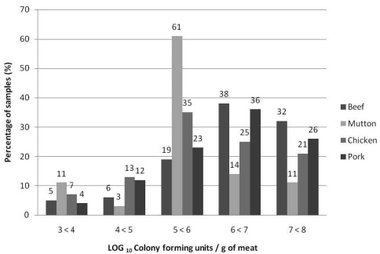

J. Food Prot., Vol. 75, No. 4

SALMONELLA FROM RAW SAUSAGES

639

TACTG-3') as documented by Bansal et al. (4) were synthesized by Inqaba Biotechnology Industries (Hatfield, South Africa), and the PCR reagents including the Taq polymerase were from Fermentas (Life Sciences, Pretoria, South Africa). A PCR mix was prepared containing 0.2 mM concentrations of each deoxynucleoside triphosphate, 250 nM concentrations of the primers, 2.0 mM MgCl $ _{2} $ , and 1 U of Taq polymerase, and the mix was made up to 50  $ \mu $ l with sterile double-distilled water. The PCR was carried out with Gene Amp 2400 PCR system (Applied Biosystems, Singapore). The amplification conditions were as described by Bansal et al. (4), with an initial denaturation for 5 min at 94°C followed by 30 cycles of 30 s at 94°C, 20 s at 55°C, and 30 s at 72°C. After the last cycle, the PCR tubes were incubated at 72°C for 7 min and then held at 4°C. The PCR products were analyzed by gel electrophoresis with a 1.2% agarose gel in 1 × Tris-EDTA-acetate buffer at 60 V for 60 min. The gel was stained with 0.1% ethidium bromide, and electrophoresis products were visualized and images captured using the Syngene Gene Genius BioImaging System (Cambridge, UK).

Antimicrobial susceptibility testing. Individual Salmonella colonies were aseptically suspended in 3 ml of sterile saline (aqueous 0.45% NaCl, wt/vol, pH 5.0 to 7.2), and the optical density was measured with the Densichek system (bioMérieux) with an optimum turbidity of 0.6 McFarland units. Colonies were then analyzed for antibiotic susceptibility using the VITEK 2 automated system with AST cards from bioMérieux South Africa. Each card included the following antibiotics: amikacin, amoxicillin-clavulanic acid, ampicillin, aztreonam, cefepime, cefotaxime, cefoxitin, ceftazidime, cefuroxime, ciprofloxacin, colistin, ertapenem, gentamicin, imipenem, meropenem, nitrofurantoin, piperacillin-tazobactam, tigecycline, tombramycin, and trimethoprim-sulfamethoxazole. Salmonella Typhimurium ATCC 14028 and Escherichia coli ATCC 25922 were also included as quality control organisms for determining MICs.

Statistical analysis. The Salmonella detection data for the four sausages types were analyzed using the Statistical Package for Social Sciences (SPSS 12.0, SPSS, Chicago, IL). The Pearson chi-square test was used to evaluate differences in the proportion of Salmonella culture-positive sausages among the four meat types.

## RESULTS

Microbiological quality of sausages. The sanitation, freshness, extent of contamination, and level of temperature abuse of food can be assessed by determining the aerobic mesophilic bacterial count of samples. In this study, 85% of the pork, 89% of the beef, 81% of the chicken, and 86% of the mutton sausages had counts above  $ 10^{6} $  CFU/g (Fig. 1). Of these contaminated sausages, 62% of pork, 70% of beef, 25% of mutton, and 46% of chicken sausages had mesophilic aerobic counts  $ >10^{7} $  CFU/g. Few of the samples (11 to 22%) had counts  $ <10^{5} $  CFU/g.

Prevalence of salmonellae in sausages. Sixty-five of the 300 samples were positive for Salmonella by both the conventional culture method and the PCR assay. Salmonella was more often observed in chicken samples (27.8% of samples tested) than in the other types. Mutton had the lowest prevalence of Salmonella contamination (15.5%), closely followed by pork, at 17.9% (Table 1). However, the prevalences in all four sausage types were not significantly different based on the Pearson chi-square test (P < 0.05).

FIGURE 1. Distribution of mean aerobic mesophilic bacterial counts for different sausage types.

Serotyping of all the 65 Salmonella isolates indicated that Salmonella enterica subsp. salamae serotype (II) was the most frequently isolated serotype (35.4% of all isolates). This serotype was isolated in all the four sausage types. S. enterica subsp. salamae II was predominantly found in beef; in all other meat types its prevalence was less than 8%. Salmonella enterica subsp. enterica serotype Muenchen was the second most prevalent serotype (30.8%) and was found in all sausage types except beef. This serotype occurred at a higher level in chicken sausages (20%) than in mutton and beef sausages. Salmonella Thompson and Salmonella Anatum were more prevalent than the other eight serotypes of S. enterica subsp. enterica, which were sporadically isolated (Table 2). Overall, the less frequently isolated serotypes represented 13.8% of all Salmonella isolates recovered.

Antibiotic resistance of Salmonella isolates. When the 65 Salmonella isolates were subjected to antibiotic susceptibility testing, all were resistant to four common aminoglycoside antibiotics: amikacin, cefuroxime, gentamicin, and tombramycin (resistance profile: AN, CXM, GM, TM). This particular resistance profile formed the core template from which other resistance patterns were derived. Variability was attained by permutation involving the addition of not more than three antibiotics, for a total of 12 antibiotic resistance patterns. Resistance was limited to amoxicillin, nitrofurantoin, trimethoprim, ampicillin, and cefoxitin from the 16 remaining antibiotics that were used for testing.

The AN, CXM, GM, TM resistance antibiogram was the most predominant in all four types of sausages, comprising 90% of all Salmonella isolates from beef, 71% from pork, 63% from mutton, and 35% of chicken sausages. Although beef and chicken sausages both had the highest numbers of Salmonella isolates (20 each), the isolates from chicken had the most diverse antibiotic resistant patterns, with all eight patterns, compared with beef, which only had three resistance patterns (Table 3). Salmonella Muenchen had the greatest diversity of antibiotic resistance, with all but one resistance pattern represented. Although S. enterica subsp. salamae II was the