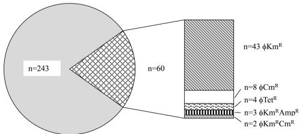

# Bacteriophages Isolated from Chicken Meat and the Horizontal Transfer of Antimicrobial Resistance Genes

Amira Shousha, $ ^{a} $  Nattakarn Awaiwanont, $ ^{a} $  Dmitrij Sofka, $ ^{a} $  Frans J. M. Smulders, $ ^{a} $  Peter Paulsen, $ ^{a} $  Michael P. Szostak, $ ^{b} $  Tom Humphrey, $ ^{c} $  Friederike Hilbert $ ^{a} $ 

Institute of Meat Hygiene, Meat Technology and Food Science, University of Veterinary Medicine, Vienna, Austria $ ^{a} $ ; Institute of Microbiology, University of Veterinary Medicine, Vienna, Austria $ ^{b} $ ; Medical Microbiology and Infectious Diseases Group, College of Medicine, Swansea University, Swansea, Wales, United Kingdom $ ^{c} $ 

Antimicrobial resistance in microbes poses a global and increasing threat to public health. The horizontal transfer of antimicrobial resistance genes was thought to be due largely to conjugative plasmids or transposons, with only a minor part being played by transduction through bacteriophages. However, whole-genome sequencing has recently shown that the latter mechanism could be highly important in the exchange of antimicrobial resistance genes between microorganisms and environments. The transfer of antimicrobial resistance genes by phages could underlie the origin of resistant bacteria found in food. We show that chicken meat carries a number of phages capable of transferring antimicrobial resistance. Of 243 phages randomly isolated from chicken meat, about a quarter (24.7%) were able to transduce resistance to one or more of the five antimicrobials tested into Escherichia coli ATCC 13706 (DSM 12242). Resistance to kanamycin was transduced the most often, followed by that to chloramphenicol, with four phages transducing tetracycline resistance and three transducing ampicillin resistance. Phages able to transduce antimicrobial resistance were isolated from 44% of the samples of chicken meat that we tested. The statistically significant  $ (P = 0.01) $  relationship between the presence of phages transducing kanamycin resistance and E. coli isolates resistant to this antibiotic suggests that transduction may be an important mechanism for transferring kanamycin resistance to E. coli. It appears that the transduction of resistance to certain antimicrobials, e.g., kanamycin, not only is widely distributed in E. coli isolates found on meat but also could represent a major mechanism for resistance transfer. The result is of high importance for animal and human health.

The use of antimicrobial agents in veterinary medicine and the development of antimicrobial resistance, especially in food-producing animals, are currently giving rise to intense discussion  $ (1) $ . Food of animal origin represents an important and direct link between animals and humans. Despite approved recommendations regarding the prudent use of antimicrobial substances in production animals, the rate of resistance to certain classes of antibiotics (e.g., extended-spectrum cephalosporins) used in human medicine continues to rise  $ (2, 3) $ . Escherichia coli, an important indicator bacterium for antimicrobial resistance, can frequently be found on food surfaces and has been reported to be resistant to many different classes of antimicrobial agents. This microorganism easily acquires and carries different antimicrobial resistance elements (in the last report on antimicrobial resistance in the European Union, at least one  $ E.\ coli $  isolate was found to be resistant to every single antimicrobial substance tested  $ [4] $ ) and not only transfers these elements within the species but also receives these elements from and transfers them to related microorganisms  $ (5–7) $ . Resistance gene exchange between Salmonella and  $ E.\ coli $  has also been described  $ (8) $ .

Bacterial resistance to antimicrobial agents develops by a variety of mechanisms: (i) by changes within the existing genome of a bacterial cell (mutations) and changes within the proteome (phase variation)  $ (9, 10) $ , (ii) by the formation of bacterial cell interactions (mixed bacterial biofilms)  $ (11) $ , and (iii) most importantly, by the acquisition of new genes through horizontal transfer  $ (12) $ . Bacteria have evolved numerous mechanisms to take up new genes to help them withstand harsh environmental conditions or settle in a new environmental niche. The same mechanism now also enables them to develop antimicrobial resistance  $ (13, 14) $ . Horizontal transfer of antimicrobial resistance genes was thought to be largely the result of conjugative plasmids, transposons, or the uptake of naked DNA, with only a minor part being played by transduction by bacteriophages  $ (12, 15, 16) $ .

Phages (bacterial viruses) depend on the bacterial cell to produce viral proteins or peptides. They are very common in all environments, outnumbering their bacterial hosts by 10:1 (17, 18). Bacteriophages are highly diverse and can be classified on the basis of their genome, morphology, and host specificity. Most phages are host specific, but some broad-host-range ones are able to invade different bacterial species and even different genera (19, 20). Infection of bacterial cells occurs when the phage attaches itself to the host cell and injects viral and sometimes foreign DNA (RNA) into it in a penetration step. Phages can be lytic or nonlytic, leading in the former case to the death of the host and in the latter case to the production of bacteria with phage DNA incorporated into their genomes. Temperate phages lead to lysogeny, where the bacterial cell becomes infected for an indefinite period of time. While

Received 16 March 2015 Accepted 22 April 2015

Accepted manuscript posted online 1 May 2015

Citation Shousha A, Awaiwanont N, Sofka D, Smulders FJM, Paulsen P, Szostak MP, Humphrey T, Hilbert F. 2015. Bacteriophages isolated from chicken meat and the horizontal transfer of antimicrobial resistance genes. Appl Environ Microbiol 81:4600–4606. doi:10.1128/AEM.00872-15.

Editor: J. Björkroth

Address correspondence to Friederike Hilbert, friederike.hilbert@vetmeduni.ac.at. Copyright © 2015, American Society for Microbiology. All Rights Reserved. doi:10.1128/AEM.00872-15

4600

aem.asm.org

Applied and Environmental Microbiology

July 2015 Volume 81 Number ___

14

Phage Transfer of Antibiotic Resistance in Chicken Meat

most bacterial cells eventually lyse, a few are persistently infected (for a review, see reference 21).

A phage can transfer bacterial DNA from one host to the other in a process known as transduction. Specialized transduction occurs frequently in the environment during lysogeny, when a prophage incorrectly excises not only its own DNA but also attached bacterial DNA from the host genome. Phages can store this DNA in the capsid, and during the next infection cycle the bacterial host might integrate the foreign DNA by homologous recombination  $ (22) $ . The process has been documented in different environments, such as in environmental water and on plant surfaces  $ (17) $ . New studies, using whole-genome sequencing, have shown that transduction events have occurred in almost every bacterial isolate sequenced  $ (23) $ . In theory, generalized transduction, in which either a virulent or a temperate phage accidentally packs bacterial DNA instead of phage DNA into its capsid and delivers it to the next host, may occur without the need for homologous recombination between different species of bacteria, although there has not yet been any definitive proof of the phenomenon  $ (16) $ . Broad-host-range plasmids have also been transduced between bacteria of nonrelated species  $ (20) $ .

We tested chicken meat for the presence of phages that infect  $ E.\ coli $  (coliphages) and that are able to transduce important antimicrobial resistances. Our results suggest that the transduction of antimicrobial resistance is not, as has been assumed to date, a rare event but is, rather, more common for certain resistance elements. Phages able to transfer antimicrobial resistance are rather diverse, ranging from host-specific ones to those with a broad host range, and the process is not dependent on homologous recombination. This study raises the question about new strategies in combating the transfer of antimicrobial resistance in the food environment.

## MATERIALS AND METHODS

Sample collection and preparation. From May to December 2013, 50 packed, chilled (4°C) chicken meat products were collected from supermarkets, street markets, and butchers in Vienna, Austria. A 25-g portion of each sample was removed from the package and placed into a sterile filter stomacher bag (BBAG03; Corning Gosselin, Hazebrouck, France) under aseptic conditions. Fifty milliliters of sterile 0.9% NaCl was used as a rinsing solution (Merck, Darmstadt, Germany) and was added to the bag, which was shaken manually for 3 min. After the rinsing, the saline was used for the isolation of phages and resistant bacteria.

Isolation of resistant Escherichia coli colonies. One milliliter from each of the rinsing solutions was spread onto Coli-ID agar plates (bio-Mérieux, Marcy l'Etoile, France) containing appropriate antimicrobials (ampicillin at 35  $ \mu $ g/ml, tetracycline at 20  $ \mu $ g/ml, kanamycin at 30  $ \mu $ g/ml, and chloramphenicol at 35  $ \mu $ g/ml [Sigma-Aldrich, St. Louis, MO, USA]) and incubated at 42°C for 24 h. Four presumptive resistant E. coli colonies were further subcultured from the colonized plates onto plate count agar (Merck, Darmstadt, Germany) and incubated at 37°C for 24 h. These E. coli isolates were stored in Luria broth (Merck, Darmstadt, Germany) with the addition of 20% (wt/vol) glycerol (Sigma-Aldrich, St. Louis, MO, USA) at -80°C. Isolates were tested for antimicrobial resistance using standard methods (24).

Isolation of bacteriophages and preparation of lysates. Bacteriophages (virulent and temperate, based on plaque morphology) were isolated as described in standard ISO 10705-2:2000 (25). Briefly, 0.5 ml from an overnight culture of E. coli ATCC 13706 (DSM 12242) was mixed with 50 ml of modified Scholtens' broth, and the mixture was incubated at 37°C with shaking for 1 to 5 h until the culture reached an optical density at 600 nm of 0.4. One milliliter of this culture and 1 ml of sample rinsing solution were added to 2.5 ml preheated (45°C) modified Scholtens' soft agar (Scholtens' broth plus 0.8% agar), and the mixture was vortexed and immediately spread as an overlay on modified Scholtens' agar plates (Scholtens' broth plus 1.5% agar) at room temperature. These plates were incubated at 37°C for 18 to 20 h. Lysates of plaques were prepared as described by Groisman (26). In brief, plaques (five from each sample) were individually cut out from the soft agar plate and diluted in chloroform (1%, vol/vol),  $ MgSO_{4} $  (2 mM), and  $ CaCl_{2} $  (0.2 mM) (Sigma-Aldrich, St. Louis, MO, USA). The solution was vortexed for 10 s and centrifuged at 20,000 × g for 10 min. The supernatants were filtered through a 0.2-μm-pore-size filter (Whatman; GE Healthcare, Buckinghamshire, United Kingdom) and kept at 4°C for further use.

Titration of bacteriophage. Tenfold serial dilutions  $ \left(10^{-1}\right. $  to  $ \left.10^{-6}\right) $  were prepared from each phage lysate. Mixtures from 1 ml of an overnight culture of E. coli ATCC 13706 and 10  $ \mu $ l from the diluted lysate were added to 2.5 ml preheated  $ (45^{\circ}\mathrm{C}) $  modified Scholtens' soft agar, vortexed, and immediately spread as an overlay on modified Scholtens' agar plates to solidify at room temperature. After incubation at  $ 37^{\circ}C $  for 18 to 20 h, plaques were counted and appropriate dilutions were prepared for transduction and typing. Phage particles were expressed as the number of PFU per milliliter using the following formula: (number of plaques  $ \times $  dilution factor)/ml. Titers were calculated for each phage and ranged from  $ 1.5 \times 10^{8} $  to  $ 3.1 \times 10^{10} $  PFU/ml.

Transduction. Transduction was performed as described by Groisman with slight variations (26). In brief, 100  $ \mu $ l of an E. coli ATCC 13706 overnight culture was mixed with 10  $ \mu $ l of properly diluted (10 $ ^{4} $  PFU/ml) phage lysate, and the mixture was incubated at 37°C for 30 min without shaking to allow phage absorption. Two milliliters of modified Scholtens' broth was then added, and the mixture was incubated at 37°C for 1 to 2 h with shaking. The tubes were centrifuged at 12,000 × g for 3 min. The supernatant was discarded, and the pellet was suspended in 150  $ \mu $ l modified Scholtens' broth and plated on Mueller-Hinton agar plates (Merck, Darmstadt, Germany) containing either ampicillin at 35  $ \mu $ g/ml, tetracycline at 20  $ \mu $ g/ml, kanamycin at 30  $ \mu $ g/ml, or chloramphenicol at 35  $ \mu $ g/ml. The plates were incubated at 37°C for 24 to 48 h. Additionally, to detect the transfer of extended-spectrum  $ \beta $ -lactamase (ESBL) production to E. coli, ESBL-Bx plates (bioMérieux, Marcy l'Etoile, France) were incubated. Colonies were subcultured and stored at -80°C in Luria broth with the addition of 20% (wt/vol) glycerol for further analysis.

PCR for identification of resistance genes and Southern blot analysis. Resistance genes in the transduced E. coli isolates were detected by amplification of a partial sequence of the resistance gene by PCR (27) using different primers (Table 1) (primers were synthesized at Microsynth AG, Balgach, Switzerland). DNA was extracted from E. coli using the alkaline lysis method. The PCRs were carried out with a 12.5- $ \mu $ l reaction mixture containing 10 ng DNA, 6.25  $ \mu $ l Kapa2G polymerase from a Fast hot start kit (Kapa Biosystems, Wilmington, MA, USA), 1 mM  $ MgCl_{2} $ , and 0.1  $ \mu $ M each primer. For Southern blot analysis, whole-genome DNA was restricted with EcoRI, separated on a 1% agarose gel in 1× TAE (Tris-acetate-EDTA) buffer, and transferred to a Hybond N $ ^{+} $  membrane using a vacuum blotter (Hoefer Scientific Instruments, San Francisco, CA, USA). The PCR product of aphA1 was labeled with a DIG High Prime DNA labeling and detection starter kit II (Roche, Mannheim, Germany). The hybridization was carried out according to the manufacturer's specifications, and the hybridized product was visualized using an illuminator (ChemiDoc XRS+ system; Bio-Rad Laboratories, Munich, Germany).

Characterization of coliphage. Mixtures from 100- $ \mu $ l overnight cultures of different well-characterized, selected, laboratory E. coli strains with different properties (ATCC 13706, JM109, W3110, MC1061, and DH5 $ \alpha $ ) were used to gain a suitable lysogeny spectrum for the phages, and 2.5 ml preheated (45°C) modified Scholtens' soft agar was spread as an overlay on modified Scholtens' agar plates at room temperature. After solidification, 5  $ \mu $ l of appropriately diluted phage lysates was spotted on these plates. The plates were incubated at 37°C for 18 to 24 h, and the lysogeny spectra of each lysate were recorded.

July 2015 Volume 81 Number 14

Applied and Environmental Microbiology

aem.asm.org

4601

Shousha et al.

TABLE 1 Primers and conditions for PCR of resistance genes

<table border=1 style='margin: auto; width: max-content;'><tr><td style='text-align: center;'>Target gene</td><td style='text-align: center;'>Primer name</td><td style='text-align: center;'>Sequence</td><td style='text-align: center;'>Annealing temp (°C)</td><td style='text-align: center;'>PCR amplification product size (bp)</td><td style='text-align: center;'>Reference</td></tr><tr><td rowspan="2">tet(A)</td><td style='text-align: center;'>tet(A)-f</td><td style='text-align: center;'>5&#x27;-GCTACATCCTGCTTGCCTTC-3&#x27;</td><td style='text-align: center;'>57</td><td style='text-align: center;'>210</td><td style='text-align: center;'>44</td></tr><tr><td style='text-align: center;'>tet(A)-r</td><td style='text-align: center;'>5&#x27;-CATAGATCGCCGTGAAGAGG-3&#x27;</td><td style='text-align: center;'></td><td style='text-align: center;'></td><td style='text-align: center;'></td></tr><tr><td rowspan="2">tet(B)</td><td style='text-align: center;'>tet(B)-f</td><td style='text-align: center;'>5&#x27;-TTGGTTAGGGGCAAGTTTTG-3&#x27;</td><td style='text-align: center;'>57</td><td style='text-align: center;'>659</td><td style='text-align: center;'>44</td></tr><tr><td style='text-align: center;'>tet(B)-r</td><td style='text-align: center;'>5&#x27;-GTAATGGGCCAATAACACCG-3&#x27;</td><td style='text-align: center;'></td><td style='text-align: center;'></td><td style='text-align: center;'></td></tr><tr><td rowspan="2">tet(C)</td><td style='text-align: center;'>tet(C)-f</td><td style='text-align: center;'>5&#x27;-CTTGAGAGCCTTCAACCCAG-3&#x27;</td><td style='text-align: center;'>55</td><td style='text-align: center;'>418</td><td style='text-align: center;'>44</td></tr><tr><td style='text-align: center;'>tet(C)-r</td><td style='text-align: center;'>5&#x27;-ATGTCGTCATCTACCTGCC-3&#x27;</td><td style='text-align: center;'></td><td style='text-align: center;'></td><td style='text-align: center;'></td></tr><tr><td rowspan="2">aphA1</td><td style='text-align: center;'>aphA-1a-f</td><td style='text-align: center;'>5&#x27;-AACGTCTTGCTCGAGGCCGCG-3&#x27;</td><td style='text-align: center;'>65</td><td style='text-align: center;'>670</td><td style='text-align: center;'>45</td></tr><tr><td style='text-align: center;'>aphA-1a-r</td><td style='text-align: center;'>5&#x27;-GGCAAGATCCTGGTATCGGTCTGC-3&#x27;</td><td style='text-align: center;'></td><td style='text-align: center;'></td><td style='text-align: center;'></td></tr><tr><td rowspan="2">bla $ _{\text{CMY}} $</td><td style='text-align: center;'>bla $ _{\text{CMY}} $ -f</td><td style='text-align: center;'>5&#x27;-TGGCCGTTGCCGTTATCTAC-3&#x27;</td><td style='text-align: center;'>55</td><td style='text-align: center;'>870</td><td style='text-align: center;'>46</td></tr><tr><td style='text-align: center;'>bla $ _{\text{CMY}} $ -r</td><td style='text-align: center;'>5&#x27;-CCCGTTTTATGCACCCATGA-3&#x27;</td><td style='text-align: center;'></td><td style='text-align: center;'></td><td style='text-align: center;'></td></tr><tr><td rowspan="2">bla $ _{\text{IMP}} $</td><td style='text-align: center;'>bla $ _{\text{IMP}} $ -f</td><td style='text-align: center;'>5&#x27;-GAATAGAGTGGATTAATTCTC-3&#x27;</td><td style='text-align: center;'>55</td><td style='text-align: center;'>232</td><td style='text-align: center;'>47</td></tr><tr><td style='text-align: center;'>bla $ _{\text{IMP}} $ -r</td><td style='text-align: center;'>5&#x27;-GGTTTAAYAAAAACACCACC-3&#x27;</td><td style='text-align: center;'></td><td style='text-align: center;'></td><td style='text-align: center;'></td></tr><tr><td rowspan="2">bla $ _{\text{OXA}} $</td><td style='text-align: center;'>bla $ _{\text{OXA}} $ -2-f</td><td style='text-align: center;'>5&#x27;-CAAGCCAAAGGCACGATAGTTG-3&#x27;</td><td style='text-align: center;'>56</td><td style='text-align: center;'>561</td><td style='text-align: center;'>47</td></tr><tr><td style='text-align: center;'>bla $ _{\text{OXA}} $ -2-r</td><td style='text-align: center;'>5&#x27;-CTCAACCCATCCTACCCACC-3&#x27;</td><td style='text-align: center;'></td><td style='text-align: center;'></td><td style='text-align: center;'></td></tr><tr><td rowspan="2">bla $ _{\text{PSE}} $</td><td style='text-align: center;'>bla $ _{\text{PSE}} $ -f</td><td style='text-align: center;'>5&#x27;-TGCTTCGCAACTATGACTAC-3&#x27;</td><td style='text-align: center;'>55</td><td style='text-align: center;'>438</td><td style='text-align: center;'>46</td></tr><tr><td style='text-align: center;'>bla $ _{\text{PSE}} $ -r</td><td style='text-align: center;'>5&#x27;-AGCCTGTGTTTGAGCTAGAT-3&#x27;</td><td style='text-align: center;'></td><td style='text-align: center;'></td><td style='text-align: center;'></td></tr><tr><td rowspan="2">bla $ _{\text{TEM-1}} $</td><td style='text-align: center;'>bla $ _{\text{TEM-1}} $ -f</td><td style='text-align: center;'>5&#x27;-CAGCGGTAAGATCCTTGAGA-3&#x27;</td><td style='text-align: center;'>55</td><td style='text-align: center;'>643</td><td style='text-align: center;'>46</td></tr><tr><td style='text-align: center;'>bla $ _{\text{TEM-1}} $ -r</td><td style='text-align: center;'>5&#x27;-ACTCCCCCGTCGTAGATAA-3&#x27;</td><td style='text-align: center;'></td><td style='text-align: center;'></td><td style='text-align: center;'></td></tr><tr><td rowspan="2">catI</td><td style='text-align: center;'>catI-f</td><td style='text-align: center;'>5&#x27;-AGTTGCTCAATGTACCTATAACC-3&#x27;</td><td style='text-align: center;'>50</td><td style='text-align: center;'>547</td><td style='text-align: center;'>48</td></tr><tr><td style='text-align: center;'>catI-r</td><td style='text-align: center;'>5&#x27;-TTGTAATTCATTAAGCATTCTGCC-3&#x27;</td><td style='text-align: center;'></td><td style='text-align: center;'></td><td style='text-align: center;'></td></tr><tr><td rowspan="2">floR</td><td style='text-align: center;'>floR-f</td><td style='text-align: center;'>5&#x27;-CGCCGTCATTCCTCACCTTC-3&#x27;</td><td style='text-align: center;'>50</td><td style='text-align: center;'>215</td><td style='text-align: center;'>48</td></tr><tr><td style='text-align: center;'>floR-r</td><td style='text-align: center;'>5&#x27;-GATCACGGGCCACGCTGTGTC-3&#x27;</td><td style='text-align: center;'></td><td style='text-align: center;'></td><td style='text-align: center;'></td></tr></table>

Statistical analysis. The relation of the presence of transferable elements encoding antimicrobial resistance in coliphages isolated from chicken meat samples to the recovery of phenotypically antimicrobial-resistant E. coli isolates from the same samples was studied for four different antimicrobial substances. For this purpose, information on resistance transfer from all phages (typically, five) per sample was combined; i.e., a sample was considered to carry transferable resistance against an antimicrobial substance if at least one of the phages isolated from this sample was able to transfer the respective resistance. The relation of the presence/absence of resistant E. coli to the presence/absence of phages able to transduce the respective antimicrobial resistance was then assessed by Fisher's exact test. The significance level was established at a P value of <0.05.

TABLE 2 Numbers of chicken meat samples by type of resistant E. coli isolate

<table border=1 style='margin: auto; width: max-content;'><tr><td style='text-align: center;'>Antimicrobial resistance $ ^{a} $</td><td style='text-align: center;'>No. of samples</td></tr><tr><td style='text-align: center;'>Amp $ ^{r} $</td><td style='text-align: center;'>6</td></tr><tr><td style='text-align: center;'>Amp $ ^{r} $  Cm $ ^{r} $</td><td style='text-align: center;'>0</td></tr><tr><td style='text-align: center;'>Amp $ ^{r} $  Km $ ^{r} $</td><td style='text-align: center;'>0</td></tr><tr><td style='text-align: center;'>Amp $ ^{r} $  Tet $ ^{r} $</td><td style='text-align: center;'>12</td></tr><tr><td style='text-align: center;'>Amp $ ^{r} $  Cm $ ^{r} $  Km $ ^{r} $</td><td style='text-align: center;'>1</td></tr><tr><td style='text-align: center;'>Amp $ ^{r} $  Cm $ ^{r} $  Tet $ ^{r} $</td><td style='text-align: center;'>5</td></tr><tr><td style='text-align: center;'>Amp $ ^{r} $  Km $ ^{r} $  Tet $ ^{r} $</td><td style='text-align: center;'>10</td></tr><tr><td style='text-align: center;'>Amp $ ^{r} $  Cm $ ^{r} $  Km $ ^{r} $  Tet $ ^{r} $</td><td style='text-align: center;'>10</td></tr><tr><td style='text-align: center;'>Cm $ ^{r} $</td><td style='text-align: center;'>0</td></tr><tr><td style='text-align: center;'>Cm $ ^{r} $  Km $ ^{r} $</td><td style='text-align: center;'>0</td></tr><tr><td style='text-align: center;'>Cm $ ^{r} $  Tet $ ^{r} $</td><td style='text-align: center;'>1</td></tr><tr><td style='text-align: center;'>Cm $ ^{r} $  Km $ ^{r} $  Tet $ ^{r} $</td><td style='text-align: center;'>1</td></tr><tr><td style='text-align: center;'>Km $ ^{r} $</td><td style='text-align: center;'>0</td></tr><tr><td style='text-align: center;'>Km $ ^{r} $  Tet $ ^{r} $</td><td style='text-align: center;'>0</td></tr><tr><td style='text-align: center;'>Tet $ ^{r} $</td><td style='text-align: center;'>1</td></tr><tr><td style='text-align: center;'>Sensitive</td><td style='text-align: center;'>3</td></tr><tr><td style='text-align: center;'>Total</td><td style='text-align: center;'>50</td></tr></table>

 $ ^{a} $  Amp $ ^{r} $ , Cm $ ^{r} $ , Km $ ^{r} $ , and Tet $ ^{r} $ , ampicillin, chloramphenicol, kanamycin, and tetracycline resistant, respectively.

## RESULTS

Detection of antimicrobial-resistant E. coli isolates in chicken meat. One or more resistant E. coli isolates whose resistance was determined using antimicrobial susceptibility testing by broth microdilution could be isolated from 47 out of 50 chicken meat samples using selective plating. Most E. coli isolates were resistant to ampicillin (44 of 50 samples), followed by tetracycline (40 of 50 samples). Kanamycin-resistant isolates were found in 22 chicken meat samples, and chloramphenicol-resistant isolates were found in 18. Table 2 shows the numbers of samples with the different types of resistant E. coli isolates. Ampicillin-resistant as well as tetracycline-resistant E. coli strains were found in the most often in the chicken meat samples (n = 12, 24%); this was followed by E. coli isolates resistant to all different antimicrobial tests tested and E. coli isolates resistant to ampicillin, kanamycin, and tetracycline (n = 10 [20%] for each group). Six samples harbored ampicillin-resistant E. coli isolates only. Five samples carried E. coli isolates with resistance to ampicillin, chloramphenicol, as well as tetracycline. Three samples did not harbor any E. coli isolates resistant to the tested antimicrobial substances. One sample each held E. coli strains resistant to tetracycline only; chloramphenicol and tetracycline; chloramphenicol, kanamycin, and tetracycline; and ampicillin, chloramphenicol, and kanamycin.

Resistance-transducing phage isolated from chicken meat. Coliphages were detected in all but one chicken meat sample. The sample with no coliphage did not hold any resistant  $ E.\ coli $  isolates. About 90% of the phages isolated revealed a clear plaque morphology, and 10% produced a cloudy center. Of all phages randomly isolated from chicken meat  $ (n = 243) $ , about a quarter  $ (n = 60) $  were able to transduce one or more of the tested antimicrobial resistances into  $ E.\ coli $  ATCC 13706. Phages able to transduce antimicrobial resistance were isolated from 22 out of a total of 50 chicken meat samples. Phages which transduced kanamycin

4602

aem.asm.org

Applied and Environmental Microbiology

July 2015 Volume 81 Number 14

Phage Transfer of Antibiotic Resistance in Chicken Meat

FIG 1 Proportion of resistance-transducing phages among all isolated phages. Kanamycin resistance-transducing phages were detected the most often  $ (n=43 $  of 243 phages detected), followed by chloramphenicol  $ (n=8) $  and tetracycline  $ (n=4) $  resistance-transducing phages. Three phages were found to transduce kanamycin plus ampicillin resistance, and two phages transduced kanamycin plus chloramphenicol resistance.  $ \phi Cm^{r} $ ,  $ \phi Km^{r} $ ,  $ \phi Tet^{r} $ ,  $ \phi Km^{r} $  Amp $ ^{r} $ , and  $ \phi Km^{r} $  Cm $ ^{r} $ , chloramphenicol, kanamycin, tetracycline, kanamycin and ampicillin, and kanamycin and chloramphenicol resistance-transducing phages, respectively.

resistance only were isolated from seven chicken meat samples. Phages transducing kanamycin and chloramphenicol resistance were found in six samples. Phages from three samples could transduce either kanamycin or ampicillin resistance. Chloramphenicol resistance-transducing phages were recovered from three samples. Phages with the ability to transduce resistance to tetracycline only were seen in another two samples, and kanamycin and tetracycline resistance-transducing phages were isolated from one sample.

Antimicrobial resistance transduced by phages. Kanamycin resistance could be transduced the most often, i.e., by 43 phages. Eight phages were able to transduce chloramphenicol resistance, and four transduced tetracycline resistance. Three phages could transduce ampicillin and kanamycin resistance, and two transduced chloramphenicol and kanamycin resistance (Fig. 1). No phages were able to transduce extended-spectrum  $ \beta $ -lactamase production to E. coli ATCC 13706.

Coliphage characterization. An optimized titer was defined by titration of phages  $ (n = 243) $  isolated from chicken meat. The titer of each phage was calculated to range from  $ 1.5 \times 10^{8} $  to  $ 3.1 \times 10^{10} $  PFU/ml. For a brief characterization of the antimicrobial resistance-transducing phages, a lysotype pattern was determined for five different E. coli strains (ATCC 13706, JM109, W3110, MC1061, and DH5 $ \alpha $ ) using lysates of each phage whose titers had been determined. Table 3 lists the different lysotypes of all antimicrobial resistance-transducing phages. A high degree of variability, given by 13 different lysotypes, was seen within these phages isolated from chicken meat.

Detection of resistance genes in transduced E. coli isolates. The  $ \operatorname{tet}(A) $  gene fragment could be amplified from all transduced tetracycline-resistant E. coli isolates. All transduced kanamycin-resistant E. coli isolates harbored the aphA1 gene. All but one E. coli isolate to which ampicillin resistance was transduced harbored the  $ bla_{TEM} $  gene. The floR gene was detected in three transduced chloramphenicol-resistant E. coli isolates. Southern blot analysis of five kanamycin-resistant isolates of E. coli ATCC 13706 transduced with phage  $ \phi $ E5c uncovered that the aphA1 gene integrated at different sites in the genome; thus, homologous recombination was not required.

Association of resistance-transducing phages and  $ E.\ coli $  in meat samples. A statistically significant association between the presence/absence of resistant  $ E.\ coli $  isolates and the presence/absence of phages able to transduce the same antimicrobial resistance into  $ E.\ coli $  ATCC 13706 in chicken meat samples was established for kanamycin  $ (P = 0.01) $  (Table 4).

TABLE 3 Lysotypes of antimicrobial resistance-transducing phages

<table border=1 style='margin: auto; width: max-content;'><tr><td style='text-align: center;'></td><td colspan="5">Lysis of the indicated E. coli strains</td><td colspan="5">Phage(s) transducing resistance to the indicated antimicrobial</td></tr><tr><td style='text-align: center;'>LT $ ^{\alpha} $  pattern</td><td style='text-align: center;'>ATCC 13706</td><td style='text-align: center;'>JM109</td><td style='text-align: center;'>W3110</td><td style='text-align: center;'>MC1061</td><td style='text-align: center;'>DH5 $ \alpha $</td><td style='text-align: center;'>Kanamycin</td><td style='text-align: center;'>Chloramphenicol</td><td style='text-align: center;'>Ampicillin</td><td style='text-align: center;'>Tetracycline</td><td style='text-align: center;'></td></tr><tr><td rowspan="6">LT1</td><td rowspan="6">+++</td><td rowspan="6">+++</td><td rowspan="6">+++</td><td rowspan="6">+++</td><td rowspan="6">-</td><td style='text-align: center;'>$ \phi $ E2b,  $ \phi $ E5a,  $ \phi $ E5b,  $ \phi $ E5c,  $ \phi $ E5d,  $ \phi $ E5e</td><td style='text-align: center;'>$ \phi $ E6b,  $ \phi $ E16e,  $ \phi $ E30e</td><td style='text-align: center;'>$ \phi $ E5c,  $ \phi $ E9b</td><td style='text-align: center;'>$ \phi $ E10c,  $ \phi $ E10d</td><td style='text-align: center;'></td></tr><tr><td style='text-align: center;'>$ \phi $ E7a,  $ \phi $ E7b,  $ \phi $ E7c,  $ \phi $ E7d,  $ \phi $ E7e,  $ \phi $ E9b</td><td style='text-align: center;'>$ \phi $ E49d</td><td style='text-align: center;'>$ \phi $ E13d</td><td style='text-align: center;'>$ \phi $ E15d,  $ \phi $ E40e</td><td style='text-align: center;'></td></tr><tr><td style='text-align: center;'>$ \phi $ E9d,  $ \phi $ E12b,  $ \phi $ E12e,  $ \phi $ E13a,  $ \phi $ E13b</td><td style='text-align: center;'></td><td style='text-align: center;'></td><td style='text-align: center;'></td><td style='text-align: center;'></td></tr><tr><td style='text-align: center;'>$ \phi $ E13c,  $ \phi $ E13d,  $ \phi $ E13e,  $ \phi $ E16a,  $ \phi $ E16d</td><td style='text-align: center;'></td><td style='text-align: center;'></td><td style='text-align: center;'></td><td style='text-align: center;'></td></tr><tr><td style='text-align: center;'>$ \phi $ E19b,  $ \phi $ E19c,  $ \phi $ E22c,  $ \phi $ E23b,  $ \phi $ E23c</td><td style='text-align: center;'></td><td style='text-align: center;'></td><td style='text-align: center;'></td><td style='text-align: center;'></td></tr><tr><td style='text-align: center;'>$ \phi $ E28a,  $ \phi $ E28b,  $ \phi $ E28c,  $ \phi $ E28d,  $ \phi $ E30a,  $ \phi $ E49a</td><td style='text-align: center;'></td><td style='text-align: center;'></td><td style='text-align: center;'></td><td style='text-align: center;'></td></tr><tr><td style='text-align: center;'>LT2</td><td style='text-align: center;'>+++</td><td style='text-align: center;'>++</td><td style='text-align: center;'>+</td><td style='text-align: center;'>+++</td><td style='text-align: center;'>-</td><td style='text-align: center;'>$ \phi $ E2c</td><td style='text-align: center;'>$ \phi $ E43e</td><td style='text-align: center;'></td><td style='text-align: center;'></td><td style='text-align: center;'></td></tr><tr><td style='text-align: center;'>LT3</td><td style='text-align: center;'>+++</td><td style='text-align: center;'>++</td><td style='text-align: center;'>++</td><td style='text-align: center;'>++</td><td style='text-align: center;'>-</td><td style='text-align: center;'>$ \phi $ E2d</td><td style='text-align: center;'></td><td style='text-align: center;'></td><td style='text-align: center;'></td><td style='text-align: center;'></td></tr><tr><td style='text-align: center;'>LT4</td><td style='text-align: center;'>+++</td><td style='text-align: center;'>+</td><td style='text-align: center;'>++</td><td style='text-align: center;'>++</td><td style='text-align: center;'>-</td><td style='text-align: center;'>$ \phi $ E2e</td><td style='text-align: center;'></td><td style='text-align: center;'></td><td style='text-align: center;'></td><td style='text-align: center;'></td></tr><tr><td style='text-align: center;'>LT5</td><td style='text-align: center;'>+++</td><td style='text-align: center;'>+</td><td style='text-align: center;'>+++</td><td style='text-align: center;'>++</td><td style='text-align: center;'>-</td><td style='text-align: center;'>$ \phi $ E6a,  $ \phi $ E19a</td><td style='text-align: center;'></td><td style='text-align: center;'></td><td style='text-align: center;'></td><td style='text-align: center;'></td></tr><tr><td style='text-align: center;'>LT6</td><td style='text-align: center;'>+++</td><td style='text-align: center;'>+</td><td style='text-align: center;'>+++</td><td style='text-align: center;'>+++</td><td style='text-align: center;'>-</td><td style='text-align: center;'>$ \phi $ E6d,  $ \phi $ E9c,  $ \phi $ E27c</td><td style='text-align: center;'></td><td style='text-align: center;'></td><td style='text-align: center;'></td><td style='text-align: center;'></td></tr><tr><td style='text-align: center;'>LT7</td><td style='text-align: center;'>+++</td><td style='text-align: center;'>+</td><td style='text-align: center;'>+</td><td style='text-align: center;'>++</td><td style='text-align: center;'>-</td><td style='text-align: center;'>$ \phi $ E9a,  $ \phi $ E15c</td><td style='text-align: center;'></td><td style='text-align: center;'></td><td style='text-align: center;'></td><td style='text-align: center;'></td></tr><tr><td style='text-align: center;'>LT8</td><td style='text-align: center;'>+++</td><td style='text-align: center;'>+++</td><td style='text-align: center;'>+</td><td style='text-align: center;'>+++</td><td style='text-align: center;'>-</td><td style='text-align: center;'>$ \phi $ E12c,  $ \phi $ E12d,  $ \phi $ E34e</td><td style='text-align: center;'>$ \phi $ E12c</td><td style='text-align: center;'></td><td style='text-align: center;'></td><td style='text-align: center;'></td></tr><tr><td style='text-align: center;'>LT9</td><td style='text-align: center;'>+++</td><td style='text-align: center;'>+</td><td style='text-align: center;'>++</td><td style='text-align: center;'>+</td><td style='text-align: center;'>-</td><td style='text-align: center;'>$ \phi $ E19e</td><td style='text-align: center;'></td><td style='text-align: center;'></td><td style='text-align: center;'></td><td style='text-align: center;'></td></tr><tr><td style='text-align: center;'>LT10</td><td style='text-align: center;'>+++</td><td style='text-align: center;'>++</td><td style='text-align: center;'>++</td><td style='text-align: center;'>+++</td><td style='text-align: center;'>-</td><td style='text-align: center;'>$ \phi $ E34a</td><td style='text-align: center;'>$ \phi $ E34a</td><td style='text-align: center;'></td><td style='text-align: center;'></td><td style='text-align: center;'></td></tr><tr><td style='text-align: center;'>LT11</td><td style='text-align: center;'>+++</td><td style='text-align: center;'>+</td><td style='text-align: center;'>+</td><td style='text-align: center;'>+++</td><td style='text-align: center;'>-</td><td style='text-align: center;'></td><td style='text-align: center;'>$ \phi $ E35d</td><td style='text-align: center;'></td><td style='text-align: center;'></td><td style='text-align: center;'></td></tr><tr><td style='text-align: center;'>LT12</td><td style='text-align: center;'>+++</td><td style='text-align: center;'>++</td><td style='text-align: center;'>+++</td><td style='text-align: center;'>+++</td><td style='text-align: center;'>-</td><td style='text-align: center;'></td><td style='text-align: center;'>$ \phi $ E35e</td><td style='text-align: center;'></td><td style='text-align: center;'></td><td style='text-align: center;'></td></tr><tr><td style='text-align: center;'>LT13</td><td style='text-align: center;'>+++</td><td style='text-align: center;'>-</td><td style='text-align: center;'>-</td><td style='text-align: center;'>-</td><td style='text-align: center;'>-</td><td style='text-align: center;'></td><td style='text-align: center;'>$ \phi $ E39d</td><td style='text-align: center;'></td><td style='text-align: center;'></td><td style='text-align: center;'></td></tr></table>

 $ ^{a} $  LT, lysotype.

 $ ^{b} $  The phage designations indicate the chicken meat sample (E) number (indicated by Arabic numerals) and the phage isolate number (indicated by lowercase letters); for example,  $ \phi $ E5a represents the first phage isolate from chicken meat sample number 5.

July 2015 Volume 81 Number 14

Applied and Environmental Microbiology

aem.asm.org

4603

Shousha et al.

TABLE 4 Association between isolation of antimicrobial-resistant E. coli and resistance-transducing phages from the same chicken meat sample

<table border=1 style='margin: auto; width: max-content;'><tr><td style='text-align: center;'></td><td colspan="3">No. of samples positive for:</td><td style='text-align: center;'></td></tr><tr><td style='text-align: center;'>Antimicrobial resistance $ ^{a} $</td><td style='text-align: center;'>E. coli</td><td style='text-align: center;'>Transducing phage</td><td style='text-align: center;'>Both</td><td style='text-align: center;'>P</td></tr><tr><td style='text-align: center;'>Amp $ ^{r} $</td><td style='text-align: center;'>44</td><td style='text-align: center;'>3</td><td style='text-align: center;'>3</td><td style='text-align: center;'>1.0000</td></tr><tr><td style='text-align: center;'>Cm $ ^{r} $</td><td style='text-align: center;'>18</td><td style='text-align: center;'>9</td><td style='text-align: center;'>1</td><td style='text-align: center;'>0.1304</td></tr><tr><td style='text-align: center;'>Km $ ^{r} $</td><td style='text-align: center;'>22</td><td style='text-align: center;'>17</td><td style='text-align: center;'>12</td><td style='text-align: center;'>0.0148 $ ^{b} $</td></tr><tr><td style='text-align: center;'>Tet $ ^{r} $</td><td style='text-align: center;'>40</td><td style='text-align: center;'>3</td><td style='text-align: center;'>2</td><td style='text-align: center;'>0.4959</td></tr></table>

 $ ^{a} $  Amp $ ^{r} $ , Cm $ ^{r} $ , Km $ ^{r} $ , and Tet $ ^{r} $ , ampicillin, chloramphenicol, kanamycin, and tetracycline resistant, respectively.

 $ ^{b} $  Statistically significant relation between isolation of antimicrobial-resistant E. coli and resistance-transducing phages.

## DISCUSSION

Although transduction of the antibiotic resistance island in Salmonella enterica serovar Typhimurium phage type DT104 has been effectively shown  $ (28) $ , until very recently, transduction via bacteriophages was assumed to play a minor part in the horizontal transfer of antimicrobial resistance genes  $ (12, 15) $ . Food of animal origin is a well-known vehicle allowing the transfer of bacteria from food-producing animals to humans, as reflected by the increasing incidence of foodborne zoonotic diseases in humans and the rising numbers of antimicrobial-resistant bacteria found on food of animal origin. Such food thus represents a possible source of antimicrobial resistance in the human environment and is included in many antimicrobial screening programs. The increasing numbers of resistant bacteria, both commensals and foodborne pathogens, on food are a cause of concern to public health authorities, veterinarians, and physicians. Strategies to combat antimicrobial resistance have enjoyed only limited success, and there are still many questions relating to how and when resistance transfer occurs. The presence of phages that transfer antimicrobial resistance could explain the failures to combat antimicrobial resistance described above. We now show, based on mathematical modeling, that chicken meat can carry a considerable number of phages capable of transferring antimicrobial resistance and that certain antimicrobial resistance genes may be transferred primarily by phages. We tested randomly selected coliphages from chicken meat samples for their ability to transduce resistance to tetracycline (an antimicrobial widely used in veterinary medicine, in aquaculture, and on plants and thus extensively released into the environment, although its photodegradation is fairly rapid), ampicillin (a  $ \beta $ -lactam antibiotic and, thus, a compound typical of a range of compounds that are important in veterinary and human medicine and that have a very short half-life in the environment), chloramphenicol (which is banned in veterinary medicine but which is still found in the environment), and kanamycin (an aminoglycoside which is commonly used as a second-choice antibiotic in human medicine and which can be found in aquatic environments because of its long degradation time)  $ (29, 30) $ . About a quarter of the randomly selected phages were able to transduce resistance to one or more of these antimicrobials to E. coli ATCC 13706. Thus, the actual number of phages found on chicken meat able to transduce antibiotic resistance genes must be much higher, as we tested for resistance to only five different antibiotics and randomly chose only five phages per sample (from a plate with 10 to 300 plaques). Accordingly, our results confirm speculations that transduction may have a role in the exchange of antimicrobial resistance between microorganisms and, thus, between environments  $ (17, 31–34) $ . Chicken meat has been reported to harbor a high number of resistant E. coli isolates  $ (63\% $  of E. coli strains randomly isolated from chicken meat in Austria were resistant  $ (7) $ . Resistance to tetracycline has been described to be the most prevalent. In this study, we detected tetracycline resistance-transducing phages in three different types of chicken meat samples (a total of 50 samples).

By means of a mathematical model (16) of the transfer of resistance to E. coli by transduction in the gut of cattle, it has been estimated that transduction is on the order of 1,000-fold less efficient than bacterial conjugation at transferring genes (16). It is thus not surprising that resistance to tetracycline and ampicillin, which are the antimicrobials to which E. coli strains isolated from food are the most frequently resistant (27, 35–38), is not significantly associated with phages that transfer resistance. Thus, phage transduction may not be the major mechanism for tetracycline resistance transfer to E. coli strains found on chicken meat. In contrast, phages that transfer kanamycin resistance were more frequently recovered and were significantly associated with the presence of resistant E. coli isolates in the samples that we investigated. These findings indicate not only that phages appear to represent a substantial reservoir of antimicrobial resistance transfer but also demonstrate that different mechanisms of resistance depend on different transfer strategies. Although kanamycin-resistant E. coli isolates are not common in food of animal origin (7, 35), our data show, for the first time, that phage transduction might be a major mechanism for transferring this resistance trait. Although the elements used to transfer tetracycline and ampicillin resistance appear to be dominated by conjugative plasmids or transposons, phages have been shown able to transfer all types of resistance tested, except that associated with ESBL production. ESBL-producing E. coli strains can be found on chicken meat, but data suggest that clonal dissemination is the most prevalent means (39). The resistance genes transduced to E. coli were those most commonly found  $ [aphAI, bla_{TEM}, floR, and tet(A)] $  in these bacteria on chicken meat (27, 36–38). As an example, one gene found to be transduced and to deliver chloramphenicol resistance is the E. coli floR gene, which is almost identical to the floR gene of Salmonella enterica serovar Typhimurium phage type DT104 and is located in the antimicrobial resistance island flanked by two class 1 integrons.

Recently, lytic phages have been used in phage therapy for the treatment of colibacillosis caused by multiresistant chicken-pathogenic  $ E.\ coli $  strains (40) or for reducing Campylobacter loads in chickens (41). Considering our results, there could possibly be a risk of transduction of antibiotic resistance genes by these phages. Testing the transduction ability of these therapeutic phages could be a tool for avoiding the transduction of antibiotic resistance by these phages.

Phages differ from their bacterial hosts in a number of important properties, such as their ability to persist in the presence of disinfectants  $ (42, 43) $ . Thus, disinfectants used to kill bacteria are, in many cases, not able to eliminate bacteriophages. Some phages are highly resistant to sodium hypochlorite at the concentrations used in the food industry, and this disinfectant does not eliminate or reduce the numbers of most bacteriophages  $ (42) $ . Alcoholic solutions, such as 70% ethanol, have been reported to be unable to harm most bacteriophages  $ (42, 43) $ . It appears that only peracetic acid is a reliable disinfectant for most bacteriophages  $ (42) $ , but at

4604

aem.asm.org

Applied and Environmental Microbiology

July 2015 Volume 81 Number 14

Phage Transfer of Antibiotic Resistance in Chicken Meat

present, this is not extensively used for disinfection. It is thus highly likely that phages survive under routine conditions of disinfection not only in the food industry.

Our results show for the first time that generalized transduction without the need for homologous recombination is a neglected but nevertheless efficient way to transfer antimicrobial resistance to  $ E.\ coli $  in different environments, including in food of animal origin. This conclusion has important consequences for hygiene, sanitation, and public health when it is important to combat antimicrobial resistance.

## ACKNOWLEDGMENTS

Amira Shousha was granted a Vetmeduni Success Scholarship from the University of Veterinary Medicine, Vienna, Austria, to perform this study. Nattakarn Awaiwanont was funded by the Technologiestipendien Südostasien in the framework of ASEA-UNINET, granted by the OeAD (Austrian Agency for International Cooperation in Education & Research), financed by the Austrian Federal Ministry for Science and Research.

We thank Stefan Hertwig for discussions and Graham Tebb for critical reading of and suggestions on the manuscript.

