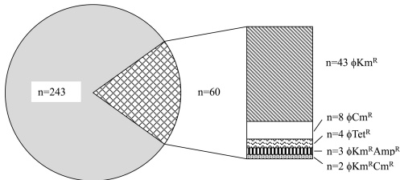

FIG 1 Proportion of resistance-transducing phages among all isolated phages. Kanamycin resistance-transducing phages were detected the most often  $ (n=43 $  of 243 phages detected), followed by chloramphenicol  $ (n=8) $  and tetracycline  $ (n=4) $  resistance-transducing phages. Three phages were found to transduce kanamycin plus ampicillin resistance, and two phages transduced kanamycin plus chloramphenicol resistance.  $ \phi Cm^{r} $ ,  $ \phi Km^{r} $ ,  $ \phi Tet^{r} $ ,  $ \phi Km^{r} $  Amp $ ^{r} $ , and  $ \phi Km^{r} $  Cm $ ^{r} $ , chloramphenicol, kanamycin, tetracycline, kanamycin and ampicillin, and kanamycin and chloramphenicol resistance-transducing phages, respectively.

resistance only were isolated from seven chicken meat samples. Phages transducing kanamycin and chloramphenicol resistance were found in six samples. Phages from three samples could transduce either kanamycin or ampicillin resistance. Chloramphenicol resistance-transducing phages were recovered from three samples. Phages with the ability to transduce resistance to tetracycline only were seen in another two samples, and kanamycin and tetracycline resistance-transducing phages were isolated from one sample.

Antimicrobial resistance transduced by phages. Kanamycin resistance could be transduced the most often, i.e., by 43 phages. Eight phages were able to transduce chloramphenicol resistance, and four transduced tetracycline resistance. Three phages could transduce ampicillin and kanamycin resistance, and two transduced chloramphenicol and kanamycin resistance (Fig. 1). No phages were able to transduce extended-spectrum  $ \beta $ -lactamase production to E. coli ATCC 13706.

Coliphage characterization. An optimized titer was defined by titration of phages  $ (n = 243) $  isolated from chicken meat. The titer of each phage was calculated to range from  $ 1.5 \times 10^{8} $  to  $ 3.1 \times 10^{10} $  PFU/ml. For a brief characterization of the antimicrobial resistance-transducing phages, a lysotype pattern was determined for five different E. coli strains (ATCC 13706, JM109, W3110, MC1061, and DH5 $ \alpha $ ) using lysates of each phage whose titers had been determined. Table 3 lists the different lysotypes of all antimicrobial resistance-transducing phages. A high degree of variability, given by 13 different lysotypes, was seen within these phages isolated from chicken meat.

Detection of resistance genes in transduced E. coli isolates. The  $ \operatorname{tet}(A) $  gene fragment could be amplified from all transduced tetracycline-resistant E. coli isolates. All transduced kanamycin-resistant E. coli isolates harbored the aphA1 gene. All but one E. coli isolate to which ampicillin resistance was transduced harbored the  $ bla_{TEM} $  gene. The floR gene was detected in three transduced chloramphenicol-resistant E. coli isolates. Southern blot analysis of five kanamycin-resistant isolates of E. coli ATCC 13706 transduced with phage  $ \phi $ E5c uncovered that the aphA1 gene integrated at different sites in the genome; thus, homologous recombination was not required.

Association of resistance-transducing phages and  $ E.\ coli $  in meat samples. A statistically significant association between the presence/absence of resistant  $ E.\ coli $  isolates and the presence/absence of phages able to transduce the same antimicrobial resistance into  $ E.\ coli $  ATCC 13706 in chicken meat samples was established for kanamycin  $ (P = 0.01) $  (Table 4).

TABLE 3 Lysotypes of antimicrobial resistance-transducing phages

<table><tr><td></td><td colspan="5">Lysis of the indicated E. coli strains</td><td colspan="5">Phage(s) transducing resistance to the indicated antimicrobial</td></tr><tr><td>LT $ ^{\alpha} $  pattern</td><td>ATCC 13706</td><td>JM109</td><td>W3110</td><td>MC1061</td><td>DH5 $ \alpha $</td><td>Kanamycin</td><td>Chloramphenicol</td><td>Ampicillin</td><td>Tetracycline</td><td></td></tr><tr><td rowspan="6">LT1</td><td rowspan="6">+++</td><td rowspan="6">+++</td><td rowspan="6">+++</td><td rowspan="6">+++</td><td rowspan="6">-</td><td>$ \phi $ E2b,  $ \phi $ E5a,  $ \phi $ E5b,  $ \phi $ E5c,  $ \phi $ E5d,  $ \phi $ E5e</td><td>$ \phi $ E6b,  $ \phi $ E16e,  $ \phi $ E30e</td><td>$ \phi $ E5c,  $ \phi $ E9b</td><td>$ \phi $ E10c,  $ \phi $ E10d</td><td></td></tr><tr><td>$ \phi $ E7a,  $ \phi $ E7b,  $ \phi $ E7c,  $ \phi $ E7d,  $ \phi $ E7e,  $ \phi $ E9b</td><td>$ \phi $ E49d</td><td>$ \phi $ E13d</td><td>$ \phi $ E15d,  $ \phi $ E40e</td><td></td></tr><tr><td>$ \phi $ E9d,  $ \phi $ E12b,  $ \phi $ E12e,  $ \phi $ E13a,  $ \phi $ E13b</td><td></td><td></td><td></td><td></td></tr><tr><td>$ \phi $ E13c,  $ \phi $ E13d,  $ \phi $ E13e,  $ \phi $ E16a,  $ \phi $ E16d</td><td></td><td></td><td></td><td></td></tr><tr><td>$ \phi $ E19b,  $ \phi $ E19c,  $ \phi $ E22c,  $ \phi $ E23b,  $ \phi $ E23c</td><td></td><td></td><td></td><td></td></tr><tr><td>$ \phi $ E28a,  $ \phi $ E28b,  $ \phi $ E28c,  $ \phi $ E28d,  $ \phi $ E30a,  $ \phi $ E49a</td><td></td><td></td><td></td><td></td></tr><tr><td>LT2</td><td>+++</td><td>++</td><td>+</td><td>+++</td><td>-</td><td>$ \phi $ E2c</td><td>$ \phi $ E43e</td><td></td><td></td><td></td></tr><tr><td>LT3</td><td>+++</td><td>++</td><td>++</td><td>++</td><td>-</td><td>$ \phi $ E2d</td><td></td><td></td><td></td><td></td></tr><tr><td>LT4</td><td>+++</td><td>+</td><td>++</td><td>++</td><td>-</td><td>$ \phi $ E2e</td><td></td><td></td><td></td><td></td></tr><tr><td>LT5</td><td>+++</td><td>+</td><td>+++</td><td>++</td><td>-</td><td>$ \phi $ E6a,  $ \phi $ E19a</td><td></td><td></td><td></td><td></td></tr><tr><td>LT6</td><td>+++</td><td>+</td><td>+++</td><td>+++</td><td>-</td><td>$ \phi $ E6d,  $ \phi $ E9c,  $ \phi $ E27c</td><td></td><td></td><td></td><td></td></tr><tr><td>LT7</td><td>+++</td><td>+</td><td>+</td><td>++</td><td>-</td><td>$ \phi $ E9a,  $ \phi $ E15c</td><td></td><td></td><td></td><td></td></tr><tr><td>LT8</td><td>+++</td><td>+++</td><td>+</td><td>+++</td><td>-</td><td>$ \phi $ E12c,  $ \phi $ E12d,  $ \phi $ E34e</td><td>$ \phi $ E12c</td><td></td><td></td><td></td></tr><tr><td>LT9</td><td>+++</td><td>+</td><td>++</td><td>+</td><td>-</td><td>$ \phi $ E19e</td><td></td><td></td><td></td><td></td></tr><tr><td>LT10</td><td>+++</td><td>++</td><td>++</td><td>+++</td><td>-</td><td>$ \phi $ E34a</td><td>$ \phi $ E34a</td><td></td><td></td><td></td></tr><tr><td>LT11</td><td>+++</td><td>+</td><td>+</td><td>+++</td><td>-</td><td></td><td>$ \phi $ E35d</td><td></td><td></td><td></td></tr><tr><td>LT12</td><td>+++</td><td>++</td><td>+++</td><td>+++</td><td>-</td><td></td><td>$ \phi $ E35e</td><td></td><td></td><td></td></tr><tr><td>LT13</td><td>+++</td><td>-</td><td>-</td><td>-</td><td>-</td><td></td><td>$ \phi $ E39d</td><td></td><td></td><td></td></tr></table>

 $ ^{a} $  LT, lysotype.

 $ ^{b} $  The phage designations indicate the chicken meat sample (E) number (indicated by Arabic numerals) and the phage isolate number (indicated by lowercase letters); for example,  $ \phi $ E5a represents the first phage isolate from chicken meat sample number 5.