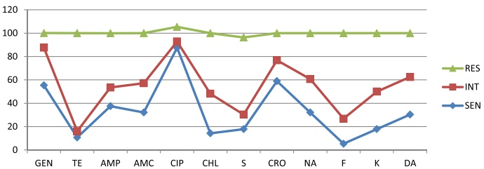

Fig. 1 Multidrug resistant profile of Salmonella species isolated from raw beef samples at Wolaita Sodo municipal abattoir, 2016. Key: DA clindamycin, AMP ampicillin, AMC amoxicillin-clavulanic acid, GEN gentamicin, K kanamycin, CIP ciprofloxacin, CHL chloramphenicol, NA nalidixic acid, CRO ceftriaxone, F nitrofurantoin, S streptomycin, TE tetracycline

the market [57]. In addition to public health problems, it could lead to economic loss in the country due to loss of exporting meat and animal products.

Ciprofloxacin showed a good antimicrobial activity against the Salmonella isolates. From the 56 isolates, 49 (87.5%) were susceptible to ciprofloxacin which was comparable to the previous studies conducted in Ethiopia [49], Nigeria [53], and Addis Ababa [51]. The effectiveness of ciprofloxacin might be a recent introduction of the drug. It is not widely used in countries like Ethiopia and other African countries [51].

## Conclusions

Salmonella species contamination frequency was high in raw beef, and most of the isolates exhibited resistance to commonly used antibiotics. Tetracycline-resistant and ciprofloxacin-susceptible Salmonella species were frequently detected in raw beef. People living in the town and consuming the raw meat are at risk for developing diseases, and attention should be given to select antimicrobials in treating Salmonella infections in both animals and human beings based on antimicrobial susceptibility test. Hence, intersectoral working and developing one health approach is essential. Health information should be given to individuals who have the habit of eating raw meat. Training on sanitary and hygiene practice should be given to the abattoir workers. WHO basic hygiene principles, which cover food safety procedures from the farm of origin to ante-mortem and post-mortem inspection to handling until the food is consumed, should be practiced.

## Additional file

Additional file 1: Table S1. Conventional biochemical test results of the samples that yielded growth on agar at Wolaita Sodo municipal abattoir, 2016. Table S2 Antimicrobial susceptibility pattern of 56 isolates of Salmonella spp. at Wolaita Sodo municipal abattoir, 2016. Figure S1 Antimicrobial susceptibility pattern of salmonella isolate at Wolaita Sodo Municipal Abattoir, 2016. (DOCX 37 kb)

## Abbreviations

BGA: Brilliant green agar; BPW: Buffered peptone water; MDR: Multiple drug resistance; MKTTn: Müller-Kauffman tetrathionate with novobiocin; MoH: Minister of Health; RV: Rappaport-Vassiliadis medium; SIM: Simon's citrate indole motility; TSI: Triple sugar iron; XLD: Xylose lysine desoxycholate

## Acknowledgements

We would like to thank the staffs of Ottona Teaching Reference Hospital Laboratory and faculty member of Natural and Computational Sciences in Wolaita Sodo University.

## Funding

Not applicable

## Availability of data and materials

Data is not available for online access; however, readers who wish to gain access to the data can write to the corresponding author Antehun Alemayehu at Antehunalemayehu@gmail.com

## Authors' contributions

WW and YA were involved in the conception and designing of the study, writing the proposal, analysis, and interpretation of data. AA was involved in the analysis and interpretation of data and manuscript writing. All authors agreed to be accountable for all aspects of the work.

## Ethics approval and consent to participate

The study was approved by the Ethical Clearance Committee of the Faculty of Natural and Computational Science, University of Wolaita Sodo, Southern Ethiopia. A letter of support was obtained from the administrative bodies of Wolaita Sodo town. A written consent was obtained from the municipal abattoir. The animals were being processed as part of the normal work of the abattoir, and samples were taken after explaining the objectives of the study.

## Consent for publication

Not applicable

## Competing interests

The authors declare that they have no competing interests.

## Publisher's Note

Springer Nature remains neutral with regard to jurisdictional claims in published maps and institutional affiliations.

## Author details

 $ ^{1} $ Dubbo Preparatory School, Wolaita Zone, Ethiopia.  $ ^{2} $ Department of Medical Laboratory, College of Health Sciences and Medicine, Wolaita Sodo University, P.O. Box: 138, Wolaita Sodo, Ethiopia.