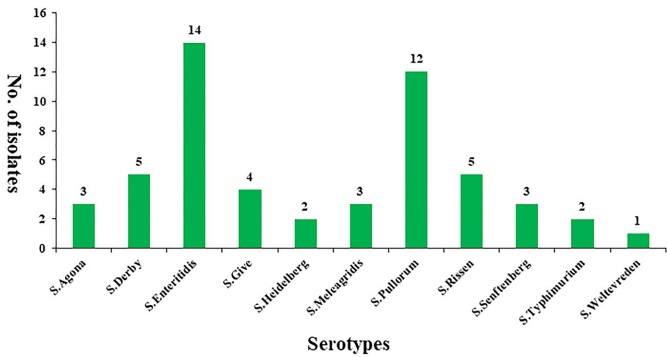

XIE ET AL.

Food Science & Nutrition

WILEY

2849

antibiotic disks as specified by the CLSI. Ampicillin (AMP) resistance was the most common with 32 (59.26%) resistant strains. As shown in Table 1, our strains were resistant to  $ \beta $ -lactams antibiotic, including amoxicillin (37.04%), cephazolin (38.89%), penicillin (33.33%), and piperacillin (29.63%). Following this, similar levels of antibiotic resistances were shown by isolates to aminoglycosides and tetracyclines antibiotics, such as gentamicin (18.52%), kanamycin (53.70%), streptomycin (27.78%), minocycline (31.48%), and tetracycline (42.59%) were similar. Only a few strains were resistant to macrolides and quinolones antibiotics, for example azithromycin (9.26%), erythromycin (7.41%), ciprofloxacin (9.26%), and nalidixic acid (12.96%). Of note, only six isolates were L193 to any of the tested antibiotics, and most isolates were resistant to more than three antibiotics (Table S1). In particular, three strains were resistant to seven antibiotics (SalE4, SalE24, SalE54), and one was resistant to eight (SalE13).

### 3.3 | Serotypes phenotype

Somatic -O and -H antisera agglutination serotyped the 54 Salmonella isolates into 11 different serovars (Figure 1). Their distribution is as follows: S. Agona (3), S. Derby (5), S. Enteritidis (14), S. Give (4), S. Heidelberg (2), S. Meleagridis (3), S. Pullorum (12), S. Rissen (5), S. Senftenberg (3), S. Typhimurium (2), and S. Weltevreden (1).

TABLE 1 Antimicrobial resistance profiles of the Salmonella isolates

<table border=1 style='margin: auto; width: max-content;'><tr><td rowspan="2">Antimicrobial agents</td><td colspan="3">Salmonella enterica (n = 54)</td></tr><tr><td style='text-align: center;'>No. (%) of R</td><td style='text-align: center;'>No. (%) of I</td><td style='text-align: center;'>No. (%) of S</td></tr><tr><td style='text-align: center;'>Macrolides</td><td style='text-align: center;'></td><td style='text-align: center;'></td><td style='text-align: center;'></td></tr><tr><td style='text-align: center;'>Azithromycin (AZM)</td><td style='text-align: center;'>5 (9.26)</td><td style='text-align: center;'>3 (5.56)</td><td style='text-align: center;'>46 (85.18)</td></tr><tr><td style='text-align: center;'>Erythromycin (ERY)</td><td style='text-align: center;'>4 (7.41)</td><td style='text-align: center;'>1 (1.85)</td><td style='text-align: center;'>49 (90.74)</td></tr><tr><td style='text-align: center;'>Aminoglycosides</td><td style='text-align: center;'></td><td style='text-align: center;'></td><td style='text-align: center;'></td></tr><tr><td style='text-align: center;'>Gentamicin (GEN)</td><td style='text-align: center;'>10 (18.52)</td><td style='text-align: center;'>5 (9.26)</td><td style='text-align: center;'>39 (72.22)</td></tr><tr><td style='text-align: center;'>Kanamycin (KAN)</td><td style='text-align: center;'>29 (53.70)</td><td style='text-align: center;'>3 (5.56)</td><td style='text-align: center;'>22 (40.74)</td></tr><tr><td style='text-align: center;'>Streptomycin (SM)</td><td style='text-align: center;'>15 (27.78)</td><td style='text-align: center;'>2 (3.70)</td><td style='text-align: center;'>37 (68.52)</td></tr><tr><td style='text-align: center;'>Quinolones</td><td style='text-align: center;'></td><td style='text-align: center;'></td><td style='text-align: center;'></td></tr><tr><td style='text-align: center;'>Ciprofloxacin (CIP)</td><td style='text-align: center;'>5 (9.26)</td><td style='text-align: center;'>2 (3.70)</td><td style='text-align: center;'>47 (87.04)</td></tr><tr><td style='text-align: center;'>Nalidixic acid (NA)</td><td style='text-align: center;'>7 (12.96)</td><td style='text-align: center;'>4 (7.41)</td><td style='text-align: center;'>43 (79.63)</td></tr><tr><td style='text-align: center;'>$ \beta $ -lactams</td><td style='text-align: center;'></td><td style='text-align: center;'></td><td style='text-align: center;'></td></tr><tr><td style='text-align: center;'>Amoxicillin (AMC)</td><td style='text-align: center;'>20 (37.04)</td><td style='text-align: center;'>2 (3.70)</td><td style='text-align: center;'>32 (59.26)</td></tr><tr><td style='text-align: center;'>Ampicillin (AMP)</td><td style='text-align: center;'>32 (59.26)</td><td style='text-align: center;'>3 (5.56)</td><td style='text-align: center;'>19 (35.18)</td></tr><tr><td style='text-align: center;'>Cephazolin (CEP)</td><td style='text-align: center;'>21 (38.89)</td><td style='text-align: center;'>4 (7.41)</td><td style='text-align: center;'>29 (53.70)</td></tr><tr><td style='text-align: center;'>Penicillin (PEN)</td><td style='text-align: center;'>18 (33.33)</td><td style='text-align: center;'>2 (3.70)</td><td style='text-align: center;'>34 (62.97)</td></tr><tr><td style='text-align: center;'>Piperacillin (PIP)</td><td style='text-align: center;'>16 (29.63)</td><td style='text-align: center;'>5 (9.26)</td><td style='text-align: center;'>33 (61.11)</td></tr><tr><td style='text-align: center;'>Tetracyclines</td><td style='text-align: center;'></td><td style='text-align: center;'></td><td style='text-align: center;'></td></tr><tr><td style='text-align: center;'>Minocycline (MIN)</td><td style='text-align: center;'>17 (31.48)</td><td style='text-align: center;'>5 (9.26)</td><td style='text-align: center;'>32 (59.26)</td></tr><tr><td style='text-align: center;'>Tetracycline (TET)</td><td style='text-align: center;'>23 (42.59)</td><td style='text-align: center;'>1 (1.85)</td><td style='text-align: center;'>30 (55.56)</td></tr></table>

Abbreviations: I, intermediate resistance; R, resistant; S, susceptibility.

FIGURE 1 Distribution of Salmonella serotypes from egg samples

20487177, 2019, 9, Downloaded from https://onlinelibrary.wiley.com/doi/10.1002/fsn3.1126 by Schweizerische Akademie Der, Wiley Online Library on [16/11/2025]. See the Terms and Conditions (https://onlinelibrary.wiley.com/terms-and-conditions) on Wiley Online Library for rules of use; OA articles are governed by the applicable Creative Commons License.