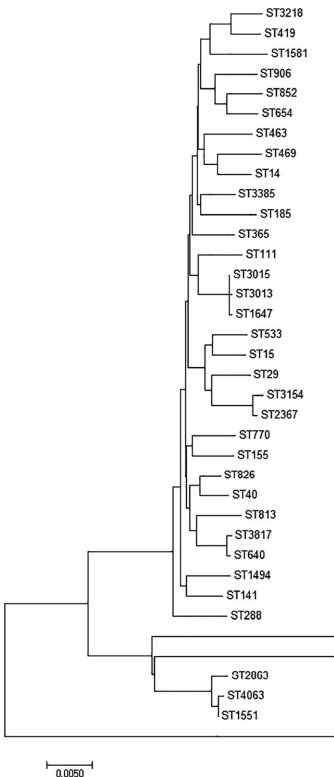

2850

Food Science & Nutrition

XIE ET AL.

### 3.4 | Molecular diversity patterns

After the seven housekeeping gene sequences were uploaded, the alleles were numbered and the isolates were assigned to 37 sequence types (STs) according to the Salmonella database. The numbers of each MLST locus were aroC: 29, dnaN: 27, hemD: 22, hisD: 28, purE: 24, sucA: 25, and thrA: 29. A minimum evolution tree was constructed using the concatenated sequences of each allele, as shown in Figure 2. The MLST results grouped the Salmonella isolates into three clusters. ST3315 (SalE28) formed its own cluster, which was widely separated from the others on the evolutionary tree.

The results of ERIC-PCR analysis of the Salmonella isolates are shown in Figure 3. We found bands ranging in size from 100 bp to about 5,000 bp. The ERIC-PCR patterns revealed that our isolates could be divided into five clusters (A, B, C, D, and E) with a relative similarity coefficient of 0.65. Analysis of the ERIC-PCR found the isolates to be very diverse genetically. Meanwhile, the isolates belonging to clusters A and B were similar to the cluster in MLST typing, including SalE7, 9, 29, and 37. However, there was no evidence showing a relationship between source, serotype, and antibiotic resistance.

## 4 | DISCUSSION

Eggs were an important host of S. enterica. In the United States alone, eggs were responsible for 80% of the 371 known Salmonella food poisoning cases from 1985 to 1999. In 2010, more than 2,000 people in the United States contracted food poisoning from consuming eggs contaminated with Salmonella. This led to the recall of more than 550 million eggs and resulted in heavy economic losses (AI, 2004). In China, about 70% of bacterial food poisoning is caused by Salmonella, with eggs and egg products accounting for 90% of these (Wu, Qin, Shi, & Zheng, 2004). Our data found that 7.6% and 3.2% of farm and market egg samples were contaminated with Salmonella, respectively. The market eggs may have a lower positive rate due to stricter access rules. The results were also much lower than contamination pork (41.8%) and other meats (Capuano, Mancusi, Caparelli, Esposito, & Proroga, 2013). For the egg samples, the contamination

<table border=1 style='margin: auto; width: max-content;'><tr><td style='text-align: center;'></td><td style='text-align: center;'>ST</td><td style='text-align: center;'>aroC</td><td style='text-align: center;'>dnaN</td><td style='text-align: center;'>hemD</td><td style='text-align: center;'>hisD</td><td style='text-align: center;'>purE</td><td style='text-align: center;'>sucA</td><td style='text-align: center;'>thrA</td></tr><tr><td style='text-align: center;'>SalE2,23</td><td style='text-align: center;'>3,218</td><td style='text-align: center;'>11</td><td style='text-align: center;'>10</td><td style='text-align: center;'>25</td><td style='text-align: center;'>790</td><td style='text-align: center;'>10</td><td style='text-align: center;'>58</td><td style='text-align: center;'>4</td></tr><tr><td style='text-align: center;'>SalE4</td><td style='text-align: center;'>419</td><td style='text-align: center;'>13</td><td style='text-align: center;'>11</td><td style='text-align: center;'>25</td><td style='text-align: center;'>72</td><td style='text-align: center;'>10</td><td style='text-align: center;'>23</td><td style='text-align: center;'>23</td></tr><tr><td style='text-align: center;'>SalE50</td><td style='text-align: center;'>1,581</td><td style='text-align: center;'>72</td><td style='text-align: center;'>32</td><td style='text-align: center;'>36</td><td style='text-align: center;'>33</td><td style='text-align: center;'>429</td><td style='text-align: center;'>79</td><td style='text-align: center;'>209</td></tr><tr><td style='text-align: center;'>SalE54</td><td style='text-align: center;'>906</td><td style='text-align: center;'>84</td><td style='text-align: center;'>161</td><td style='text-align: center;'>25</td><td style='text-align: center;'>356</td><td style='text-align: center;'>41</td><td style='text-align: center;'>23</td><td style='text-align: center;'>283</td></tr><tr><td style='text-align: center;'>SalE6,27,53</td><td style='text-align: center;'>852</td><td style='text-align: center;'>42</td><td style='text-align: center;'>11</td><td style='text-align: center;'>17</td><td style='text-align: center;'>42</td><td style='text-align: center;'>40</td><td style='text-align: center;'>71</td><td style='text-align: center;'>102</td></tr><tr><td style='text-align: center;'>SalE34,35,41</td><td style='text-align: center;'>654</td><td style='text-align: center;'>111</td><td style='text-align: center;'>47</td><td style='text-align: center;'>49</td><td style='text-align: center;'>42</td><td style='text-align: center;'>12</td><td style='text-align: center;'>58</td><td style='text-align: center;'>3</td></tr><tr><td style='text-align: center;'>SalE3</td><td style='text-align: center;'>463</td><td style='text-align: center;'>92</td><td style='text-align: center;'>125</td><td style='text-align: center;'>78</td><td style='text-align: center;'>128</td><td style='text-align: center;'>138</td><td style='text-align: center;'>9</td><td style='text-align: center;'>141</td></tr><tr><td style='text-align: center;'>SalE20</td><td style='text-align: center;'>469</td><td style='text-align: center;'>92</td><td style='text-align: center;'>107</td><td style='text-align: center;'>79</td><td style='text-align: center;'>156</td><td style='text-align: center;'>64</td><td style='text-align: center;'>151</td><td style='text-align: center;'>87</td></tr><tr><td style='text-align: center;'>SalE38,49</td><td style='text-align: center;'>14</td><td style='text-align: center;'>7</td><td style='text-align: center;'>6</td><td style='text-align: center;'>8</td><td style='text-align: center;'>8</td><td style='text-align: center;'>7</td><td style='text-align: center;'>8</td><td style='text-align: center;'>13</td></tr><tr><td style='text-align: center;'>SalE12,52</td><td style='text-align: center;'>3,385</td><td style='text-align: center;'>4</td><td style='text-align: center;'>64</td><td style='text-align: center;'>8</td><td style='text-align: center;'>278</td><td style='text-align: center;'>2</td><td style='text-align: center;'>146</td><td style='text-align: center;'>672</td></tr><tr><td style='text-align: center;'>SalE48</td><td style='text-align: center;'>185</td><td style='text-align: center;'>71</td><td style='text-align: center;'>65</td><td style='text-align: center;'>67</td><td style='text-align: center;'>75</td><td style='text-align: center;'>61</td><td style='text-align: center;'>9</td><td style='text-align: center;'>64</td></tr><tr><td style='text-align: center;'>SalE11,30,31</td><td style='text-align: center;'>365</td><td style='text-align: center;'>130</td><td style='text-align: center;'>97</td><td style='text-align: center;'>25</td><td style='text-align: center;'>125</td><td style='text-align: center;'>84</td><td style='text-align: center;'>9</td><td style='text-align: center;'>101</td></tr><tr><td style='text-align: center;'>SalE47</td><td style='text-align: center;'>111</td><td style='text-align: center;'>41</td><td style='text-align: center;'>42</td><td style='text-align: center;'>43</td><td style='text-align: center;'>12</td><td style='text-align: center;'>9</td><td style='text-align: center;'>12</td><td style='text-align: center;'>53</td></tr><tr><td style='text-align: center;'>SalE29,43</td><td style='text-align: center;'>3,015</td><td style='text-align: center;'>10</td><td style='text-align: center;'>7</td><td style='text-align: center;'>12</td><td style='text-align: center;'>9</td><td style='text-align: center;'>621</td><td style='text-align: center;'>9</td><td style='text-align: center;'>2</td></tr><tr><td style='text-align: center;'>SalE15</td><td style='text-align: center;'>3,013</td><td style='text-align: center;'>10</td><td style='text-align: center;'>7</td><td style='text-align: center;'>12</td><td style='text-align: center;'>9</td><td style='text-align: center;'>5</td><td style='text-align: center;'>9</td><td style='text-align: center;'>639</td></tr><tr><td style='text-align: center;'>SalE5,17,39</td><td style='text-align: center;'>1,647</td><td style='text-align: center;'>10</td><td style='text-align: center;'>7</td><td style='text-align: center;'>12</td><td style='text-align: center;'>517</td><td style='text-align: center;'>112</td><td style='text-align: center;'>9</td><td style='text-align: center;'>2</td></tr><tr><td style='text-align: center;'>SalE1,8</td><td style='text-align: center;'>533</td><td style='text-align: center;'>14</td><td style='text-align: center;'>7</td><td style='text-align: center;'>3</td><td style='text-align: center;'>191</td><td style='text-align: center;'>6</td><td style='text-align: center;'>19</td><td style='text-align: center;'>12</td></tr><tr><td style='text-align: center;'>SalE25</td><td style='text-align: center;'>15</td><td style='text-align: center;'>2</td><td style='text-align: center;'>7</td><td style='text-align: center;'>9</td><td style='text-align: center;'>9</td><td style='text-align: center;'>5</td><td style='text-align: center;'>9</td><td style='text-align: center;'>12</td></tr><tr><td style='text-align: center;'>SalE42</td><td style='text-align: center;'>29</td><td style='text-align: center;'>16</td><td style='text-align: center;'>16</td><td style='text-align: center;'>20</td><td style='text-align: center;'>18</td><td style='text-align: center;'>8</td><td style='text-align: center;'>12</td><td style='text-align: center;'>18</td></tr><tr><td style='text-align: center;'>SalE16</td><td style='text-align: center;'>3,154</td><td style='text-align: center;'>16</td><td style='text-align: center;'>2</td><td style='text-align: center;'>513</td><td style='text-align: center;'>43</td><td style='text-align: center;'>36</td><td style='text-align: center;'>39</td><td style='text-align: center;'>42</td></tr><tr><td style='text-align: center;'>SalE46</td><td style='text-align: center;'>2,367</td><td style='text-align: center;'>534</td><td style='text-align: center;'>2</td><td style='text-align: center;'>45</td><td style='text-align: center;'>43</td><td style='text-align: center;'>36</td><td style='text-align: center;'>39</td><td style='text-align: center;'>42</td></tr><tr><td style='text-align: center;'>SalE19</td><td style='text-align: center;'>770</td><td style='text-align: center;'>188</td><td style='text-align: center;'>37</td><td style='text-align: center;'>18</td><td style='text-align: center;'>46</td><td style='text-align: center;'>5</td><td style='text-align: center;'>2</td><td style='text-align: center;'>34</td></tr><tr><td style='text-align: center;'>SalE40</td><td style='text-align: center;'>155</td><td style='text-align: center;'>10</td><td style='text-align: center;'>60</td><td style='text-align: center;'>58</td><td style='text-align: center;'>66</td><td style='text-align: center;'>6</td><td style='text-align: center;'>65</td><td style='text-align: center;'>16</td></tr><tr><td style='text-align: center;'>SalE26</td><td style='text-align: center;'>826</td><td style='text-align: center;'>19</td><td style='text-align: center;'>81</td><td style='text-align: center;'>8</td><td style='text-align: center;'>20</td><td style='text-align: center;'>5</td><td style='text-align: center;'>9</td><td style='text-align: center;'>185</td></tr><tr><td style='text-align: center;'>SalE21</td><td style='text-align: center;'>40</td><td style='text-align: center;'>19</td><td style='text-align: center;'>20</td><td style='text-align: center;'>3</td><td style='text-align: center;'>20</td><td style='text-align: center;'>5</td><td style='text-align: center;'>22</td><td style='text-align: center;'>22</td></tr><tr><td style='text-align: center;'>SalE13,14,24</td><td style='text-align: center;'>813</td><td style='text-align: center;'>39</td><td style='text-align: center;'>107</td><td style='text-align: center;'>79</td><td style='text-align: center;'>20</td><td style='text-align: center;'>8</td><td style='text-align: center;'>35</td><td style='text-align: center;'>2</td></tr><tr><td style='text-align: center;'>SalE10,30,36</td><td style='text-align: center;'>3,817</td><td style='text-align: center;'>5</td><td style='text-align: center;'>2</td><td style='text-align: center;'>3</td><td style='text-align: center;'>7</td><td style='text-align: center;'>6</td><td style='text-align: center;'>681</td><td style='text-align: center;'>11</td></tr><tr><td style='text-align: center;'>SalE18</td><td style='text-align: center;'>640</td><td style='text-align: center;'>5</td><td style='text-align: center;'>2</td><td style='text-align: center;'>3</td><td style='text-align: center;'>7</td><td style='text-align: center;'>6</td><td style='text-align: center;'>11</td><td style='text-align: center;'>11</td></tr><tr><td style='text-align: center;'>SalE45</td><td style='text-align: center;'>1,494</td><td style='text-align: center;'>5</td><td style='text-align: center;'>2</td><td style='text-align: center;'>3</td><td style='text-align: center;'>491</td><td style='text-align: center;'>5</td><td style='text-align: center;'>5</td><td style='text-align: center;'>10</td></tr><tr><td style='text-align: center;'>SalE33</td><td style='text-align: center;'>141</td><td style='text-align: center;'>59</td><td style='text-align: center;'>58</td><td style='text-align: center;'>56</td><td style='text-align: center;'>62</td><td style='text-align: center;'>51</td><td style='text-align: center;'>59</td><td style='text-align: center;'>16</td></tr><tr><td style='text-align: center;'>SalE51</td><td style='text-align: center;'>288</td><td style='text-align: center;'>102</td><td style='text-align: center;'>15</td><td style='text-align: center;'>8</td><td style='text-align: center;'>105</td><td style='text-align: center;'>8</td><td style='text-align: center;'>18</td><td style='text-align: center;'>103</td></tr><tr><td style='text-align: center;'>SalE72822</td><td style='text-align: center;'>2,822</td><td style='text-align: center;'>30</td><td style='text-align: center;'>28</td><td style='text-align: center;'>31</td><td style='text-align: center;'>151</td><td style='text-align: center;'>57</td><td style='text-align: center;'>29</td><td style='text-align: center;'>30</td></tr><tr><td style='text-align: center;'>SalE37</td><td style='text-align: center;'>4,345</td><td style='text-align: center;'>33</td><td style='text-align: center;'>26</td><td style='text-align: center;'>30</td><td style='text-align: center;'>282</td><td style='text-align: center;'>21</td><td style='text-align: center;'>87</td><td style='text-align: center;'>805</td></tr><tr><td style='text-align: center;'>SalE44</td><td style='text-align: center;'>2,863</td><td style='text-align: center;'>191</td><td style='text-align: center;'>23</td><td style='text-align: center;'>27</td><td style='text-align: center;'>22</td><td style='text-align: center;'>589</td><td style='text-align: center;'>24</td><td style='text-align: center;'>174</td></tr><tr><td style='text-align: center;'>SalE9</td><td style='text-align: center;'>4,063</td><td style='text-align: center;'>738</td><td style='text-align: center;'>22</td><td style='text-align: center;'>27</td><td style='text-align: center;'>22</td><td style='text-align: center;'>18</td><td style='text-align: center;'>131</td><td style='text-align: center;'>24</td></tr><tr><td style='text-align: center;'>SalE22</td><td style='text-align: center;'>1,551</td><td style='text-align: center;'>25</td><td style='text-align: center;'>77</td><td style='text-align: center;'>27</td><td style='text-align: center;'>22</td><td style='text-align: center;'>18</td><td style='text-align: center;'>131</td><td style='text-align: center;'>24</td></tr><tr><td style='text-align: center;'>SalE28</td><td style='text-align: center;'>3,315</td><td style='text-align: center;'>65</td><td style='text-align: center;'>451</td><td style='text-align: center;'>29</td><td style='text-align: center;'>312</td><td style='text-align: center;'>20</td><td style='text-align: center;'>617</td><td style='text-align: center;'>60</td></tr></table>

FIGURE 2 Multilocus sequence typing minimum evolution tree of the Salmonella isolates

20487177, 2019, 9, Downloaded from https://onlinelibrary.wiley.com/doi/10.1002/lsn3.1126 by Schweizerische Akademie Der, Wiley Online Library on [16/11/2025]. See the Terms and Conditions (https://onlinelibrary.wiley.com/terms-and-conditions) on Wiley Online Library for rules of use; OA articles are governed by the applicable Creative Commons License